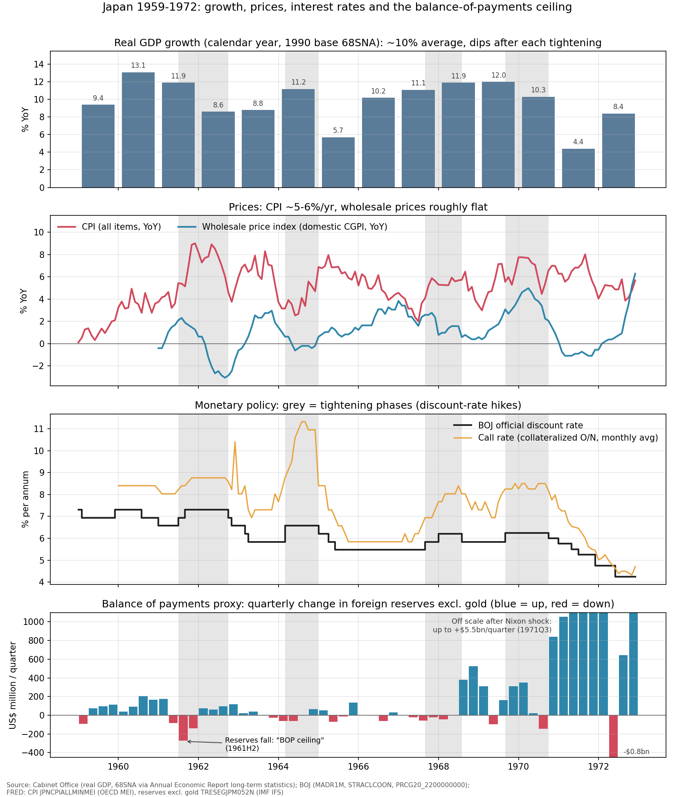

# 1960年代の日銀はなぜ利上げしたのか──「国際収支の天井」と国会の答弁から読む

※ この記事は、日本銀行・内閣府・FRED の公表データと、国立国会図書館「国会会議録検索システム」の API を使って調べています。

1960年代の日本では、消費者物価が毎年5〜6％ずつ上がっていました。今の感覚なら十分に「インフレ」です。ところが、日銀が公定歩合を上げ下げした理由を追っていくと、その多くは**物価ではなく国際収支**でした。

データと、当時の日銀総裁が国会で行った答弁を並べると、この事情がよく見えます。

## グラフで見る1959〜1972年

上から順に、次の4つを並べています。グレーの帯は、公定歩合を引き上げていた「引き締め期」です。

- 実質GDP成長率（暦年）
- 消費者物価と卸売物価の前年比
- 公定歩合とコールレート
- 外貨準備の増減（国際収支の代わりの指標）

## データから見えること

### 成長率は平均10％、引き締めのたびに落ち込む

- 1960年は13.1％、1968〜69年は12％前後でした。
- 引き締めのあとは成長率が下がります。1961年の引き締めのあとは1962年に8.6％、1964年の引き締めのあとは1965年に5.7％（昭和40年不況）です。1969〜70年の引き締めとニクソン・ショックのあと、1971年は4.4％でした。
- 1967〜68年の引き締めでは、成長率は11〜12％のまま下がっていません。

### 消費者物価は5〜6％、卸売物価はほぼ横ばい

- 消費者物価は、成長率が高い年も低い年も5％前後で推移しています。
- 一方で、卸売物価（今の企業物価）は0〜2％程度でした。
- 当時の物価の目安は卸売物価でした。消費者物価の上昇は、製造業とサービス業・農業の生産性の差から生まれる構造的なもの（生産性格差インフレ）と考えられていました。そのため、金融政策で対処する問題とは見なされていませんでした。

### 引き締めのきっかけは外貨準備の減少

- 1ドル＝360円の固定相場のもとでは、景気が過熱すると輸入が増え、外貨準備が減ります。そこで公定歩合を上げて景気を冷やす、という動きが繰り返されました。いわゆる**「国際収支の天井」**です。
- 1961年後半には外貨準備がはっきり減り、その最中に利上げが行われています。
- ところが1969年9月の利上げは、**外貨準備が増えている時期**に行われています。

### コールレートは公定歩合より高いまま

- 市場の金利であるコールレートは、公定歩合より1〜4％高い状態が続きました。
- 銀行が日銀からの借入れに頼る「オーバーローン」と、預金金利や貸出金利の規制（人為的低金利政策）が背景にあります。
- 1964年の引き締め期には、コールレートが11％を超えました。

## 国会で日銀総裁はどう説明したか

国会会議録で、公定歩合をめぐる日銀総裁の答弁を時期ごとに拾いました。

### ① 1961年7月の利上げ（山際正道総裁）

1961年10月13日、衆議院大蔵委員会での答弁です。

> 収支は、五月以降総合収支においても赤字に転ずるに至ったのでございます。（中略）七月の下旬でありましたが、公定歩合を一厘幅引き上げたのでございます。また、この引き上げを背景といたしまして、窓口規制等による量的引き締めも一そう強化することに努めて参ったのでございます。

- 国際収支の赤字が、はっきりと利上げの理由になっています。
- 同じ答弁の中で、**輸出向けの金利だけは逆に一厘引き下げた**とも述べています。
- 利上げの直前には、産業界に「設備投資一割削減」を要請していました。

出典： https://kokkai.ndl.go.jp/txt/103904629X00419611013/2

### ② 1963年、金利が高い理由（山際総裁）

1963年3月8日、参議院大蔵委員会での答弁です。日本の金利が海外より高い理由として、オーバーローンを挙げています。

> 俗にオーバー・ローンだといわれておりまするが、金融機関が預かりました預金を腹一ぱいに使っておる。足らぬところは外部からコールをとり、日本銀行から資金を借り入れ、さらに貸し付けるということでありますので

出典： https://kokkai.ndl.go.jp/txt/104314629X01519630308/68

### ③ 1964年3月の利上げ（山際総裁）

1964年3月26日、衆議院大蔵委員会での答弁です。

> 日本銀行では去る三月十七日に公定歩合日歩二厘引き上げを決定いたしまして、翌十八日から実施いたしたのでありますが

- 手段としては、公定歩合の引き上げ、窓口指導、準備率の引き上げを「取りまぜて」使ったと説明しています。
- 目標は、国際収支を年度内に均衡させることでした。

出典： https://kokkai.ndl.go.jp/txt/104604629X02619640326/2

### ④ 1967年9月の利上げ（宇佐美洵総裁）

- 1967年12月13日、衆議院大蔵委員会での答弁です。ポンドの切り下げに続いて英米が利上げしたことで、日本の資本収支や輸出に影響が出ることを心配しています。国際収支の改善の前途は「多難」だと述べています。
- 1968年2月27日、衆議院予算委員会では、利上げのときに政府が財政の面からも協力したとして、「ポリシーミックス」を強調しています。

出典： https://kokkai.ndl.go.jp/txt/105704629X00219671213/85 ／ https://kokkai.ndl.go.jp/txt/105805261X00719680227/175

### ⑤ 1968年秋の「当分下げません」（宇佐美総裁）

1968年8月に利下げしたあと、10月に「当分下げない」と表明しました。その理由を、12月20日の衆議院大蔵委員会で次のように説明しています。

> 十月に私は、いろいろ検討の結果、公定歩合はいろいろ御議論があるけれども、当分下げませんということを述べたわけでございます。

企業の気持ちがゆるみすぎないように、先の方針を言葉で示したものです。今でいうフォワードガイダンスに近い使い方です。

出典： https://kokkai.ndl.go.jp/txt/106004629X00219681220/81

### ⑥ 1969年9月の利上げ──国際収支が黒字なのに引き締めた

宇佐美総裁は、1969年9月10日の衆議院大蔵委員会で、設備投資の計画が毎月のように膨らんでいることを理由に挙げました。

> 今後のことを考えまして未然にこれを防止するというようなことがいま必要ではないか、かように考えまして公定歩合を引き上げ、また準備率も引き上げたような次第でございます。

後任の佐々木直総裁は、1970年3月5日の参議院大蔵委員会で、この利上げの意味をはっきり述べています。

> 戦後の日本では、金融調整をいたしますときには、国際収支の天井にぶつかって行なうということがいつも通例でございました。昨年九月の例は全く新しい例でございまして、国際収支では相当大幅な黒字が出ておりますのにかかわらず、公定歩合の引き上げをいたし、金融、資金量の調整も始めたわけでございます

理由として挙げたのは、物価と人手不足（労働力の需給のひっ迫）でした。**国際収支の天井の時代が終わったことを、日銀総裁自身が国会で認めた場面**です。グラフでも、この利上げは外貨準備が増えている時期に重なっています。

出典： https://kokkai.ndl.go.jp/txt/106104629X05119690910/34 ／ https://kokkai.ndl.go.jp/txt/106314629X00519700305/4

### ⑦ 1970〜71年の利下げ（佐々木総裁）

1971年5月27日、衆議院大蔵委員会での答弁です。公定歩合を何度も下げたのに、銀行が実際に貸し出す金利は月に0.01％程度しか下がらなかったと認めています。金利が規制されていた時代には、政策が効きにくかったことがわかります。

出典： https://kokkai.ndl.go.jp/txt/106504629X03719710527/43

## 国会で「公定歩合」はどれくらい話題になったか

「公定歩合」という言葉を含む発言の数を、年ごとに数えました。

- 1961年：221件（引き締め）
- 1963年：248件（利下げと金利の国際比較）
- 1964年：423件（オリンピックの年の引き締め。この期間で最多）
- 1968年：224件（利下げと「当分下げません」）
- 1969年：83件（予防的な利上げの年ですが、件数は少なめ）

## まとめ

- 1960年代前半は、**国際収支が赤字になったら利上げする**という形がはっきりしていました。消費者物価が6〜7％上がっても、それだけでは利上げの理由になりませんでした。
- 1967年ごろからは、海外の金利の動きも意識されるようになります。
- 1969年9月に、初めて**物価と景気の過熱を理由にした予防的な利上げ**が行われました。
- ただ、1971年のニクソン・ショックのあとは円高不況を防ぐために大幅に利下げし、そのとき生まれた金余りが1973年の狂乱物価につながっていきます。

## データの取り方

- 実質GDP成長率：内閣府『経済財政白書』長期経済統計の「国民経済計算」（暦年。1979年以前は平成2年基準・68SNA） https://www5.cao.go.jp/j-j/wp/wp-je12/h10_data01.html
- 公定歩合・コールレート・卸売物価：日本銀行 時系列統計データ検索サイトの API（系列 MADR1M、STRACLCOON、PRCG20_2200000000）。卸売物価は、今の国内企業物価指数を遡った系列です。
- 消費者物価：OECD のデータを FRED から取得（JPNCPIALLMINMEI）。月ごとの前年比の平均なので、総務省が公表している年平均とは0.1〜0.2ポイントずれることがあります。
- 外貨準備：FRED（TRESEGJPM052N、IMF 国際金融統計の金を除く外貨準備）の四半期末の差。固定相場の時代には、総合収支を表す指標として使えます。
- 国会の答弁：国立国会図書館「国会会議録検索システム」の API で、「公定歩合」を含み、肩書きが「日本銀行総裁」の発言を時期ごとに検索しました。引用はすべて本文からの抜粋です。
