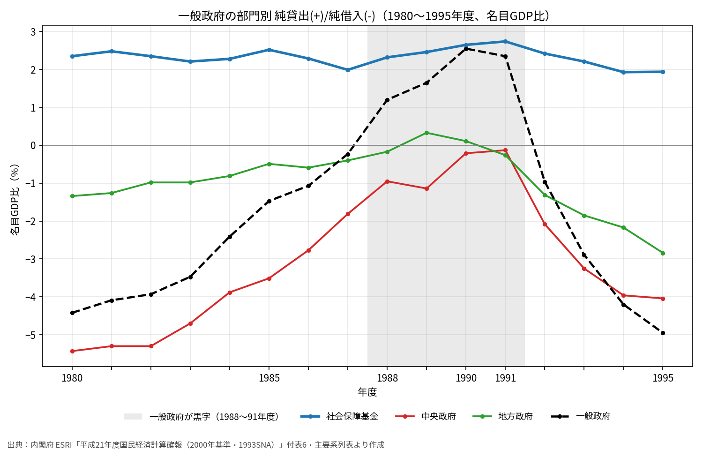

# バブル期の「財政黒字」はどこから来たのか──社会保障基金の黒字を国民経済計算で見る

※ この記事は、内閣府 経済社会総合研究所（ESRI）が公表している国民経済計算（SNA）の旧系列のデータを使って調べている。

1988〜91年度の日本では、一般政府（国・地方・社会保障基金を合わせたもの）の収支が黒字であった。1990年度には名目GDP比で2.55％の黒字である。「バブル期は税収が増えて財政が黒字になった」とよく言われる。

ところが、一般政府を3つの部門に分けてみると、黒字の中身はかなり違って見える。**黒字の大部分は、年金などの積立金を持つ社会保障基金の黒字**であった。国（中央政府）と地方（地方政府）は、赤字がほぼゼロまで縮んだだけで、合わせて黒字になった年は一度もない。

## グラフで見る1980〜1995年度

一般政府を次の3つの部門に分け、それぞれの「純貸出(+)／純借入(-)」を名目GDP比で並べている。プラスが黒字、マイナスが赤字である。グレーの帯は、一般政府全体が黒字だった1988〜91年度である。

- 社会保障基金（公的年金、医療保険、雇用保険など）
- 中央政府（国の一般会計と、多くの特別会計）
- 地方政府（都道府県と市町村）
- 一般政府（上の3つの合計）

## データから見えること

### 社会保障基金は毎年GDP比2％台の黒字

- 社会保障基金は、1980年度から1995年度まで**毎年GDP比2〜2.7％の黒字**であった。
- バブル期に少し増えてはいるが（1987年度1.99％→1991年度2.74％）、大きな変化ではない。
- 金額で見ると、1985年度の8.3兆円から、1988年度9.0兆円、1990年度12.0兆円、1991年度13.0兆円と増えている。1991年度がピークであった。

### 一般政府が黒字になったのは、国と地方の赤字が縮んだから

- 中央政府の赤字は、1980年度のGDP比5.43％から、1991年度には0.13％まで縮んだ。
- 地方政府は、1989〜90年度にわずかな黒字（0.33％、0.11％）になっている。
- 国と地方を合わせると、最も赤字が小さかった1990年度でも**GDP比0.10％の赤字**であった。国と地方だけで黒字になった年はない。
- つまり、「財政黒字」の中身は、ほぼ社会保障基金の黒字そのものだったことになる。

### 保険料の伸びが給付の伸びを上回っていた

社会保障基金の黒字の中身を、1985年度と1991年度で比べた。

- 社会負担（保険料など）の受取：24.0兆円 → 37.3兆円（13.2兆円の増加）
- 現物以外の社会給付（年金など）の支払：16.8兆円 → 25.3兆円（8.4兆円の増加）
- 財産所得（積立金の利子など）の受取：5.2兆円 → 8.2兆円

保険料率の引上げに加えて、バブル期に雇用と賃金が増えたことで、保険料の収入が給付を上回るペースで伸びていた。また、金利が高い時代だったため、積立金の利子だけで毎年5〜8兆円の収入があり、これが黒字の土台になっていた。

### 1992年度からは一気に赤字へ

- 1992年度以降、社会保障基金の黒字はゆっくり縮んでいく（1995年度は1.94％）。
- 急に変わったのは国と地方の方である。景気対策で支出が増え、税収が減ったことで、1992年度には中央政府が2.08％、地方政府が1.31％の赤字に戻った。
- その結果、一般政府全体も1992年度に赤字（0.96％）に転じ、1995年度には4.95％の赤字になっている。

## まとめ

- バブル期の一般政府の黒字（1988〜91年度）は、**社会保障基金の黒字が大部分**を占めていた。
- 社会保障基金の黒字はGDP比2％台で安定しており、バブル期に急に増えたわけではない。
- 国と地方の赤字はほぼゼロまで縮んだが、合わせて黒字になった年はなかった。
- 年金の積立金が増えていくことは、将来の給付に備えるためのものである。これを含んだ「一般政府の黒字」を、国の財政が健全だった証拠と読むときには注意が必要である。

## 注意点

- 本稿の数字は、**2000年基準・1993SNAの旧系列**である。今の国民経済計算（2020年基準・2008SNA）は、部門別の数字が1994年度からしかない。基準の違う系列をつなげると段差ができるので、本稿では旧系列だけを使っている。
- 「純貸出(+)／純借入(-)」は、SNAで財政収支を見るときの代表的な指標である。国の予算で使う「財政収支」や「プライマリーバランス」とは範囲や計上の仕方が違うので、数字は一致しない。

## データの取り方

- 部門別の純貸出／純借入と、社会保障基金の収支の内訳：内閣府 ESRI「平成21年度 国民経済計算確報（2000年基準・1993SNA）」付表6「一般政府の部門別勘定」（21s6_jp.xls）の「26. 純貸出(+)／純借入(-)」「9. 社会負担（受取）」「3. 財産所得（受取）」「12. 現物社会移転以外の社会給付（支払）」 https://www.esri.cao.go.jp/jp/sna/data/data_list/kakuhou/files/h21/h21_kaku_top.html
- 名目GDP：同じ確報の主要系列表「国内総生産（支出側、名目）」年度（21ffm1n_jp.xls）。GDP比は、この2つのファイルから自分で計算した。
