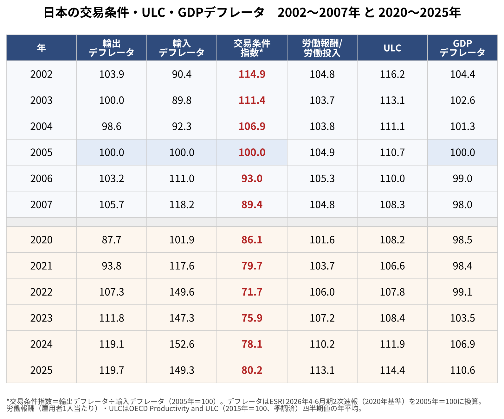
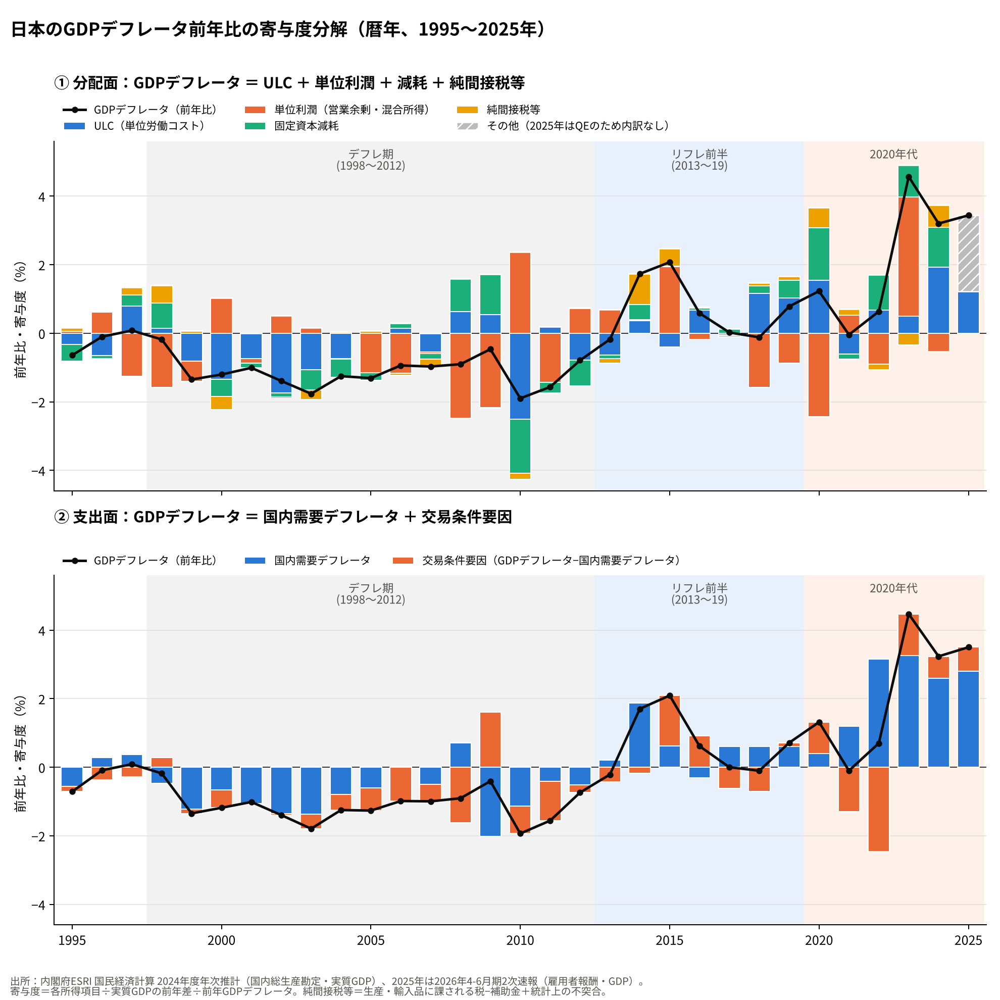

# 交易損失は賃金を下げるのか──2000年代と2020年代のGDPデフレータを分解して比べる

※ この記事は、内閣府 経済社会総合研究所（ESRI）の国民経済計算と、OECD の単位労働コスト（ULC）統計の公表データを使って計算している。

日本のデフレについては、「円高や資源高で交易条件が悪くなり、その損失を吸収するために賃金が下がり、物価も下がった」という説明がよく聞かれる。交易損失が先にあって、賃金の下落やデフレはその結果だ、という見方である。

もしそうなら、交易条件が大きく悪化した時期には、いつでも賃金と物価が下がるはずである。ところが2020年代には、2000年代よりも大きな交易条件の悪化が起きたのに、賃金も物価も上がった。

本稿では、2000年代と2020年代を同じ物差しで並べ、さらにGDPデフレータの変化を「何が動かしたのか」に分解して、この説明が成り立つのかを確かめる。

結果を先に示すと、次のようになった。

- 2020年代の交易条件の悪化は2000年代より大きかったのに、GDPデフレータとULCは2000年代と逆に上がった。
- 1998〜2012年のGDPデフレータの下落（年平均−1.13％）のうち、交易条件で説明できるのは3分の1ほどであった。主役は国内需要の物価と単位労働コストの下落である。
- 同じ規模の交易損失でも、国内の名目の需要や物価がどう反応するかで、結末は正反対になった。
- ただし、2013〜2019年のリフレ政策の前半は、デフレ脱却の向きには変わったものの、賃金を強く押し上げるところまでは届いていない。

## 2000年代と2020年代を並べる

まず、輸出・輸入デフレータ、交易条件、雇用者1人あたりの労働報酬、単位労働コスト（ULC）、GDPデフレータを、2002〜2007年と2020〜2025年で並べた。デフレータはすべて2005年＝100にそろえている。

交易条件は、輸出デフレータを輸入デフレータで割ったものである。日本の輸出品で、どれだけの輸入品が買えるかを表す。

2000年代は、2002年の114.9から2007年の89.4まで下がった。資源価格の上昇で、輸入デフレータが2005年からの2年で18％上がったためである。このとき、GDPデフレータは104.4から98.0へ下がり、ULCも116.2から108.3へ下がった。労働報酬は104〜105でほとんど動いていない。

2020年代は、交易条件が2020年の86.1から2022年には71.7まで下がった。2000年代の底より、さらに2割近く低い水準である。輸入デフレータは2005年の1.5倍になった。ところが、GDPデフレータは98.5から2025年には110.6まで上がり、ULCも108.2から114.4へ上がった。労働報酬は113.1となり、2000年代の104〜105を初めてはっきり上回っている。

交易条件の悪化という同じショックに対して、国内の物価と賃金の反応がまったく逆になっている。

## GDPデフレータを2つの面から分解する

次に、1995〜2025年のGDPデフレータの前年比を、2つの見方で分解した。

1つ目は「分配面」である。GDPは、働く人への報酬（雇用者報酬）、企業の利益（営業余剰・混合所得）、設備の減価償却（固定資本減耗）、税から補助金を引いたものに分かれる。それぞれを実質GDPで割ると、生産1単位あたりの賃金コスト（ULC）、生産1単位あたりの利潤（単位利潤）などになり、その合計がGDPデフレータになる。

2つ目は「支出面」である。GDPデフレータの変化を、国内で使われるモノやサービスの物価（国内需要デフレータ）と、残りの部分に分けた。残りは、輸出と輸入の価格の動き、つまり交易条件の変化を主に反映している。

上が分配面、下が支出面である。黒い線がGDPデフレータの前年比で、棒が各要因の寄与である。

## データから見えること

### デフレ期の主役は、交易条件ではなく国内の物価と賃金

1998〜2012年の年平均で見ると、GDPデフレータは−1.13％であった。その中身は次の通りである。

- 分配面：ULC −0.58、単位利潤 −0.40、固定資本減耗 −0.13、純間接税等 −0.03
- 支出面：国内需要デフレータ −0.76、交易条件要因 −0.37

交易条件の悪化は確かにマイナスに効いているが、全体の3分の1ほどである。下落の大部分は、国内で使われるモノやサービスの物価の下落と、単位労働コストの下落から来ている。

「交易損失のせいで賃金が下がり、デフレになった」という説明は、少なくとも数字の大きさの上では、交易条件を主役にしすぎていると言える。

### 2008年と2022年：同じショック、正反対の結末

最もはっきり違いが出るのは、2008年と2022年の比較である。どちらも資源高で交易条件が大きく悪化した年である。

- 2008年：交易条件要因 −1.61、国内需要デフレータ ＋0.71、GDPデフレータ −0.90、単位利潤 −2.48
- 2009年：国内需要デフレータ −2.01、GDPデフレータ −0.41
- 2022年：交易条件要因 −2.46、国内需要デフレータ ＋3.16、GDPデフレータ ＋0.70、単位利潤 −0.91
- 2023年：単位利潤 ＋3.47、GDPデフレータ ＋4.47
- 2024年：ULC ＋1.93、GDPデフレータ ＋3.24

2008年は、交易損失を企業の利潤が丸ごとかぶり、翌年には国内の物価が大きく下がってデフレに戻った。2022年は、交易損失を国内の物価上昇で広く薄く分担し、翌年には価格転嫁で利潤が戻り、その次の年には賃金（ULC）が追いついてきた。

交易損失が起きたとき、その負担を「名目賃金や国内物価の下落」で吸収するのか、「物価の上昇」で分担するのかは、自然に決まるものではない。国内の名目の需要がどれだけ伸びるか、つまり金融政策を含むマクロ政策の枠組みによって変わると考えられる。

2013年より前の日本銀行は、物価の目安を「0〜2％、中心は1％程度」としていた。名目の需要の伸びが低く抑えられる枠組みのもとでは、輸入コストの上昇は、国内の付加価値の価格、つまり賃金と利潤の圧縮という形で吸収されやすくなる。「交易損失→賃金下落→デフレ」という流れは、交易損失そのものの帰結というより、こうした政策の枠組みのもとで起きる帰結だった、と読むことができる。

### リフレ前半（2013〜2019年）は「向きは変わったが力不足」

一方で、2013〜2019年の年平均を見ると、リフレ政策の効果には限界も見える。

- GDPデフレータ ＋0.70
- ULC ＋0.31、単位利潤 0.00、固定資本減耗 ＋0.18、純間接税等 ＋0.21
- 国内需要デフレータ ＋0.60、交易条件要因 ＋0.08

GDPデフレータはプラスに転じたが、ULCの寄与は年0.3ポイントほどしかない。純間接税等の＋0.21は、2014年と2019年の消費税率の引き上げによるものである。2015年の単位利潤の急増（＋1.95）も、原油安で交易条件が良くなったことによるものであった。

ULCがはっきりプラスになったのは2018〜2019年で、ようやく年1％台に乗ったところで2020年のコロナ禍が来た。「リフレ政策をすれば賃金がすぐ上がる」とまでは、このデータからは言えない。

## まとめ

- 2020年代の交易条件の悪化は2000年代より大きかったのに、GDPデフレータとULCは上がった。交易損失が起きれば必ず賃金とデフレにつながる、というわけではない。
- 1998〜2012年のGDPデフレータの下落のうち、交易条件で説明できるのは3分の1ほどで、主役は国内の物価と単位労働コストの下落であった。
- 2008年と2022年は同じような交易損失であったが、国内の名目の反応が違ったことで、デフレへの逆戻りと、賃金・物価の上昇という正反対の結末になった。
- ただし、2013〜2019年のリフレ政策の前半は、デフレを止める向きには働いたものの、賃金を強く押し上げるところまでは届いていない。

## 注意点

- **反実仮想は確かめられない**：「リフレ政策がなければ物価も賃金も下がっていた」は、データで直接確かめることはできない。本稿で言えるのは、「交易損失が起きても、賃金と物価が下がるとは限らない」ところまでである。
- **2008年と2022年はショックの中身が違う**：2008年はリーマン・ショックで世界の需要が崩れた年であった。2022年は世界的なインフレと国内の人手不足が重なっていた。両年の違いを、すべて金融政策の枠組みの違いで説明することはできない。
- **2020年のULCの上昇は見かけ上のもの**：コロナ禍で生産が急に減る一方、雇用は維持されたため、生産1単位あたりの賃金コストが上がって見えている。賃上げによるものではない。
- **交易条件要因は簡便な方法**：「GDPデフレータ−国内需要デフレータ」で求めている。輸出入の金額の割合の変化も混ざるため、厳密な寄与度ではない。
- **固定資本減耗の寄与**：2020年代は固定資本減耗の寄与が年0.9ポイントと大きくなっている。設備などの資本財の価格が上がったためで、「賃金か利潤か」の二択では見えない部分である。
- **2025年の内訳**：2025年は年次推計（確報）がまだないため、分配面はULCだけを四半期速報から計算し、残りは「その他」にまとめている。
- **前に作った表との違い**：2002〜2007年の値も、最新の系列（ESRI 2020年基準、OECDの最新版）で計算し直している。古い系列で作った表とは、小数点以下で少しずれる。

## データの取り方

- 輸出・輸入・GDP・国内需要デフレータ：内閣府 ESRI「2026年4-6月期 2次速報」暦年デフレーター（2020暦年＝100）を2005年＝100に換算 [https://www.esri.cao.go.jp/jp/sna/sokuhou/sokuhou_top.html](https://www.esri.cao.go.jp/jp/sna/sokuhou/sokuhou_top.html)
- 分配面の分解（1995〜2024年）：内閣府 ESRI「2024年度 国民経済計算年次推計」の統合勘定「国内総生産勘定」（雇用者報酬、営業余剰・混合所得、固定資本減耗、生産・輸入品に課される税、補助金、統計上の不突合）と主要系列表「実質GDP（支出側）」の暦年値 [https://www.esri.cao.go.jp/jp/sna/data/data_list/kakuhou/files/2024/2024_kaku_top.html](https://www.esri.cao.go.jp/jp/sna/data/data_list/kakuhou/files/2024/2024_kaku_top.html)
- 2025年のULC寄与：同じ2次速報の暦年 雇用者報酬・名目GDP・実質GDP
- 労働報酬とULC（表）：OECD「Productivity and unit labour costs」（日本、雇用者ベース、季節調整済み、2015年＝100）の四半期値を年平均 [https://sdmx.oecd.org/public/rest/data/OECD.SDD.TPS,DSD_PDB@DF_PDB_ULC_Q,1.0/JPN.Q..........](https://sdmx.oecd.org/public/rest/data/OECD.SDD.TPS,DSD_PDB@DF_PDB_ULC_Q,1.0/JPN.Q..........)
- 寄与度は、各所得項目を実質GDPで割った値の前年差を、前年のGDPデフレータで割って求めた。期間平均や交易条件指数は、上のデータから自分で計算した。
