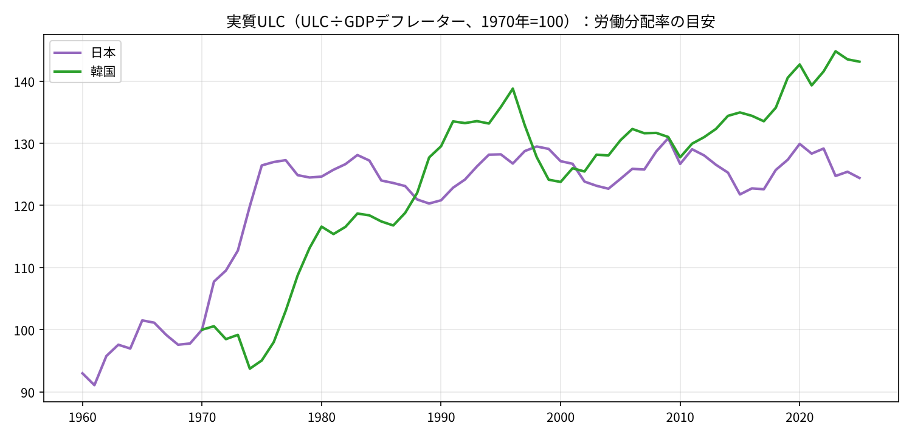

# 生産性は3割伸びたが、消費者物価で測った実質報酬は1割半──日本と韓国のCPIとGDPデフレーターの差

※ この記事は、OECD「Economic Outlook」の日本と韓国の年次データ（日本は1960〜2025年、韓国は1965〜2025年）を使って計算している。

「日本は生産性が伸びても賃金が上がらない国だ」という指摘は多い。しかし、その「実質賃金」を何の物価で割ったのかによって、結論は大きく変わる。

本稿の出発点は、次の問いである。

> 日本では1960年代から一貫して「CPI（消費者物価）の上昇率＞GDPデフレーターの上昇率」だったのか。それとも交易条件が一貫して悪化していたのか。

この問いを確かめる過程で、1990年以降の生産性の伸びと、消費者物価で測った実質報酬の伸びの差がどこから生じたのかを検討することになった。比較対象として韓国のデータも用いる。

結論を先に示す。

- 日本で「CPI＞GDPデフレーター」が定着したのは**1980年ごろから**である。1960年代は両者がほぼ同じ速さで上昇していた。
- 日本の交易条件は一貫して悪化したわけではない。大きく悪化したのは、**石油危機（1970年代）、資源高（2000年代）、2021〜22年**の3回である。
- 1990〜2024年の日本の時間当たりの数字では、**労働生産性は＋31.5％**、GDPデフレーターで割った**生産者実質報酬は＋36.5％**伸びた。一方、CPIで割った**消費者実質報酬は＋14.4％**にとどまった。
- 両者の差約22ポイントの大半は、**CPIとGDPデフレーターのギャップ**で説明できる。**労働分配率の低下**は、少なくともこの指標では主因とはいえない。
- 韓国は、1970年からの累積では**CPIの伸びのほうが小さく**、消費者実質報酬が生産者実質報酬を上回った。交易条件が悪化した時期は同様にあったが、日本ほど大きなギャップは生じていない。

## 1．CPIとGDPデフレーターの差はいつから生じたか

CPIは家計が購入する財・サービスの価格を、GDPデフレーターは国内で生み出した付加価値の価格を測る。最も大きな違いは輸入品の扱いである。

- CPIには、ガソリンや輸入食品など輸入品の価格上昇がそのまま反映される。
- GDPデフレーターでは輸入は控除される。輸入品の価格上昇は、むしろデフレーターを押し下げる方向に働く。

したがって、輸入品の価格が上がる（交易条件が悪化する）と、CPIだけが上がりデフレーターは上がらない、すなわち「CPI＞デフレーター」になりやすい。

棒グラフは「CPI上昇率−GDPデフレーター上昇率」で、赤はCPIのほうが高かった年を示す。黒い線は交易条件（輸出価格÷輸入価格）である。上段が日本、下段が韓国である。

日本を10年ごとに集計すると、次のようになる。

- 1961〜69年：差の平均 −0.4ポイント（CPIのほうが高かったのは9年中4年）、交易条件 −4％
- 1970〜79年：＋0.9ポイント（10年中6年）、交易条件 −28％
- 1980〜89年：＋0.8ポイント（10年中9年）、交易条件 ＋3％
- 1990〜99年：＋0.7ポイント（**10年中10年**）、交易条件 −5％
- 2000〜09年：＋0.9ポイント（10年中9年）、交易条件 −26％
- 2010〜19年：＋0.4ポイント（10年中7年）、交易条件 −10％
- 2020〜25年：−0.3ポイント（6年中1年）、交易条件 −2％

最初の問いに対する答えは、どちらも否である。

- 高度成長期の1960年代は、CPIもデフレーターも年5％前後で並行して上昇していた。交易条件もほぼ横ばいだった。
- 「CPI＞デフレーター」が定着したのは1980年ごろからで、1980〜2014年の35年間のうち33年がそうだった。例外は、逆オイルショックと円高が重なった1986年と、資源価格が急落した2009年である。
- 2015年以降はデフレーターのほうが高い年が増え、2023〜25年は3年続けて逆転している。

### 韓国との比較

韓国の動きは日本とかなり異なる。

- 1966〜79年：差の平均 **−3.1ポイント**（14年中3年）、交易条件 −16％
- 1980〜89年：0.0ポイント（10年中4年）、交易条件 ＋8％
- 1990〜99年：−0.2ポイント（10年中5年）、交易条件 **−20％**
- 2000〜09年：＋0.7ポイント（10年中7年）、交易条件 −22％
- 2010〜19年：＋0.3ポイント（10年中7年）、交易条件 ＋1％
- 2020〜25年：＋0.1ポイント（6年中2年）、交易条件 −2％

1970年代までの韓国では、デフレーターのほうが速く上昇していた。注目されるのは1990年代である。交易条件が2割悪化したにもかかわらず、CPIとデフレーターの差は平均でほぼゼロだった。交易条件がほとんど動かなかった1990年代に10年連続で「CPI＞デフレーター」だった日本とは対照的である。

2000年代には、韓国も日本と同程度の幅で「CPI＞デフレーター」になっている。

## 2．どちらの物価で実質化するかで、実質賃金は大きく異なる

次に、この物価のギャップが実質賃金にどう影響したかを見る。

1人当たりで比べると、短時間労働者の増加だけで賃金が下がって見える。日本の就業者1人当たりの年間労働時間は、1970年の2,243時間から、1990年に2,031時間、2024年には1,617時間まで減少した（韓国は2,934時間→2,688時間→1,865時間）。そのため、以下では**時間当たり**で比較する。

雇用者の時間当たり報酬を、2つの物価で実質化した。

- **消費者実質報酬**（÷CPI）：働く側から見た購買力を表す。
- **生産者実質報酬**（÷GDPデフレーター）：企業側から見た、自らの生産物の価格で測った人件費を表す。

これに時間当たり労働生産性を加えて比較する。左が日本、右が韓国で、縦軸の目盛りはそろえてある。

### 日本：消費者実質報酬だけが伸び悩む

日本では、生産者実質報酬（オレンジ）と消費者実質報酬（赤）が1970年代半ばから乖離し始め、その後差が拡大していく。

年平均の伸び率は次のとおりである。

- 1970〜90年：生産性 ＋3.1％、生産者実質報酬 ＋4.1％、消費者実質報酬 ＋3.2％
- 1990〜2012年：生産性 ＋1.0％、生産者 ＋1.3％、消費者 **＋0.4％**
- 2012〜24年：生産性 ＋0.5％、生産者 ＋0.3％、消費者 ＋0.3％

1990〜2024年の累積は次のとおりである。

- 時間当たり労働生産性：**＋31.5％**
- 生産者実質報酬（÷デフレーター）：**＋36.5％**（生産性を上回る）
- 消費者実質報酬（÷CPI）：**＋14.4％**（実質化に用いる物価をCPIに変えるだけで、約22ポイント小さくなる）

企業側の指標では、賃金は生産性以上に伸びていた。一方、働く側の購買力で見ると、伸びは半分以下である。同じ期間について、どちらの物価を用いるかで評価が大きく分かれる。

### 韓国：消費者実質報酬が最も高い

韓国では、伸びの水準そのものが大きく異なる。1990〜2024年の累積は、生産性 ＋231％、生産者実質報酬 ＋267％、消費者実質報酬 ＋231％だった。

もう一つの特徴は、**消費者実質報酬（赤）が生産者実質報酬（オレンジ）を上回っている**ことである。1970年からの累積では、韓国のCPIはデフレーターより伸びが小さく、その分だけ消費者実質報酬が高く出ている。

ただし、1990年以降に限ると、韓国でも両者の間にはやや差が生じている。1990〜2024年に、CPIで実質化した場合はデフレーターで実質化した場合より約1割低くなった。日本の約16％よりは小さいが、韓国でも同種のギャップは存在する。違いは、韓国では生産性が年4％を超えるペースで伸びていたため、ギャップがあっても実質賃金が大きく上昇したことである。

## 3．労働分配率は低下したか

「生産性が伸びても賃金が上がらないのは、企業が利益を内部に留保し、労働分配率が低下したからだ」という説明もよく見られる。この点を確認する。

用いた指標は実質ULCである。ULC（単位労働コスト）は生産1単位当たりの人件費であり、これをGDPデフレーターで割ると、付加価値のうち労働に配分された割合、すなわち労働分配率の目安になる。

日本（紫）は1970年代前半に急上昇した。1970年を100とすると、1975年には126である。石油危機の中で大幅な賃上げが続いた、いわゆる「賃金爆発」の時期にあたる。その後は**120〜130の範囲でほぼ横ばい**で、2025年は124だった。

少なくとも国民経済計算に基づくこの指標で見る限り、1990年代以降に日本の労働分配率が趨勢的に低下したという形にはなっていない。

韓国（緑）は、1970年代後半から1990年代半ばにかけて上昇した。アジア通貨危機（1997年）でいったん低下した後、2010年代後半から再び上昇し、2025年は143である。韓国では、賃金が生産性以上に伸びる局面が日本より多かったことになる。

## 4．生産性と消費者実質報酬の差の内訳

日本では1990年以降、時間当たりの生産性が3割伸びた一方、消費者実質報酬は1割半しか伸びなかった。その差の内訳は、おおむね次のように整理できる。

- **CPIとGDPデフレーターのギャップ（約22ポイント）**：日本が生産する財・サービスの価格に比べ、家計が購入する財・サービスの価格のほうが速く上昇し続けた。
- **労働分配率**：企業側の物価で測った実質報酬は、生産性と同程度かそれ以上に伸びており、分配率の低下は主因ではない。

韓国との比較からは、もう一つの点が見えてくる。CPIとデフレーターのギャップは年0.5〜1ポイント程度と小さい。生産性や名目賃金が年に数％伸びている国では、この程度のギャップは目立たない。しかし日本のように、生産性の伸びが年1％を下回り、名目賃金もほとんど動かない国では、同じギャップが実質賃金の伸びの半分以上を相殺してしまう。

前回の記事「交易損失は賃金を下げるのか」では、2000年代のデフレの主因は交易条件というより国内の物価と賃金だったと述べた。本稿の結果はそれと矛盾せず、むしろ補完する関係にある。

交易条件の悪化は、GDPデフレーターを押し下げる要因としてはそれほど大きくなかった。しかし、CPIとデフレーターの間にギャップを生じさせる要因としては、低成長の日本で働く人の購買力を着実に削ってきたことになる。

## 5．今後の検討課題

本稿の分析からは、次のような論点が残る。

### 1990年代の日本では、交易条件がほぼ横ばいなのに、なぜCPIのほうが高かったか

1990年代の日本の交易条件はほぼ横ばいだったが、「CPI＞デフレーター」が10年連続で続いた。考えられる要因は次の3つである。

- **投資財価格の下落**：GDPデフレーターには、パソコンや通信機器などの設備投資の価格が含まれる。品質調整により大きく下落したこれらの財が、デフレーターだけを押し下げた可能性がある。
- **CPIの上方バイアス**：固定ウエイトの指数は、安くなった品目への代替を反映しにくく、物価上昇率を高めに示しやすい。
- **政府サービスなどの構成の違い**：デフレーターには、CPIにほとんど含まれない部分が含まれる。

GDPデフレーターを消費・投資・政府・輸出入に分けて寄与度を見れば、どの要因が効いていたかを確かめられる。

### 韓国の1990年代は、交易条件が2割悪化したのに、なぜギャップが生じなかったか

韓国は1990年代に交易条件が大きく悪化したが、CPIとデフレーターの差は平均でほぼゼロだった。半導体のように価格下落の速い製品を輸出していたことが、交易条件を見かけ上悪化させていた可能性がある。輸出品目の構成まで分けて確認する必要がある。

### 高度成長期にギャップが生じなかったのはなぜか

日本の1960年代は、消費者物価が上昇する一方で卸売物価が横ばいという、いわゆる生産性格差インフレの時代だった。生産性の伸びにくいサービスなどの価格が上昇したにもかかわらず、CPIとデフレーターの差はほとんどない。

デフレーターにも同程度のサービス価格の上昇が含まれていたためと考えられる。韓国の1970年代はさらに極端で、デフレーターのほうが年3ポイント速く上昇していた。ただし、この点は確認していない。

### 2023年以降の「デフレーター＞CPI」は続くか

日本では2023〜25年に、3年続けてデフレーターがCPIを上回った。過去40年あまりで初めての動きである。

これが続けば、本稿で見たギャップが逆向きに働き、消費者実質報酬を押し上げる。交易条件の持ち直しによる一時的なものか、企業の価格設定行動の変化による構造的なものかが、今後の重要な論点である。

### 日本の1970年代前半の分配率の急上昇は実態を反映しているか

1960〜70年代は、自営業者や家族従業者から雇用者への移動が大きかった時代である。実質ULCの上昇には、雇用者比率の上昇という構成変化も含まれているはずである。自営業の所得も労働の対価とみなして調整すれば、結果が変わる可能性がある。韓国の分配率の上昇についても、同じ点を確認する必要がある。

## 注意点

- **労働時間は就業者ベース**：OECDの労働時間は自営業者を含む。雇用者だけの労働時間とはややずれる。データは日韓とも1970年からしかないため、時間当たりの数字は1970年以降である。
- **パートタイム比率の構成効果は残る**：時間当たりにすることで、労働時間の短い人が増えた効果は除かれる。ただし、パートタイム労働者の時給は一般労働者より低いため、その比率の上昇だけで平均時給は下がって見える。この構成効果は残っている。生産性も同じ構成で計算しているため分配率の比較への影響は小さいが、実質賃金の水準は低めに出ている可能性がある。
- **報酬には社会保険料の事業主負担を含む**：ここで用いた雇用者報酬には、事業主が負担する社会保険料も含まれる。給与の額面とはやや異なる。
- **労働分配率は目安**：実質ULCは雇用者報酬だけで計算している。自営業の所得の扱いによって、分配率の水準は変わる。
- **韓国の古いCPI**：韓国のCPIは1965年からである。1970年代は政府による価格統制もあったため、CPIとデフレーターの差は割り引いて見る必要がある。
- **2025年の値**：OECDの公表時点の推計値を含む可能性がある。
- **交易条件はSNAベース**：ここで用いた交易条件は、国民経済計算の輸出デフレーター÷輸入デフレーター（財とサービス）である。日本銀行の輸出入物価指数（財のみ）で計算した交易条件とは細部の動きが異なる。ただし、日本で大きく悪化した3つの時期は共通している。

## データの取り方

- OECD「Economic Outlook No.119」（SDMX API、`OECD.ECO.MAD,DSD_EO@DF_EO,1.5`）の日本と韓国の年次データを用いた。 [https://sdmx.oecd.org/public/rest/dataflow/OECD.ECO.MAD](https://sdmx.oecd.org/public/rest/dataflow/OECD.ECO.MAD)
- 用いた系列は次のとおり。
  - CPI：消費者物価指数（韓国は1965年から）
  - PGDP：GDPデフレーター
  - TTRADE：交易条件（財・サービス）
  - WSST：雇用者1人当たり報酬（事業主の社会負担を含む。韓国は1970年から）
  - ULC：経済全体の単位労働コスト（韓国は1970年から）
  - HRS：就業者1人当たり年間労働時間（日韓とも1970〜2024年）
- 計算方法は次のとおり。
  - 消費者実質報酬（時間当たり）＝WSST÷HRS÷CPI
  - 生産者実質報酬（時間当たり）＝WSST÷HRS÷PGDP
  - 労働生産性（時間当たり）＝WSST÷ULC÷HRS
  - 実質ULC＝ULC÷PGDP
  - 10年ごとの平均や累積の伸び率は、上のデータから自分で計算した。
- 日本については確認のため、世界銀行 WDI のCPI・GDPデフレーターの前年比と、日本銀行の輸出・輸入物価指数（円ベース）から計算した交易条件も比較した。結論は変わらない（世界銀行の系列は、1970年に旧SNAとの接続による段差がある）。 [https://data.worldbank.org/indicator/NY.GDP.DEFL.KD.ZG?locations=JP](https://data.worldbank.org/indicator/NY.GDP.DEFL.KD.ZG?locations=JP) ／ [https://www.stat-search.boj.or.jp/](https://www.stat-search.boj.or.jp/)
