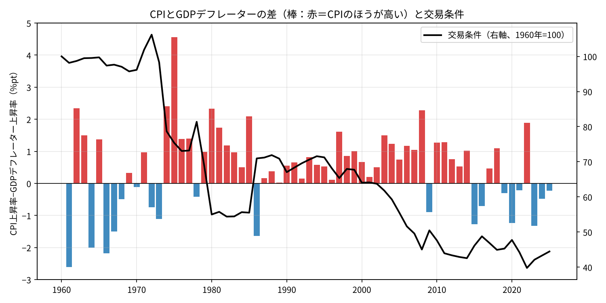
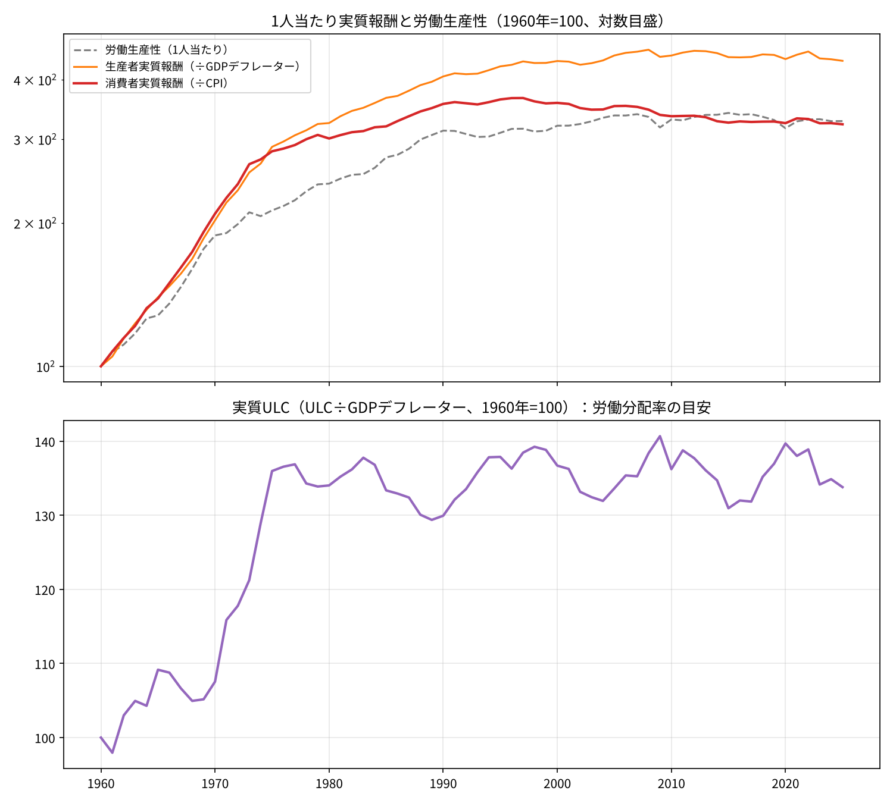
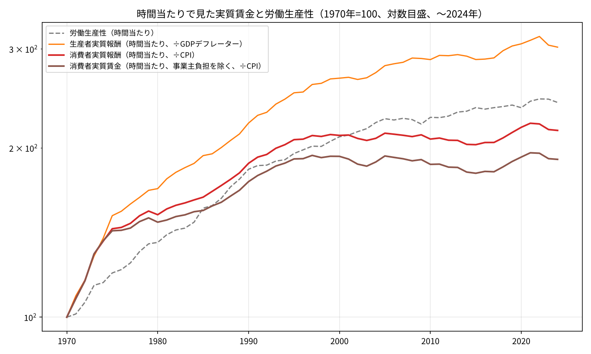

# 生産性は3割伸びたのに、手取りは1割──60年分のデータで「消えた実質賃金」を捜査する

※ この記事は、OECD「Economic Outlook」の日本の年次データ（1960〜2025年）を使って計算しています。

「日本は生産性が伸びても賃金が上がらない国だ」という話を、何度も聞いたことがあると思います。

でも、ちょっと待ってください。その「賃金」は何で割った実質賃金でしょうか。「生産性」は1人当たりでしょうか、時間当たりでしょうか。物差しを変えると、話がずいぶん変わってきます。

きっかけは、ふと浮かんだ素朴な疑問でした。

> 日本って、1960年代からずっと「CPI（消費者物価）の上昇率＞GDPデフレーターの上昇率」だったの？ それとも交易条件がずっと悪化してたの？

調べ始めたら芋づる式に話が広がって、最後には「1990年以降、生産性の伸びの3分の2がどこへ消えたのか」という事件の捜査になりました。今回はその記録です。

結論を先に書いておきます。

- 「CPI＞GDPデフレーター」が当たり前になったのは**1980年ごろから**です。1960年代はむしろ互角で、デフレーターのほうが高い年もありました。
- 交易条件はずっと下がり続けたわけではありません。大きく下がったのは、**石油危機（1970年代）、資源高（2000年代）、2021〜22年**の3回です。
- 1990〜2024年の時間当たりの数字では、**労働生産性は＋31.5％**、GDPデフレーターで割った**生産者実質報酬は＋36.5％**伸びました。ところが、事業主負担を除いてCPIで割った**手取り側の実質賃金は＋9.5％**にとどまりました。
- 消えた約22ポイントの主犯は「**CPIとGDPデフレーターのギャップ**」、約5ポイントの共犯は「**社会保険料の事業主負担**」です。よく疑われる「**労働分配率の低下**」は、少なくともこの物差しでは無罪でした。

## 捜査1：CPIとGDPデフレーター、いつから差がついた？

まず、そもそもの疑問から確かめます。

CPIは「家計が買うモノやサービスの値段」です。GDPデフレーターは「国内で生み出した付加価値の値段」です。いちばん大きな違いは輸入品の扱いです。

- CPIには、輸入品（ガソリン、輸入食品など）の値上がりがそのまま入ります。
- GDPデフレーターでは、輸入は差し引かれます。輸入品が値上がりすると、むしろデフレーターを押し下げる方向に働きます。

ですから、輸入品が高くなる（交易条件が悪くなる）と、CPIだけが上がってデフレーターは上がらない、つまり「CPI＞デフレーター」になりやすくなります。

棒グラフが「CPI上昇率−GDPデフレーター上昇率」で、赤がCPIのほうが高かった年です。黒い線が交易条件（輸出価格÷輸入価格）です。

10年ごとにまとめると、こうなりました。

- 1961〜69年：差の平均 −0.4ポイント（CPIのほうが高かったのは9年中4年）、交易条件 −4％
- 1970〜79年：＋0.9ポイント（10年中6年）、交易条件 −28％
- 1980〜89年：＋0.8ポイント（10年中9年）、交易条件 ＋3％
- 1990〜99年：＋0.7ポイント（**10年中10年**）、交易条件 −5％
- 2000〜09年：＋0.9ポイント（10年中9年）、交易条件 −26％
- 2010〜19年：＋0.4ポイント（10年中7年）、交易条件 −10％
- 2020〜25年：−0.3ポイント（6年中1年）、交易条件 −2％

というわけで、最初の疑問の答えは「**どちらもノー**」でした。

- 高度成長期の1960年代は、CPIもデフレーターも年5％前後で仲良く並走していました。交易条件もほぼ横ばいです。
- 「CPI＞デフレーター」が定着したのは1980年ごろからで、1980〜2014年の35年間のうち33年がそうでした。例外は、逆オイルショックと円高が重なった1986年と、資源価格が急落した2009年だけです。
- 2015年以降はデフレーターのほうが高い年が増え、2023〜25年は3年続けて逆転しています。

ここで1つ、気になる点が出てきました。1990年代は交易条件がほとんど動いていないのに、10年連続で「CPI＞デフレーター」です。これは後で「残された謎」として取り上げます。

## 捜査2：どっちの物価で割るかで、実質賃金は別物になる

次に、この物価のギャップが実質賃金にどう響くかを見ます。

雇用者1人当たりの報酬を、2つの物価で割ってみました。

- **消費者実質報酬**（÷CPI）：働く人の目線です。「その給料で、どれだけ買い物ができるか」を表します。
- **生産者実質報酬**（÷GDPデフレーター）：企業の目線です。「自社の製品で測って、どれだけの人件費を払っているか」を表します。

この2つに、労働生産性（1人当たり）を並べました。

上のグラフを見ると、オレンジ（生産者）と赤（消費者）の線は1960年代から70年代前半まではぴったり重なっています。離れ始めるのは1975年ごろからで、その後はどんどん差が開いていきます。

2025年時点の指数（1960年＝100）は、生産者実質報酬が438、消費者実質報酬が322です。**同じ給料なのに、物差しを変えるだけで約36％も差がつく**わけです。この差は、捜査1で見た「CPI−デフレーター」のギャップが60年分積み上がったものです。

年平均の伸び率で見ると、こうなります。

- 1960〜73年：消費者 ＋7.8％、生産者 ＋7.5％、生産性 ＋5.9％
- 1973〜90年：消費者 ＋1.7％、生産者 ＋2.8％、生産性 ＋2.4％
- 1990〜2012年：消費者 **−0.3％**、生産者 **＋0.6％**、生産性 ＋0.3％
- 2012〜25年：消費者 −0.3％、生産者 −0.4％、生産性 −0.2％

1990〜2012年は、企業の目線では賃金は生産性以上に伸びていました。ところが働く人の目線では、実質賃金はマイナスです。同じ時代を見ているのに、立っている場所によって景色がまるで違います。

## 捜査3：労働分配率は犯人か？

「生産性が伸びても賃金が上がらないのは、企業が利益をため込んで労働分配率が下がったからだ」という説明もよく聞きます。そこで、容疑者として取り調べてみました。

使ったのは「実質ULC」です。ULC（単位労働コスト）は、生産1単位当たりの人件費です。これをGDPデフレーターで割ると、付加価値のうち働く人に回った割合、つまり労働分配率の目安になります。

上のグラフの下の段が実質ULCです。

- 1960年の100から、1973年に121、1975年に136へと**一気に上がりました**。石油危機のさなかに大幅な賃上げが続いた、いわゆる「賃金爆発」の時期です。
- その後は、**130〜140のレンジでほぼ横ばい**です。2025年は134でした。

少なくとも国民経済計算の物差しで見る限り、1990年代以降に労働分配率がずるずる下がった、という形にはなっていません。**容疑者・労働分配率には、ひとまずアリバイがありました。**

## 捜査4：パートと社会保険料という「影の共犯」

ここまでは全部「1人当たり」の数字でした。でも1人当たりで見ると、短時間で働く人が増えるだけで賃金も生産性も下がって見えてしまいます。

実際、就業者1人当たりの年間労働時間は、1970年の2,243時間から、1990年に2,031時間、2024年には1,617時間まで減りました。1990年からの34年間で約2割減です。

そこで、**時間当たり**に直して見てみます。もう1つ、雇用者報酬には社会保険料の事業主負担も入っているので、それを**除いた賃金**の線も足しました。こちらのほうが、給与明細の額面に近い数字です。

年平均の伸び率は次の通りです。

- 1970〜90年：生産性 ＋3.1％、生産者実質報酬 ＋4.1％、消費者実質報酬 ＋3.2％、消費者実質賃金（事業主負担を除く）＋2.8％
- 1990〜2012年：生産性 ＋1.0％、生産者 ＋1.3％、消費者 ＋0.4％、事業主負担を除く ＋0.3％
- 2012〜24年：生産性 ＋0.5％、生産者 ＋0.3％、消費者 ＋0.3％、事業主負担を除く ＋0.3％

うれしいことに、時間当たりにすると「1990年以降の実質賃金マイナス」は消えて、小さいながらもプラスになります。1人当たりのマイナスのかなりの部分は、パート化と時短による見かけの効果だったわけです。

では、いよいよ1990〜2024年の累積で、事件の全体像をまとめます。

- 時間当たり労働生産性：**＋31.5％**
- 生産者実質報酬（÷デフレーター）：**＋36.5％**（生産性より上。分配率はむしろ少し上がっています）
- 消費者実質報酬（÷CPI）：**＋14.4％**（物差しをCPIに変えただけで約22ポイント消えます）
- 消費者実質賃金（事業主負担を除く）：**＋9.5％**（社会保険料の分で、さらに約5ポイント消えます）

社会保険料の重さは、別の数字でも確かめられます。雇用者報酬のうち賃金・俸給が占める割合は、1960年の0.977から、1990年に0.886、2025年に0.844へ下がりました。

## 捜査結果：消えた実質賃金の行方

生産性が3割伸びたのに、手取り側の実質賃金は1割しか伸びませんでした。消えた分の内訳は、ざっくりこうなります。

- **主犯：CPIとGDPデフレーターのギャップ（約22ポイント）**。日本が作るモノの値段に比べて、日本人が買うモノの値段のほうが速く上がり続けました。
- **共犯：社会保険料の事業主負担（約5ポイント）**。給料として払われる前に、保険料として引かれていく分が増えました。
- **無罪：労働分配率**。企業の目線で測った実質報酬は、生産性とほぼ同じか、それ以上に伸びていました。

前の記事「交易損失は賃金を下げるのか」では、2000年代のデフレの主役は交易条件というより国内の物価と賃金だった、と書きました。今回の60年分の捜査は、それと矛盾しません。むしろ補い合う関係です。

交易条件の悪化は、「デフレーターを下げる力」としてはそれほど大きくありませんでした。でも、「CPIとデフレーターのあいだにくさびを打ち込む力」としては、働く人の実感をしっかり削ってきた、ということになります。

## 残された謎（ここから湧いてくる疑問）

捜査を終えてみると、新しい謎がいくつも残りました。どれも続編のネタになりそうです。

### 謎1：1990年代、交易条件は動いていないのに、なぜCPIのほうが高かった？

1990年代の交易条件はほぼ横ばいでした。それなのに「CPI＞デフレーター」が10年連続で続いています。容疑者の候補は次の3つです。

- **投資財の値下がり**：GDPデフレーターには、パソコンや通信機器などの設備投資の価格が入ります。品質調整でどんどん値下がりしたこれらの財が、デフレーターだけを押し下げた可能性があります。
- **CPIの上方バイアス**：固定ウェイトの指数は、安くなった品物へ買い替える行動を反映しにくいため、物価を高めに出しやすい性質があります。
- **政府サービスなどの構成の違い**：デフレーターには、CPIにはほとんど入らない部分が含まれています。

GDPデフレーターを「消費」「投資」「政府」「輸出入」に分けて寄与度を見れば、どれが効いていたのか確かめられそうです。

### 謎2：高度成長期は、なぜギャップがなかった？

1960年代は「消費者物価は上がるのに卸売物価は横ばい」という、いわゆる生産性格差インフレの時代でした。サービスなど生産性の伸びにくい分野の値段が上がったのに、CPIとデフレーターの差はほとんどありません。

デフレーターのほうにも、同じくらいのサービス価格の上昇が入っていたから、と考えられます。ただ、きちんと確かめたわけではありません。

### 謎3：2023年からの「デフレーター＞CPI」は続くのか？

2023〜25年は3年続けて、デフレーターのほうがCPIより高くなりました。ここ40年あまりで初めての展開です。

もしこれが続けば、今回の主犯（ギャップ）が逆向きに働き、消費者実質賃金を押し上げる追い風になります。交易条件の持ち直しによる一時的なものなのか、企業の値上げ行動が変わった構造的なものなのか。今後のいちばんの見どころだと思います。

### 謎4：社会保険料は本当に「消えた」のか？

事業主負担は、手取りには入りません。でも、そのお金は年金や医療の給付として家計に戻ってきます。

「消えた5ポイント」は、働いている世代から引退した世代への移転とも言えます。家計全体の可処分所得や、社会保障の給付まで含めると、評価が変わるかもしれません。

### 謎5：1960年代の分配率の急上昇は本物か？

1960年代は、自営業や家族従業者から雇用者への移動が大きかった時代です。実質ULCの初期の上昇には、「雇われて働く人の割合が増えた」という構成変化も混じっているはずです。自営業の所得も労働の対価とみなして調整すると、景色が変わる可能性があります。

## 注意点

- **1人当たりの労働時間は「就業者」ベース**：OECDの労働時間は自営業者も含みます。雇用者だけの労働時間とは少しずれます。データは1970年からしかないため、1960年代の時間当たりの数字は出せていません。
- **パートの「時給の差」は残っている**：時間当たりにすると「労働時間が短い人が増えた」効果は消えます。ただ、パートの時給は一般労働者より低いため、パートの比率が上がるだけで平均時給は下がって見えます。この構成効果は残ったままです。生産性の側も同じ構成で計算しているので、分配率の比較にはあまり影響しませんが、実質賃金の水準は低めに出ている可能性があります。
- **労働分配率は目安**：「実質ULC」は雇用者報酬だけで計算しています。自営業の所得の扱いによって、分配率の水準は変わります。
- **2025年の値**：OECDの公表時点の推計値を含んでいる可能性があります。
- **交易条件はSNAベース**：ここで使った交易条件は、国民経済計算の輸出デフレーター÷輸入デフレーター（財とサービス）です。日本銀行の輸出入物価指数（財のみ）で計算した交易条件とは、細かい動きが少し違います。ただ、大きく下がった3つの時期は共通しています。

## データの取り方

- OECD「Economic Outlook No.119」（SDMX API、`OECD.ECO.MAD,DSD_EO@DF_EO,1.5`）の日本・年次データを使いました。 [https://sdmx.oecd.org/public/rest/dataflow/OECD.ECO.MAD](https://sdmx.oecd.org/public/rest/dataflow/OECD.ECO.MAD)
- 使った系列は次の通りです。
  - CPI：消費者物価指数
  - PGDP：GDPデフレーター
  - TTRADE：交易条件（財・サービス）
  - WSST：雇用者1人当たり報酬（事業主の社会負担を含む）
  - WRT：雇用者1人当たり賃金・俸給（事業主負担を含まない）
  - ULC：経済全体の単位労働コスト
  - HRS：就業者1人当たり年間労働時間（1970〜2024年）
- 計算方法は次の通りです。
  - 消費者実質報酬＝WSST÷CPI
  - 生産者実質報酬＝WSST÷PGDP
  - 労働生産性（1人当たり）＝WSST÷ULC
  - 実質ULC＝ULC÷PGDP
  - 時間当たりの系列は、それぞれをHRSで割って求めました。
  - 10年ごとの平均や累積の伸び率は、上のデータから自分で計算しました。
- 確認のため、世界銀行 WDI のCPI・GDPデフレーターの前年比と、日本銀行の輸出・輸入物価指数（円ベース）から計算した交易条件も見比べました。結論は変わりません（世界銀行の系列は、1970年に旧SNAとの接続による段差があります）。 [https://data.worldbank.org/indicator/NY.GDP.DEFL.KD.ZG?locations=JP](https://data.worldbank.org/indicator/NY.GDP.DEFL.KD.ZG?locations=JP) ／ [https://www.stat-search.boj.or.jp/](https://www.stat-search.boj.or.jp/)
