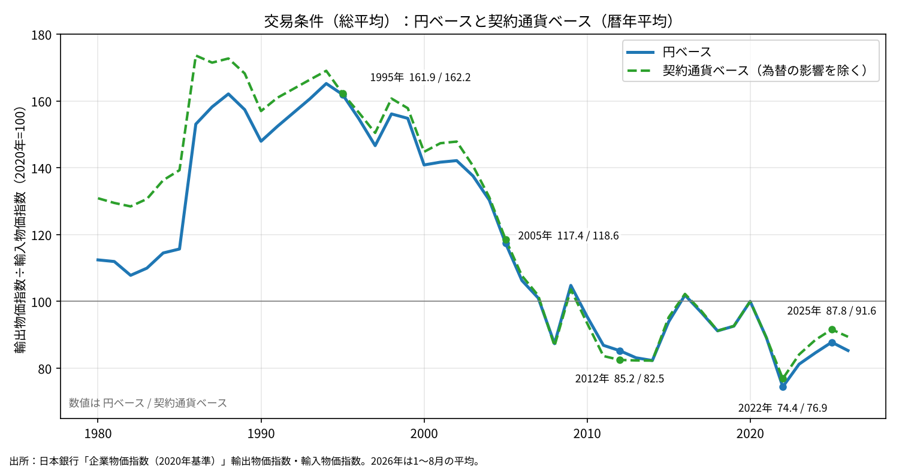
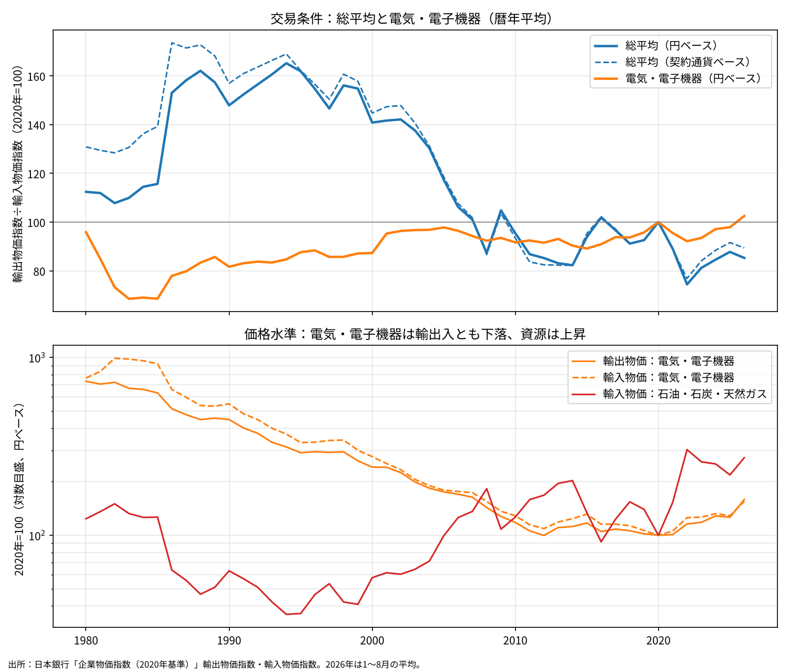
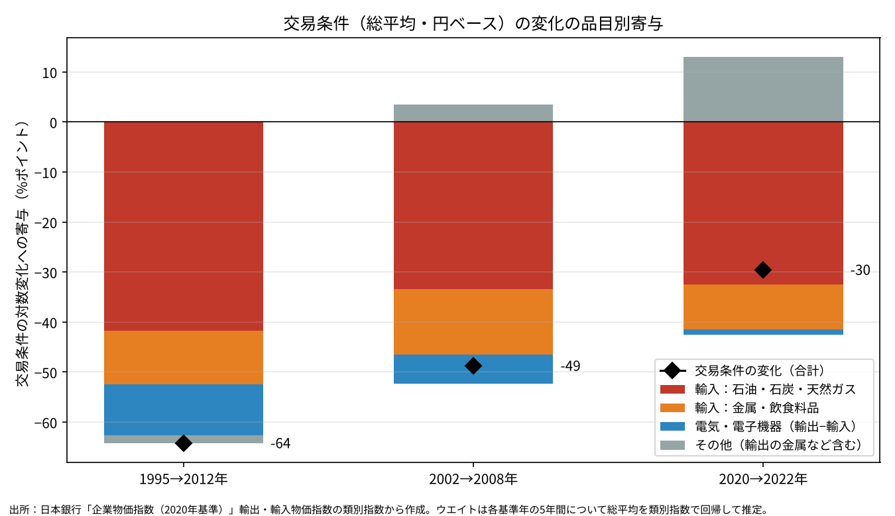

# 交易条件の悪化は何で起きたのか──輸出入物価指数の品目別寄与で見る資源価格と電気・電子機器

※ この記事は、日本銀行「企業物価指数（2020年基準）」の輸出物価指数・輸入物価指数（月次、1980年1月〜2026年8月）を使って計算している。

前回までの記事では、CPIとGDPデフレーターの差が実質賃金の伸びを押し下げてきたこと、そしてその差の一部に交易条件の悪化が関わっていることを見てきた。本稿では一歩戻って、交易条件の悪化そのものが何によって起きたのかを確かめる。

よく挙げられる説明は二つある。一つは原油・LNGなどの資源価格の上昇である。もう一つは、日本の主力輸出品である電子部品やIT機器の価格が、品質向上やアジア諸国との競争で下がり続けたという説明である。後者は「日本の価格決定力の低下」として語られることも多い。

結論を先に示す。

- 電気・電子機器だけで交易条件（輸出物価÷輸入物価）を計算すると、1995年以降ほとんど悪化していない。輸出価格も輸入価格も同じように約6割下落したためである。
- 総平均の交易条件は1995年から2012年にかけて約半分になった。品目別に寄与を分解すると、石油・石炭・天然ガスが約3分の2、金属・飲食料品の輸入が約6分の1を占める。
- 電気・電子機器は、品目内の交易条件は悪化していないが、輸出に占める比率が輸入より大きいため、構成の違いを通じて約6分の1の押し下げ要因になった。
- 為替の影響を除いた契約通貨ベースでも、総平均の交易条件は同じ形で悪化している。交易条件の悪化は円高・円安の問題ではなく、主に資源を中心とする一次産品価格の問題である。

## 1．交易条件と実質賃金の関係

最初に、交易条件が実質賃金にどう効くのかを整理しておく。消費者物価で測った実質賃金は、次のように分解できる。

> 実質賃金 ＝ 労働分配率 × 実質労働生産性 × （GDPデフレーター ÷ CPI）

輸入品の価格が上がると、CPIはその分だけ上がる。一方、GDPデフレーターは国内で生み出した付加価値の価格であり、輸入は控除項目なので、輸入価格の上昇はむしろGDPデフレーターを押し下げる方向に働く。その結果、最後の項（GDPデフレーター÷CPI）が小さくなり、分配率と生産性が変わらなくても実質賃金は下がる。これが交易条件悪化による実質賃金低下の基本的な仕組みである。

ここで、輸入コストの上昇を価格に転嫁する場合を二つに分けて考える。

- **輸出価格に転嫁する場合**：輸出品の価格はCPIに入らないが、GDPデフレーターは押し上げる。輸出企業の名目付加価値が増え、名目賃金を引き上げる余地が生まれる。輸入コストの一部を海外の買い手に負担させる形になるため、交易条件そのものが悪化しにくい。
- **国内価格に転嫁する場合**：国内の販売価格が上がるので、GDPデフレーターもCPIも上がる。両者の比率はあまり変わらず、実質賃金の目減りは残る。負担するのは国内の家計と企業であり、国全体としての交易損失は消えない。

つまり、輸出価格への転嫁と国内価格への転嫁の違いは、「CPIが上がりにくいかどうか」の違いとして表れる。その差がそのまま、国全体の実質所得が守られるかどうかの差になる。

なお、GDPデフレーターが上がれば交易条件が改善する、という関係は一般には成り立たない。因果の向きは「交易条件の改善がGDPデフレーターを押し上げる」であり、国内の物価全般の上昇（いわゆるホームメイドインフレ）は、輸出入の相対価格を変えない限り交易条件を改善しない。例外は、国内の価格上昇が円建ての輸出価格にも及ぶ場合である。

## 2．為替と輸出価格の設定

日本の輸出企業には、為替が動いても外貨建ての販売価格をあまり変えない傾向がある。これを市場別価格設定（PTM：Pricing to Market）という。

PTMのもとでは、円高になると円建ての輸出価格がそのまま下がり、輸出企業の名目付加価値と賃上げの余力が削られる。過度の円高が国内のデフレ圧力を強めるのは、この経路を通じてである。

ただし、円高は交易条件を必ずしも悪化させない。日本の輸入も多くがドルなどの外貨建てであり、円高になれば円建ての輸入価格も同じように下がるからである。円高の影響は、交易条件よりも、輸出企業から輸入企業・消費者への所得の移転や、輸出数量の減少、生産の海外移転といった分配と数量の面に強く表れる。

裏返すと、円安局面では円建ての輸出価格が上がり、輸出企業の収益は大きく増える。2013年以降や2022年以降はその典型である。それでも賃金の伸びが限られたのは、価格転嫁の問題とは別に、企業収益から賃金への分配の問題があったと考えられる。

この点は、データでも確かめられる。円ベースと契約通貨ベース（為替の影響を除いたもの）で総平均の交易条件を比べると、次のようになる（2020年＝100）。

- 1995年：円ベース 161.9、契約通貨ベース 162.2
- 2005年：円ベース 117.4、契約通貨ベース 118.6
- 2012年：円ベース 85.2、契約通貨ベース 82.5
- 2022年：円ベース 74.4、契約通貨ベース 76.9
- 2025年：円ベース 87.8、契約通貨ベース 91.6

1990年代後半以降、二つの系列はほぼ重なっている。交易条件の大きな悪化は、為替の動きではなく、外貨建ての価格そのものの変化によって起きたことになる。

## 3．電気・電子機器の交易条件は悪化していない

では、電子機器の価格下落は交易条件を悪化させたのか。電気・電子機器の輸出物価と輸入物価、そしてその比率を見る。

上段が交易条件、下段が価格水準（対数目盛）である。

電気・電子機器の価格は、1995年から2010年にかけて、輸出で291から118へ（約59％の下落）、輸入で332から129へ（約61％の下落）下がった（いずれも円ベース、2020年＝100）。品質調整を含む価格の低下は世界共通の現象であり、日本が輸出する電子機器も、日本が輸入する電子機器も、同じ速さで安くなっている。

そのため、電気・電子機器だけで計算した交易条件は、次のようにほぼ横ばいで推移した。

- 1995年：87.6
- 2005年：97.8
- 2010年：91.7
- 2012年：91.5
- 2022年：92.2
- 2025年：97.9

契約通貨ベースでも、1995年の92.6、2010年の93.0、2022年の95.0と、同じく横ばいである。「アジアとの競争で電子機器の価格が下がり、日本の交易条件が悪化した」という説明は、品目の中で見る限り支持されない。

一方、同じ期間に総平均の交易条件は1995年の161.9から2012年の85.2まで、ほぼ半分になった。下段のグラフが示すとおり、この間に石油・石炭・天然ガスの輸入物価は36から168へ、約4.6倍に上昇している。2022年には303に達した。

## 4．品目別の寄与に分解する

ただし、品目内の交易条件が悪化していなくても、全体の交易条件に影響しないとは限らない。輸出と輸入で、各品目の比率（ウエイト）が違うからである。

推計したウエイトでは、電気・電子機器は1995〜2000年代前半に輸出全体の約35％を占めていたのに対し、輸入では17〜25％程度だった。同じ率で値下がりしても、輸出側の比率が大きい分だけ、総平均では輸出物価が輸入物価より強く押し下げられる。

そこで、総平均の交易条件の変化を品目別の寄与に分解した。方法は第6節に記す。

数字は交易条件の対数変化（％ポイント）への寄与である。

**1995→2012年（合計 −64.2）**

- 輸入：石油・石炭・天然ガス −41.8
- 輸入：金属・飲食料品 −10.7
- 電気・電子機器（輸出側 −29.4、輸入側 ＋19.1、差し引き −10.3）
- その他 −1.5（輸出の金属 ＋3.5 などを含む）

**2002→2008年（合計 −48.7）**

- 輸入：石油・石炭・天然ガス −33.4
- 輸入：金属・飲食料品 −13.1
- 電気・電子機器（差し引き）−5.7
- その他 ＋3.6

**2020→2022年（合計 −29.5）**

- 輸入：石油・石炭・天然ガス −32.5
- 輸入：金属・飲食料品 −8.9
- 電気・電子機器（差し引き）−1.1
- その他 ＋13.0（輸出価格の上昇）

1995〜2012年の悪化のうち、石油・石炭・天然ガスが約3分の2、金属・飲食料品を合わせた一次産品全体では8割強を占める。電気・電子機器は約6分の1で、これは品目内の交易条件の悪化ではなく、輸出入の構成の違いによるものである。2020〜2022年の悪化は、資源価格だけで全体を上回る大きさで、他の輸出品の値上がりが一部を相殺した。

## 5．まとめと残る論点

- 日本の交易条件の悪化は、主に資源を中心とする一次産品の価格上昇によって起きた。1995〜2012年では、石油・石炭・天然ガスが約3分の2、金属・飲食料品を含めると8割強を占める。
- 電気・電子機器の交易条件は、輸出入ともに同じ速さで値下がりしたため、品目内ではほとんど悪化していない。総平均への影響は、輸出に占める比率が輸入より大きいという構成の違いを通じたもので、寄与は約6分の1にとどまる。
- 為替の影響を除いた契約通貨ベースでも、交易条件の動きは円ベースとほぼ同じである。円高はPTMを通じて輸出企業の名目付加価値を圧迫するが、輸入価格も同時に下げるため、交易条件への影響は小さい。
- したがって、交易条件の悪化による実質賃金の低下は、ほぼ資源価格の上昇によるものと整理できる。

残る論点もある。

- **品質調整による価格下落の評価**：電子機器の価格下落の多くは品質向上を反映したものであり、実質所得の損失と同じ意味を持つかは別に検討が必要である。構成効果による約6分の1の押し下げも、厚生の損失としては過大に表れている可能性がある。
- **サービス貿易**：輸出入物価指数は財のみを対象とする。国民経済計算の交易条件はサービスを含むため、時期によって動きが異なる。
- **実質賃金の他の要因**：前々回の記事で見たとおり、CPIとGDPデフレーターの差には、交易条件以外にも投資財価格や指数の作り方の違いが関わる。交易条件の悪化がほぼ資源価格によるものだとしても、実質賃金の伸び悩みのすべてが資源価格で説明できるわけではない。

## 6．注意点

- **ウエイトは推計値**：輸出入物価指数の類別ウエイトは、日本銀行が基準改定ごとに公表しているが、本稿では時系列APIから直接取得できなかった。そこで、1995・2000・2005・2010・2015・2020年の各基準年から5年間について、総平均指数を類別指数（基準年＝1に換算）で非負最小二乗回帰し、ウエイトを推計した。推計値の合計はいずれの期間も1.000で、総平均の当てはまりの誤差は最大でも0.25％以内だった。ただし、公表ウエイトとは細部で異なる可能性がある。
- **寄与の計算方法**：各年の寄与は、前年が属する基準期間のウエイトを使い、類別指数の変化をウエイトで加重して求めた。その合計が総平均の対数変化に一致するよう比例配分している。厳密な寄与度分解ではなく、近似である。
- **円ベースでの分解**：寄与の分解は円ベースで行っている。1995〜2012年は円高の時期を含むが、第2節のとおり、契約通貨ベースでも交易条件の形はほぼ同じである。
- **「金属」の中身**：輸入の金属・同製品には、非鉄金属や鉄鉱石関連など一次産品に近い品目が多く含まれる。本稿ではこれを飲食料品とともに「一次産品に近いもの」として扱ったが、加工度の高い製品も一部含まれる。
- **年平均値**：すべて暦年平均で計算している。2026年は1〜8月の平均である。
- **基準年の接続**：日本銀行が2020年基準で接続した長期系列を使っている。

## データの取り方

- 日本銀行 時系列統計データ検索サイトのAPI（DB：PR01 企業物価指数）から、2020年基準の接続系列を取得した。 [https://www.stat-search.boj.or.jp/](https://www.stat-search.boj.or.jp/)
- 使った系列は次のとおり。
  - 輸出物価指数（円ベース）総平均：PRCG20_2400000000
  - 輸出物価指数（契約通貨ベース）総平均：PRCG20_2300000000
  - 輸入物価指数（円ベース）総平均：PRCG20_2600000000
  - 輸入物価指数（契約通貨ベース）総平均：PRCG20_2500000000
  - 輸出物価指数 類別（円ベース）：繊維品、化学製品、金属・同製品、はん用・生産用・業務用機器、電気・電子機器（PRCG20_2400520001）、輸送用機器、その他産品・製品
  - 輸入物価指数 類別（円ベース）：飲食料品・食料用農水産物、繊維品、金属・同製品、木材・木製品・林産物、石油・石炭・天然ガス（PRCG20_2600520001）、化学製品、はん用・生産用・業務用機器、電気・電子機器（PRCG20_2600820001）、輸送用機器、その他産品・製品
  - 電気・電子機器の契約通貨ベース：輸出 PRCG20_2300520001、輸入 PRCG20_2500820001
- 交易条件は「輸出物価指数÷輸入物価指数×100」として、暦年平均から計算した。ウエイトの推計と寄与の分解は、上のデータから自分で計算した。
