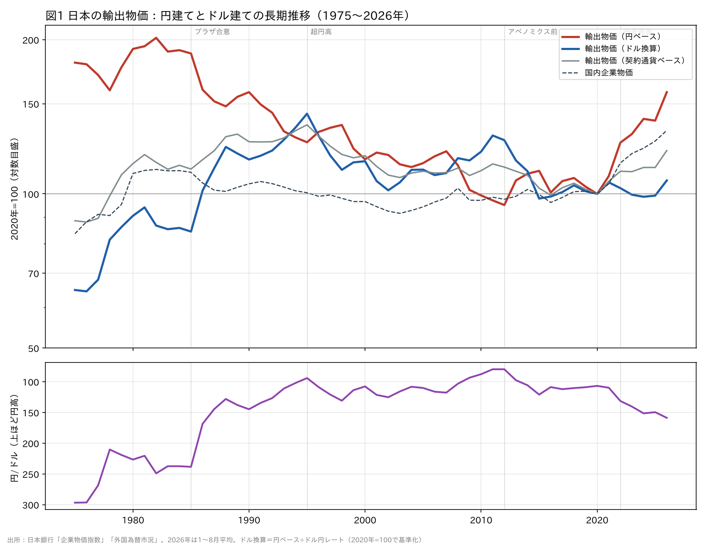
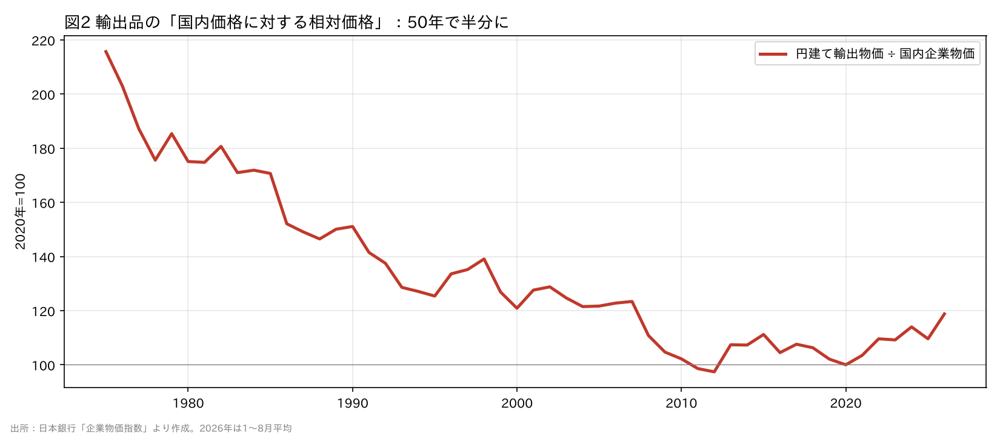
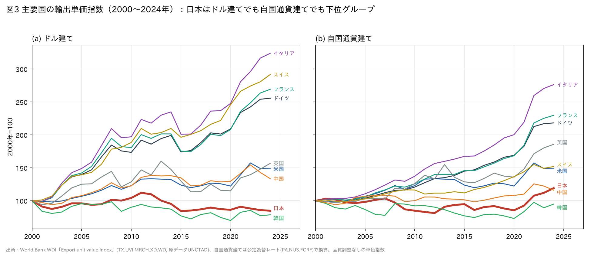
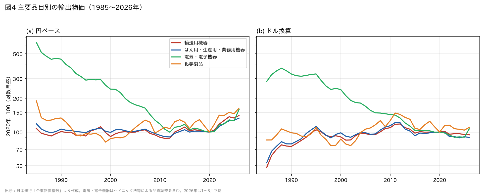
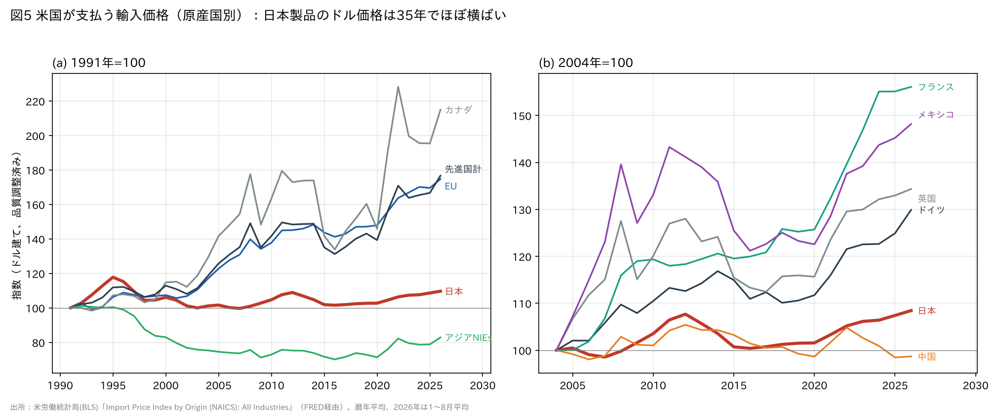
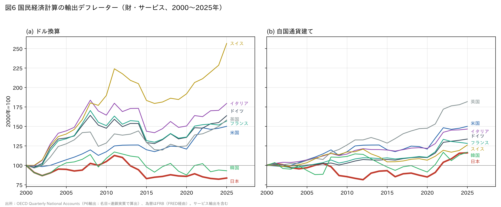
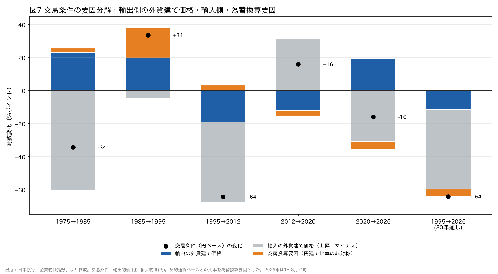
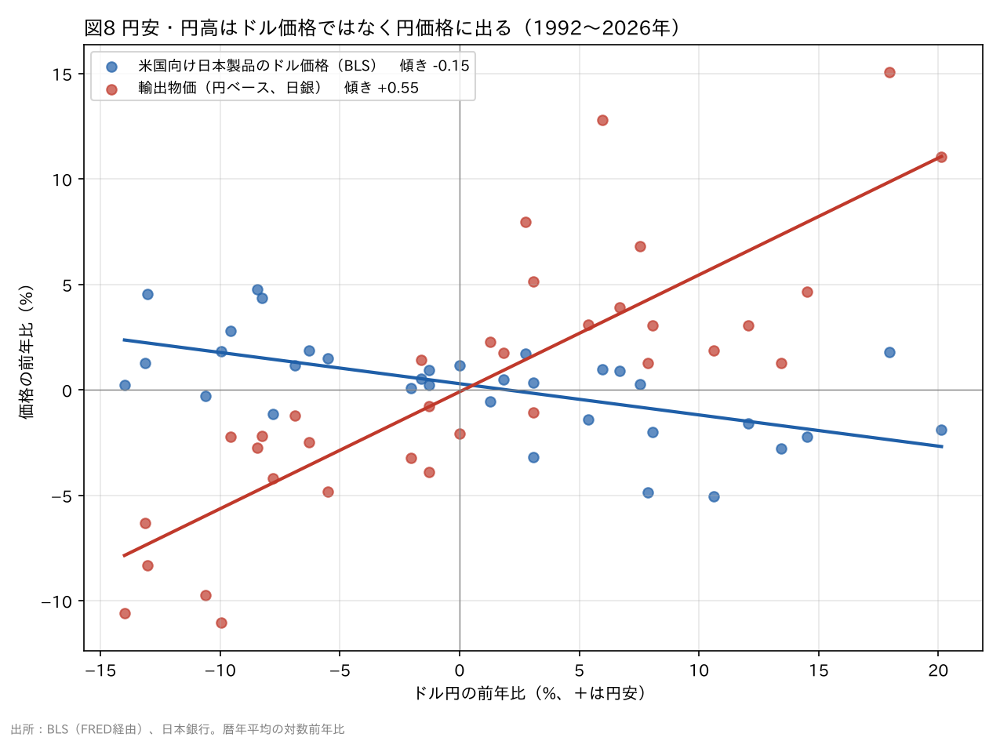

# 日本の輸出価格は円建てで低いのか、ドル建てで低いのか──長期推移と国際比較

※ この記事は、日本銀行「企業物価指数（2020年基準）」の輸出・輸入物価指数（1975年〜2026年8月）、世界銀行の輸出単価指数、米国労働統計局（BLS）の原産国別輸入物価指数、OECDの国民経済計算をもとに計算している。

前回の記事では、日本の交易条件の悪化は主に資源を中心とする一次産品価格の上昇によって起きたことを確かめた。本稿では輸入側をいったん脇に置き、輸出側だけを取り上げる。

問いは次のとおりである。日本の輸出価格が伸びていないとして、それは円建ての輸出価格が低いのか、それともドル建て（外貨建て）の輸出価格が低いのか。前者なら「円安を価格に生かせていない」という為替の問題に近く、後者なら「海外で値上げできない」という価格支配力の問題になる。

結論を先に示す。

- 低いのはドル建ての輸出価格である。米国が日本から買う製品のドル価格（品質調整済み）は、1991年から2026年までの35年間で約1割しか上がっていない。同じ期間に、EUからの輸入品は約75％、先進国全体からの輸入品は約77％上がった。
- 円建ての輸出価格は、ドル建て価格がほぼ据え置かれたまま、為替の動きに合わせて上下してきた。円高期に大きく下がり、2020年代の円安期に膨らんだのは、そのためである。円ドルレートが1％円安になると、米国向け日本製品のドル価格は0.15％しか動かず、円建ての輸出物価は0.55％上がる。
- 交易条件は、ドル建てで取引される部分では為替が分子と分母で打ち消し合うため、輸出側については外貨建ての価格で決まる。1995年から2026年にかけての交易条件の悪化（対数で−64ポイント）のうち、輸出の外貨建て価格の伸び悩みが−12ポイント、円建て契約比率の輸出入の違いによる為替換算要因が−5ポイントだった。
- 品質調整済みの国民経済計算の輸出デフレーターで比べても、日本は2000〜2025年に自国通貨建てで＋16％、ドル換算で−16％と、主要国の中で最も伸びが小さい。

## 1．問いの整理：交易条件を決めるのは外貨建ての価格

円建ての輸出価格、ドル建ての輸出価格、為替レートには、おおよそ次の関係がある。

> 円建て輸出価格 ≒ ドル建て輸出価格 × 円ドルレート

一方、交易条件は輸出物価を輸入物価で割ったものである。輸出も輸入もドル建てで取引されているなら、次のように為替が消える。

> 交易条件 ＝（輸出ドル価格 × 為替）÷（輸入ドル価格 × 為替）＝ 輸出ドル価格 ÷ 輸入ドル価格

したがって、円安で円建ての輸出価格がいくら上がっても、輸入価格も同じだけ上がるので、交易条件は改善しない。交易条件の輸出側を決めているのは、外貨建ての価格である。為替が交易条件に直接効くのは、円建てで契約される比率が輸出と輸入で違う部分だけである（第7節で確かめる）。

本稿では、日本銀行の輸出物価指数のうち、円ベースの指数と、契約通貨ベースの指数を使う。さらに、円ベースの指数を円ドルレートで割った「ドル換算」の指数も作る。契約通貨ベースにはドル建てのほかユーロ建てや円建ての契約も含まれるため、ドルでの値段の動きを見るには、ドル換算のほうが分かりやすい。

## 2．長期推移：ドル換算の輸出物価は1995年がピーク

図1の上段は輸出物価の三つの系列と国内企業物価、下段は円ドルレート（上ほど円高）である。期間ごとの変化（対数、％ポイント）は次のとおり。

**1975→1985年**

- 円建て ＋4、ドル換算 ＋26、契約通貨建て ＋23
- 円の対ドル上昇 ＋22、国内企業物価 ＋28

**1985→1995年（プラザ合意後の円高期）**

- 円建て −40、ドル換算 ＋53、契約通貨建て ＋20
- 円の対ドル上昇 ＋93、国内企業物価 −9

**1995→2012年（デフレと円高の時期）**

- 円建て −28、ドル換算 −12、契約通貨建て −19
- 円の対ドル上昇 ＋16、国内企業物価 −3

**2012→2020年（円安への転換期）**

- 円建て ＋5、ドル換算 −24、契約通貨建て −12
- 円の対ドル上昇 −29、国内企業物価 ＋2

**2020→2026年（急速な円安期）**

- 円建て ＋46、ドル換算 ＋6、契約通貨建て ＋20
- 円の対ドル上昇 −40、国内企業物価 ＋29

**1995→2026年（30年間の通算）**

- 円建て ＋23、ドル換算 −30、契約通貨建て −12
- 円の対ドル上昇 −52、国内企業物価 ＋28

時期によって、輸出企業の値付けの仕方が違う。

- 1985〜1995年には、円が93ポイント上がったのに、ドル換算の輸出価格は53ポイントしか上がらなかった。円高の4割強は値上げせずに輸出企業が吸収し、その分、円建ての輸出価格は40ポイント下がった。
- 2012〜2020年には、円安のほとんどがドル価格の低下（−24）に回り、円建ての価格はほぼ横ばい（＋5）だった。
- 2020年以降は逆に、ドル価格をほぼ据え置き（＋6）、円建ての受取額を増やした（＋46）。世界的にインフレが起きたこの時期にも、ドル換算の輸出価格はほとんど上がっていない。

30年間を通してみると、ドル換算の輸出物価は1995年をピークに約3割下がり、2025年には1990年の水準を下回っている。

図2は、円建ての輸出物価を国内企業物価で割ったものである。1975年の216から2012年の97、2020年の100へと、約半分になった。円建てで見ても、輸出品は国内向けの製品に比べて安く売られるようになってきたことになる。2020年以降の上昇（2026年は119）は、円安によるものである。

## 3．国際比較（1）：輸出単価指数

国際比較には、まず世界銀行の輸出単価指数（UNCTADのデータ）を使う。輸出額を数量で割った単価の指数で、ドル建てである。2000年から2024年までの変化は次のとおり。

**ドル建て**

- 日本 −15％、韓国 −21％、中国 ＋34％
- 米国 ＋49％、英国 ＋57％
- ドイツ ＋156％、フランス ＋169％、スイス ＋192％、イタリア ＋224％

**自国通貨建て（公定為替レートで換算）**

- 日本 ＋19％、韓国 −5％、中国 ＋16％
- 米国 ＋49％、英国 ＋86％、スイス ＋52％
- ドイツ ＋118％、フランス ＋130％、イタリア ＋176％

日本はドル建てでも自国通貨建てでも、韓国・中国とともに下位にある。日本銀行の指数から作ったドル換算の輸出物価も、2000年から2024年に−15％で、世界銀行の値とほぼ一致する。

ただし、単価指数は品質調整をしておらず、輸出品目の構成が変わるとそれだけで動く。欧州の大きな上昇には、医薬品などの高単価品の比率が高まった効果も含まれていると考えられる。この点は第5節で、品質調整済みのデータを使って確かめ直す。

## 4．品目別：機械類のドル価格は2012年から約2割低下

主な品目について、円ベースとドル換算の輸出物価を見る（2020年＝100、1985年→1995年→2012年→2025年）。

**輸送用機器**

- 円ベース：108 → 92 → 88 → 133
- ドル換算：48 → 105 → 118 → 95

**はん用・生産用・業務用機器**

- 円ベース：119 → 99 → 90 → 127
- ドル換算：53 → 112 → 121 → 91

**電気・電子機器**

- 円ベース：632 → 291 → 100 → 126
- ドル換算：283 → 330 → 133 → 90

**化学製品**

- 円ベース：190 → 97 → 107 → 146
- ドル換算：85 → 110 → 144 → 104

輸送用機器とはん用・生産用・業務用機器は、ドル換算で2011〜2012年に最も高くなり、2025年までに約2割下がった。円ベースは2020年以降に3割前後上がっているが、これはほぼ円安によるものである。電気・電子機器は、品質調整を含む世界共通の値下がりで、円ベースでもドル換算でも長期的に下がり続けている。化学製品や金属は市況に連動して上下するため、構造的にドル価格が上がっていないのは機械類である。

## 5．国際比較（2）：品質調整済みのデータで確かめる

### 米国が支払う輸入価格（原産国別）

品質を調整したうえで、各国の製品のドル価格を直接比べられるデータがある。米国労働統計局（BLS）が作っている、原産国別の輸入物価指数である。米国の輸入業者が実際に支払うドル建ての価格を、品質の変化を調整して指数にしたものだ。

1991年から2026年（1〜8月平均）の変化は次のとおり。

- 日本 ＋10％
- EU ＋75％、先進国全体 ＋77％、カナダ ＋115％
- アジアNIEs（韓国・台湾・香港・シンガポール）−17％

2004年から2026年の変化は次のとおり。

- 日本 ＋8％、中国 −1％
- ドイツ ＋30％、英国 ＋34％、メキシコ ＋48％、フランス ＋56％

同じ2004年から2026年に、米国自身の輸出物価は＋58％上がった。米国の買い手から見ると、日本製品のドル価格は35年間ほぼ横ばいだった。

### 国民経済計算の輸出デフレーター

もう一つ、品質調整を含む指標として、OECDの国民経済計算から輸出デフレーター（名目輸出÷実質輸出）を計算した。サービス輸出も含む点には注意が必要である。

2000年から2025年の変化は次のとおり。

**自国通貨建て**

- 日本 ＋16％、韓国 ＋17％
- スイス ＋26％、フランス ＋28％、ドイツ ＋34％
- イタリア ＋47％、米国 ＋50％、英国 ＋82％

**ドル換算**

- 日本 −16％、韓国 −7％
- 米国 ＋50％、フランス ＋57％、英国 ＋58％、ドイツ ＋64％
- イタリア ＋80％、スイス ＋157％

品質調整済みのデータでは、欧州の伸びは単価指数ほど大きくない。ドイツの自国通貨建ての伸びは、単価指数の＋118％に対し、デフレーターでは＋34％である。それでも日本の伸びはドイツの約半分、米国の約3分の1で、主要国の中で最も小さい。しかも日本の＋16％は、2021年以降の円安でほとんどが生じたものであり、2020年の時点では2000年より15％低かった。

ドル換算では差がさらに広がる。日本の自国通貨建ての伸びが小さいことに加えて、2000年以降に円がドルに対して下がり、ユーロやスイスフランは上がったためである。

## 6．交易条件の要因分解

ここで交易条件に戻る。円ベースの交易条件は、次のように分解できる。

> 交易条件（円ベース）＝ 契約通貨ベースの交易条件 × 為替換算要因

為替換算要因は、輸出物価と輸入物価のそれぞれについて円ベースを契約通貨ベースで割り、その比をとったものである。輸出と輸入で円建て契約の比率が同じなら、為替換算要因は為替が動いても変わらない。

期間ごとの分解（対数、％ポイント）は次のとおり。

**1975→1985年**：交易条件 −34

- 輸出の外貨建て価格 ＋23、輸入の外貨建て価格 −60、為替換算要因 ＋3

**1985→1995年**：交易条件 ＋34

- 輸出の外貨建て価格 ＋20、輸入の外貨建て価格 −5、為替換算要因 ＋18

**1995→2012年**：交易条件 −64

- 輸出の外貨建て価格 −19、輸入の外貨建て価格 −49、為替換算要因 ＋4

**2012→2020年**：交易条件 ＋16

- 輸出の外貨建て価格 −12、輸入の外貨建て価格 ＋31、為替換算要因 −3

**2020→2026年**：交易条件 −16

- 輸出の外貨建て価格 ＋20、輸入の外貨建て価格 −31、為替換算要因 −5

**1995→2026年（30年間の通算）**：交易条件 −64

- 輸出の外貨建て価格 −12、輸入の外貨建て価格 −48、為替換算要因 −5

※ 輸入の外貨建て価格は、上昇すると交易条件を下げるので、符号を反転して示している。

為替換算要因は、円安が1％進むと交易条件を約0.11％押し下げる。年次データの回帰では、円安1％あたり、円ベースの輸出物価は契約通貨ベースに比べて0.64％、輸入物価は0.75％上がる。これは輸出入の通貨別比率とほぼ一致する。税関の「貿易取引通貨別比率」によると、2026年上半期の円建て比率は、輸出で34.7％、輸入で24.7％である。円建てでない部分は輸出で約65％、輸入で約75％となり、回帰の値と合う。ただし、30年間の通算での影響は−5ポイントで、大きくはない。

30年間の交易条件の悪化の大部分は、前回の記事で見たとおり輸入側（資源）による。そのうえで、輸出の外貨建て価格も−12ポイントと、上がるどころか下がっている。米国の原産国別輸入物価で、1995年から2026年に日本製品のドル価格が−7ポイントだったのに対し、先進国からの工業品は＋36ポイント、EUからの工業品は＋46ポイントだった。日本の輸出品のドル価格は、競合国に比べて40〜50ポイント伸び負けたことになる。

この差が交易条件をどれだけ押し下げたかは、比べる品目の範囲によって変わる。「実質円安と賃金」の記事では、2000〜2019年について、電気・電子機器を除く輸出品にこの差を当てはめ、交易条件の悪化の2〜4割と試算した。資源価格ほどではないが、無視できない大きさである。

## 7．円安・円高はドル価格ではなく円価格に出る

最後に、為替が動いたとき、輸出価格のどこが動くのかを確かめる。

1992年から2026年の年次データで、円ドルレートの変化率に対する価格の変化率を回帰した。

- 米国向け日本製品のドル価格（BLS）：円安1％あたり −0.15％
- 円ベースの輸出物価（日本銀行）：円安1％あたり ＋0.55％

円安になっても、米国の買い手が払うドル価格は0.15％しか下がらない。円安分の約85％は値下げに回らず、輸出企業の円建ての受取額の増加になる。円高のときは、その逆で円建ての受取額が減る。

前年比の変動の大きさ（標準偏差）を見ても、米国向け日本製品のドル価格は2.3％、円ベースの輸出物価は6.2％、円ドルレートは9.3％である。ドル価格は企業が決めてあまり動かさず、円価格は為替に合わせて動く。日本の輸出企業が、販売先の市場の通貨で価格を決める市場別価格設定（PTM：Pricing to Market）を続けてきたことが、データからも確かめられる。

## 8．まとめと残る論点

- 日本の輸出価格の弱さは、ドル建て（外貨建て）の価格が上がらないことにある。米国向けの日本製品のドル価格は35年間で約1割しか上がっておらず、品質調整済みのデータでも、主要国の中で最も伸びが小さい。
- 円建ての輸出価格は、そのドル価格に為替を掛けた結果として動く。円高期には大きく下がり、円安期には膨らむ。国内物価に対する輸出品の相対価格が長期的に半分になったのは、主に円高期に、上がらないドル価格のもとで円建て価格が下がったためである。
- 交易条件の輸出側を決めるのは外貨建ての価格であり、円安で円建ての輸出価格が上がっても交易条件は改善しない。円建て契約の比率の違いによる為替換算要因は、円安1％あたり−0.11％の悪化で、30年通算でも−5ポイントにとどまる。
- 交易条件の悪化の主因は資源価格だが、輸出の外貨建て価格が競合国並みに上がらなかったことも、悪化の一部を説明する。

残る論点もある。

- **なぜドル価格を上げられなかったのか**：考えられる理由は三つある。一つは、為替が動いても販売先の価格を変えないPTMの行動である。二つ目は、高付加価値品の生産を海外に移し、日本からの輸出に中間財や量販品の比率が高まったことである。三つ目は、自動車・機械・電子部品など、韓国・中国と直接競合する品目が多いことである。アジアNIEsのドル価格も伸びていないことは、三つ目の理由と整合的である。どれがどれだけ効いたのかは、本稿のデータでは分けられない。
- **賃金との関係**：「実質円安と賃金」の記事で見たとおり、日本の賃金がドル建てで伸びなかったことと、輸出品のドル価格が伸びなかったことは、表裏の関係にある可能性がある。因果の向きは今後の検証課題である。
- **米国以外の市場**：BLSのデータは米国向けの輸出だけを対象とする。日本の輸出に占めるアジア向けの比率は大きく、そこでの価格の動きは別に確かめる必要がある。

## 9．注意点

- **ドル換算の作り方**：日本銀行の円ベース輸出物価指数を、円ドルレート（東京市場17時時点の月中平均）を2020年平均で基準化したもので割った。円建て契約の部分にも一律に為替を当てているため、実際のドル建て価格とは同じではない。
- **契約通貨ベースの中身**：契約通貨ベースには、ドル建てのほかユーロ建て・円建てなどの契約が含まれる。円建て契約の部分は、為替が動いても契約通貨ベースでは値が変わらない。
- **単価指数と価格指数の違い**：世界銀行の輸出単価指数は品質調整をしておらず、品目の構成の変化に影響される。日本銀行の輸出物価指数、BLSの輸入物価指数、国民経済計算のデフレーターは品質調整を含む。特に電子機器は、品質調整によって価格の下落が大きく表れる。
- **輸出デフレーターの範囲**：OECDの国民経済計算の輸出（P6）は財とサービスの合計である。サービス輸出の比率が高い英国などでは、財の価格とは動きが異なりうる。
- **回帰の期間**：第7節の回帰は暦年平均の前年比を使った単純な回帰で、2026年は1〜8月の平均である。
- **年平均値**：すべて暦年平均で計算している。2026年は1〜8月の平均である。
- **データの制約**：ドイツ連邦統計局（Destatis）の輸出物価指数、Eurostat、韓国銀行のデータは、今回の作業環境からは取得できなかった。そのため、ドイツと韓国は、BLSの原産国別データと国民経済計算のデフレーターで比較した。

## データの取り方

- 日本銀行 時系列統計データ検索サイトのAPI（DB：PR01 企業物価指数、FM08 外国為替市況）から取得した。 [https://www.stat-search.boj.or.jp/](https://www.stat-search.boj.or.jp/)
  - 輸出物価指数（円ベース）総平均：PRCG20_2400000000
  - 輸出物価指数（契約通貨ベース）総平均：PRCG20_2300000000
  - 輸入物価指数（円ベース）総平均：PRCG20_2600000000
  - 輸入物価指数（契約通貨ベース）総平均：PRCG20_2500000000
  - 国内企業物価指数 総平均：PRCG20_2200000000
  - 輸出物価指数 類別（円ベース・契約通貨ベース）：化学製品、金属・同製品、はん用・生産用・業務用機器、電気・電子機器、輸送用機器ほか（PRCG20_24xxxxxxxx、PRCG20_23xxxxxxxx）
  - 円ドルレート：東京市場 ドル・円 スポット 17時時点／月中平均（FXERM07）
- 世界銀行 World Development Indicators から、輸出単価指数（TX.UVI.MRCH.XD.WD、2015年＝100、原データはUNCTAD）と公定為替レート（PA.NUS.FCRF）を取得した。 [https://databank.worldbank.org/source/world-development-indicators](https://databank.worldbank.org/source/world-development-indicators)
- 米国労働統計局の原産国別輸入物価指数（JPNTOT、EECTOT、INDUSTOT、CANTOT、OASTOT、GERTOT、FRNTOT、UKTOT、CHNTOT、MEXTOT、INDUSMANU、EECMANU）と米国の輸出物価指数（IQ）、為替レート（DEXJPUS、DEXUSEU、DEXKOUS、DEXUSUK、DEXSZUS）を、FRED APIで取得した。 [https://fred.stlouisfed.org/series/JPNTOT](https://fred.stlouisfed.org/series/JPNTOT)
- OECD Quarterly National Accounts（DSD_NAMAIN1@DF_QNA）から、輸出（P6）の名目値と連鎖実質値を取得し、輸出デフレーターを計算した。 [https://sdmx.oecd.org/public/rest/data/OECD.SDD.NAD,DSD_NAMAIN1@DF_QNA,1.1](https://sdmx.oecd.org/public/rest/data/OECD.SDD.NAD,DSD_NAMAIN1@DF_QNA,1.1)
- 税関「貿易取引通貨別比率（令和8年上半期）」 [https://www.customs.go.jp/toukei/shinbun/tuuka/tuukar08fh.pdf](https://www.customs.go.jp/toukei/shinbun/tuuka/tuukar08fh.pdf)
- 交易条件は「輸出物価指数÷輸入物価指数×100」として、暦年平均から計算した。要因分解と回帰は、上のデータから自分で計算した。
