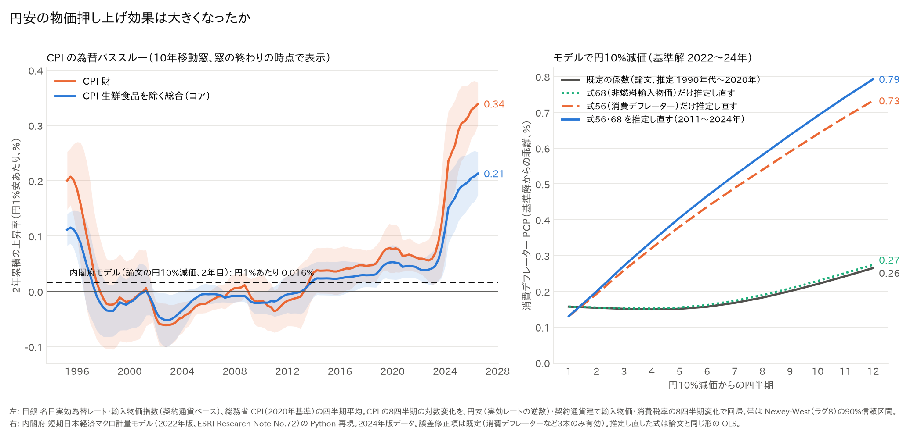
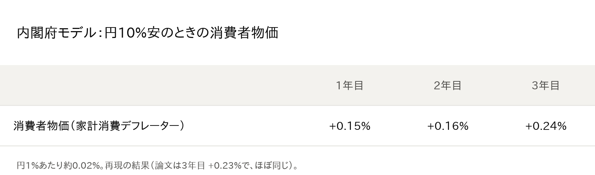
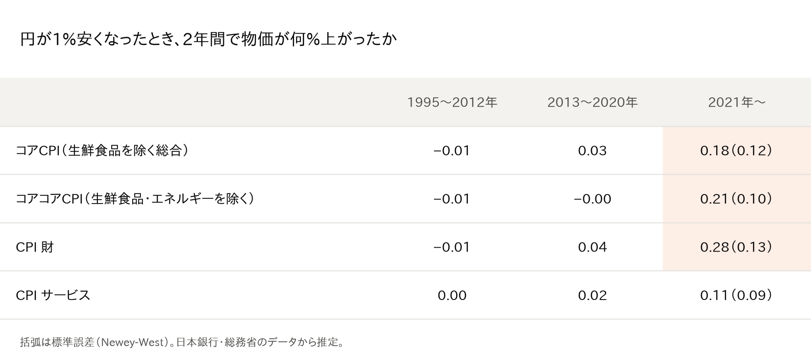
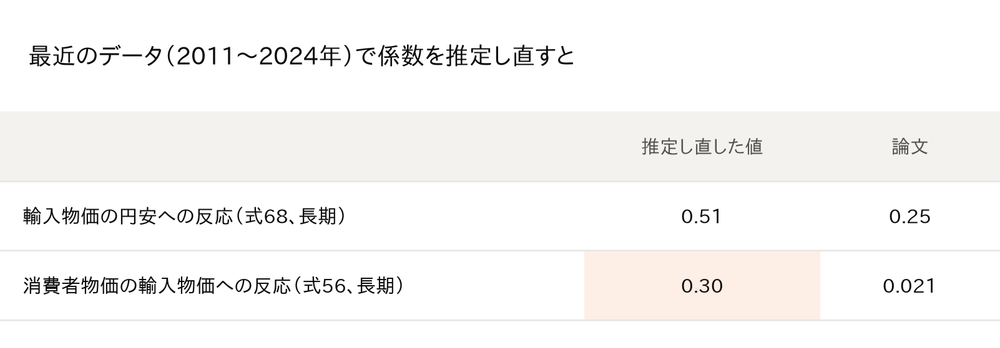
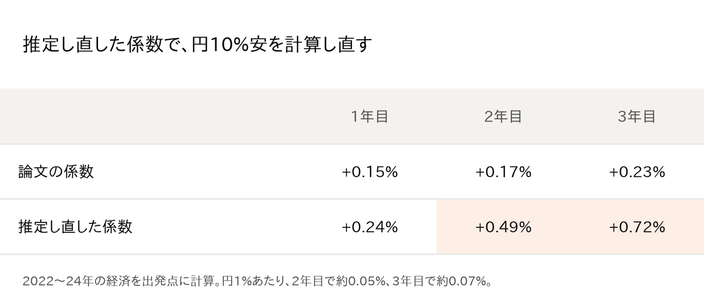

# 「円1%安で物価0.02%」はもう古い？ 内閣府モデルを再現して、円安の物価押し上げ効果を確かめてみた

※ この記事は、内閣府の「短期日本経済マクロ計量モデル（2022年版）」を Python で再現したもの（[p72/esri-short-run-macro-model](https://github.com/p72/esri-short-run-macro-model)）、日本銀行の輸入物価指数・名目実効為替レート（API）、総務省の消費者物価指数（e-Stat API）を使って計算しています。

## はじめに

「円安になっても物価はそれほど上がらない」。その根拠としてよく引かれるのが、内閣府の研究です。

> 円レートが1%下がっても、消費者物価指数は0.02%しか上がらない
> （酒巻哲朗他「短期日本経済マクロ計量モデル（2022年版）の構造と乗数分析」内閣府 ESRI Research Note No.72, 2022年12月）

一方で、こんな反論もあります。

> 最近はこの係数が大きくなっている。「円安の物価上昇力は弱い」というのは、企業が無理をして価格を据え置いていたデフレ期の統計による実証分析にすぎない。

どちらが正しいのでしょうか。私はこの内閣府モデル（152本の方程式）を Python で再現しています。そこで、このモデルと最新のデータを使って確かめてみました。

結論を先に書きます。

- **「円1%安で0.02%」は、モデルの性質としては正しい**。ただし、デフレ期を含むデータで推定した係数の結果です。
- **2021年以降のデータでは、円安の物価押し上げ効果は約10倍（円1%安で約0.2%）に大きくなっている**。
- ただし、近年はデータが短く、資源高と重なっているので、「10倍になった」と断定はできない。

## 1. 内閣府モデルでは、なぜ0.02%なのか

まず、モデルで「円が10%安くなった」場合を計算します。論文の結果は次のとおりで、私の再現もほぼ同じ数字になりました（3年目は論文 +0.23%、再現 +0.24%）。

円10%安で0.15〜0.24%なので、**円1%あたり約0.02%** です。

なぜこんなに小さいのか。モデルの中の経路を1本ずつ止めて調べると、効果のほとんどは「輸入物価 → 消費者物価」の直接の経路から来ていました。そして、この経路の係数が2か所で小さいのです。

1. **輸入物価が円安に反応しにくい**。円建ての海外価格が1%上がっても、非燃料の輸入物価は長期で0.25%しか上がらない（式68）。
2. **消費者物価が輸入物価に反応しにくい**。輸入物価が1%上がっても、消費者物価の長期の上昇は約0.02%（式56）。消費者物価は、主に国内の需給で動く形になっています。

ポイントは、これらの係数が**1990年代〜2020年のデータで推定されている**ことです。2022年以降の円安・物価高の局面は含まれていません。

ちなみに、論文の「消費者物価」は CPI ではなく、GDP統計の「家計消費デフレーター」です。帰属家賃（持ち家の家賃換算分）なども含むので、CPI とは少し違います。

## 2. 実際のデータでは、パススルーは大きくなっているか

次に、モデルを離れて実際のデータで推定します。

**使ったデータ**
- 日本銀行：名目実効為替レート、輸入物価指数（円ベース・契約通貨ベース）
- 総務省：消費者物価指数（2020年基準）

**方法**
- 「CPI の2年間の変化」を、「円の2年間の変化」で説明する回帰をします。
- 同じ時期の資源高・世界的な物価上昇の影響を除くため、契約通貨建ての輸入物価（ドル建てなど、海外での価格）も説明変数に入れます。
- 消費税率の変化も説明変数に入れます。

円が1%安くなったとき、2年間で物価が何%上がったか（括弧は標準誤差）

**デフレ期（1995〜2012年）はほぼ0**で、内閣府モデルの0.02と同じくらいです。アベノミクス期（2013〜2020年）も0.03程度。ところが **2021年以降は0.2前後と、約10倍** になっています。

冒頭の図の左は、10年ずつデータをずらしながら推定した結果です。2022年ごろから急に跳ね上がっているのが分かります。

この傾向は、先行研究とも合っています。日本銀行のワーキングペーパー（Hara, Hiraki and Ichise 2015）は、2000年代後半から CPI へのパススルーが上がっていると報告しています。その主な理由は、輸入品の比率が上がったことよりも、企業の価格設定の変化だとしています。

## 3. 係数を推定し直したモデルで計算し直すと

では、内閣府モデルの係数を最近のデータで推定し直すとどうなるでしょうか。2011〜2024年のデータで、式56と式68を論文と同じ形で推定し直しました。

この係数で、円10%安を計算し直します（2022〜24年の経済を出発点にした場合）。

円1%あたりでは、**2年目で約0.05%、3年目で約0.07%** です。論文の0.02の2.5〜3.5倍になります（冒頭の図の右）。

## 4. ただし、断定はできない理由

「やっぱり係数は大きくなっていた」と言いたいところですが、注意点がいくつかあります。

1. **データが短い**。2021年以降は約22四半期（5年半）しかありません。コアCPIの0.18は、90%信頼区間が0を含みます。
2. **円安と資源高が同時に起きた**。海外価格の影響は除こうとしていますが、円ベースの輸入物価の係数が1.4と、理屈上の上限の1を超えています。円安の効果と、他の要因を分けきれていないサインです。
3. **推定し直した係数の精度が低い**。式56の長期の反応0.30は、誤差修正の速度が統計的に有意でないため、幅を持って見る必要があります。
4. **今の状態に依存しているかもしれない**。物価全体が上がっている局面だから値上げが通りやすかった、という可能性があります。デフレマインドに戻れば、効果はまた小さくなるかもしれません。

## まとめ

- 「円1%安で消費者物価0.02%」は、内閣府モデルの計算としては正しい。ただし、**デフレ期を含むデータで推定した係数**によるもの。
- 2021年以降のデータでは、円安の物価押し上げ効果は**約0.2%（約10倍）**と大きい。モデルの係数を推定し直しても、**0.05〜0.07%（2.5〜3.5倍）** になる。
- 「円安の物価上昇力は弱い、はデフレ期の過去の統計にすぎない」という説は、データとも合っている。
- ただし、近年はデータが短く資源高と重なっているので、「どのくらい大きくなったか」はまだ幅を持って見るべき。

円安の影響を考えるとき、2022年以前のデータで作ったモデルの数字をそのまま使うと、物価への影響を小さく見積もってしまうおそれがありそうです。

## データの取り方

- コード・データ：https://github.com/p72/esri-short-run-macro-model（内閣府 ESRI 短期日本経済マクロ計量モデル 2022年版の Python 再現）の `src/experiment_fx_passthrough.py`
- モデルのデータ：内閣府 国民経済計算（2024年度年次推計など）をもとに作成
- 為替・輸入物価：日本銀行 時系列統計データ検索サイト API（名目実効為替レート、輸入物価指数 総平均）
- 消費者物価：e-Stat API（消費者物価指数 2020年基準、全国）。月次を四半期平均にして使用
- 推定：2年（8四半期）変化の回帰。標準誤差は Newey-West（ラグ8）

## 参考文献

- 酒巻哲朗他「短期日本経済マクロ計量モデル（2022年版）の構造と乗数分析」内閣府 ESRI Research Note No.72（2022年12月）
  https://www.esri.cao.go.jp/jp/esri/archive/e_rnote/e_rnote080/e_rnote072.pdf
- Hara, N., Hiraki, K. and Ichise, Y. (2015) "Changing Exchange Rate Pass-Through in Japan: Does It Indicate Changing Pricing Behavior?" 日本銀行ワーキングペーパー 15-E-4
  https://www.boj.or.jp/en/research/wps_rev/wps_2015/wp15e04.htm
- Sasaki, Y., Yoshida, Y. and Otsubo, P. K. (2019)「外国為替相場の日本の物価へのパススルー ― 輸入物価、企業物価、コアCPIへの影響」RIETI DP 19-E-078
  https://www.rieti.go.jp/jp/publications/summary/19100001.html
