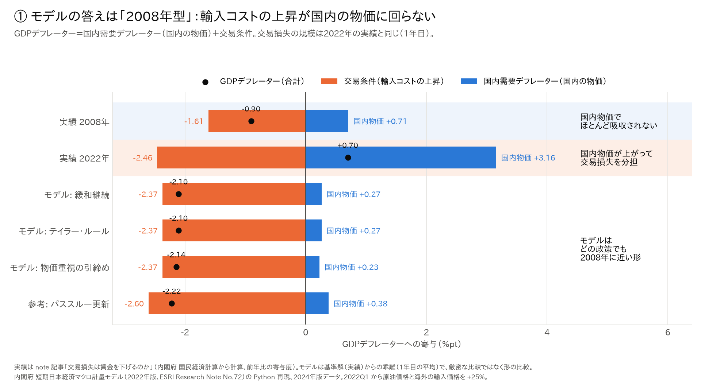
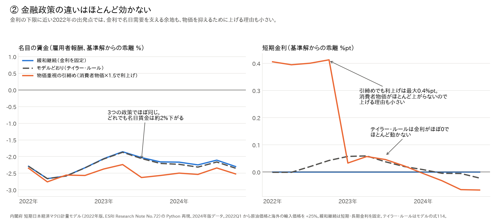
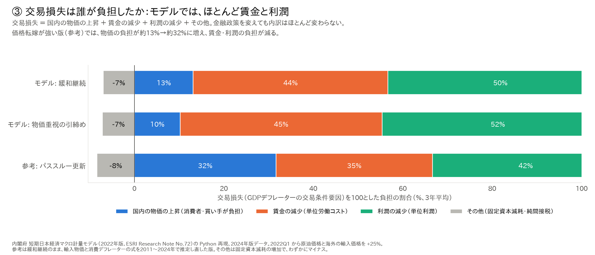
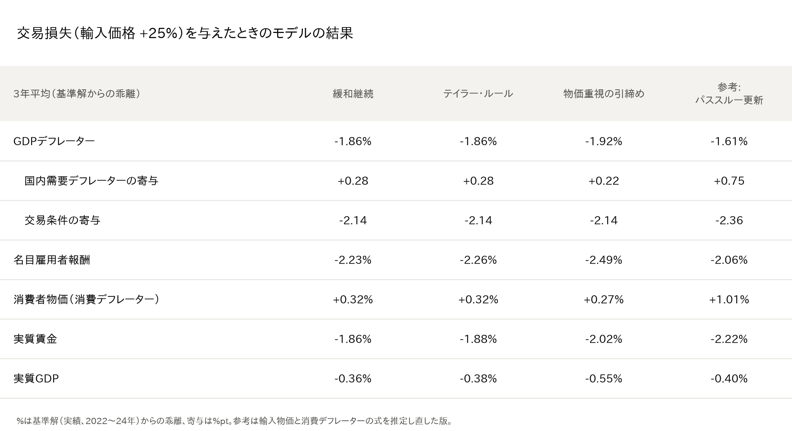

# 「交易損失は賃金を下げるのか」を内閣府モデルで確かめた：金利の政策だけでは2022年型にならない

※ この記事は、内閣府の「短期日本経済マクロ計量モデル（2022年版）」を Python で再現したもの（[p72/esri-short-run-macro-model](https://github.com/p72/esri-short-run-macro-model)）と、内閣府 経済社会総合研究所（ESRI）の国民経済計算などの公表データを使って計算している。

## はじめに

1本目の記事「[交易損失は賃金を下げるのか](01_交易損失は賃金を下げるのか.md)」では、GDPデフレーターを分解して、次のように論じた。

- 2008年と2022年は、どちらも資源高で大きな交易損失が出た。
- 2008年は名目需要が落ち込み、デフレに戻った。
- 2022年は国内の物価が上がって損失を分担し、賃金上昇に至った。
- 分かれ目は、名目需要の伸びに関わるマクロ政策の枠組みではないか。

ただし、統計の分解だけでは「もし政策が違ったら」という反事実は確かめられない。1本目の記事でも、これを限界として挙げた。

そこで本稿では、内閣府の「短期日本経済マクロ計量モデル（2022年版）」を Python で再現したものを使い、同じ交易ショックを、金融政策の設定だけを変えて計算した。

結論を先に示す。

- **モデルでは、どの金融政策でも「2008年型」になる**。国内の物価はほとんど上がらず、名目賃金が約2%下がる。
- **金融政策の違いはほとんど効かない**。2022年は金利がほぼ0で、消費者物価もほとんど上がらないので、利上げする理由も小さい。
- **差を生むのは、値上げできるかどうか（価格転嫁）と、賃金の決まり方**。モデルの係数はデフレ期に推定されたもので、モデル自体が「2008年型」の体質を持っている。

## 1. 試算の設定

- 出発点は、2022〜24年の実際の経済である。モデルのデータが2010年からしかないので、2008年そのものは計算できない。
- 2022年1-3月期から、原油価格と海外の輸入価格を25%上げる。1年目の交易損失（GDPデフレーターの交易条件要因）が、2022年の実績（−2.46%pt）と同じ規模になるように合わせた。
- 金融政策は3通りである。
  - **緩和継続**：短期金利と長期金利を据え置く（2022年の日銀に近い）。
  - **テイラー・ルール**：モデルに入っている政策金利の式どおりに動かす。
  - **物価重視の引締め**：消費者物価が上がった分の1.5倍だけ利上げする。
- 参考として、前回の記事（[円安の物価押し上げ効果](06_円安の物価押し上げ効果は大きくなったか.md)）で最近のデータから推定し直した「値上げしやすい」式の版も計算した。

## 2. モデルの答えは「2008年型」

GDPデフレーターは、「国内の物価（青）」と「交易条件（オレンジ）」に分けられる。輸入コストが上がるとオレンジがマイナスに伸びる。そのとき、青（国内の物価）がどれだけプラスになって埋めるかが分かれ目である。

- **2022年の実績**：国内の物価が +3.16 と大きく上がり、交易損失を物価で分担した。
- **2008年の実績**：国内の物価は +0.71 にとどまり、GDPデフレーターはマイナスになった。
- **モデル**：同じ規模の交易損失を与えても、国内の物価は +0.2〜0.4 しか上がらない。どの金融政策でも、形は2008年とほぼ同じである。

（実績は前年比、モデルは「ショックがなかった場合」との差なので、数字を直接比べることはできない。物価で分担しているかどうかの「形」を比べた図である。）

## 3. 金融政策の違いはほとんど効かない

- **左（名目の賃金）**：3本の線はほぼ重なっている。どの政策でも、名目賃金は約2%下がる。
- **右（短期金利）**：
  - 物価重視の引締めでも、利上げは最大0.4%pt である。消費者物価がほとんど上がらないので、上げる理由が小さいのである。
  - テイラー・ルールは、もともと金利がほぼ0なので、ほとんど動かない。

金利が0に近い2022年の出発点では、金利で名目需要を支える余地も、物価を抑えるために金利を上げる理由も、どちらも小さいということである。

## 4. 交易損失は誰が負担したか

交易損失を100としたとき、誰がどれだけ負担したかの内訳である。

- モデルでは、交易損失の約9割を賃金（約44%）と利潤（約50%）が負担する。国内の物価の上昇で分担されるのは約13%だけである。
- 金融政策を変えても、内訳はほとんど変わらない。
- 値上げしやすい式にした参考の版では、物価の負担が約13%から約32%に増え、賃金と利潤の負担が減る。

主な数値をまとめると、次のとおりである。

参考の版でも名目賃金の下落は少し和らぐだけで、物価が上がる分、実質賃金はかえって大きく下がる。モデルの賃金の式は論文のまま（デフレ期の推定）なので、賃金が物価に追いつく力が弱いためである。

## まとめ

- 1本目の記事のいう「2008年型か2022年型か」の分かれ目は、このモデルでは**金利の政策では決まらない**。
- 決め手は、**企業が値上げできるか（価格転嫁）と、賃金がどう決まるか**である。
- このモデルの係数は1990年代〜2020年のデフレ期に推定されたので、モデル自体が「2008年型」の体質を持っているとも言える。
- 1本目の記事に照らすと、「マクロ政策の枠組み」は、金利だけでなく、名目需要（財政も含む）、企業の価格設定、賃上げの慣行まで含めて考える必要がある。これは1本目の記事の注意点「金融政策だけでは説明不足」を支持する結果である。

### 注意点

- モデルの係数は1990年代〜2020年に推定されたもので、最近の賃上げの強さは入っていない。
- 2022年の出発点は金利の下限に近く、金融政策が効く余地が小さい時期である。
- ショックは輸入価格だけで、2008年の世界需要の急減は入れていない。
- 実績とモデルの数字は、定義が違うので直接は比べられない。

では、実際の2022〜24年は、モデルの予測とどこが違ったのだろうか。次回は、モデルの式ごとに「実績がモデルからどれだけ外れたか」を調べる。

## データの取り方

- コード・データ：https://github.com/p72/esri-short-run-macro-model（内閣府 ESRI 短期日本経済マクロ計量モデル 2022年版の Python 再現）
  - 試算：`src/experiment_tot_policy.py`
  - 図：`src/plot_tot_policy_explainer.py`
- モデルのデータ：内閣府 国民経済計算（2026年4-6月期2次速報、2024年度年次推計）などから作成
- 実績の2008年・2022年の値：1本目の記事（内閣府 国民経済計算 2020年基準から計算）

## 参考文献

- 酒巻哲朗他「短期日本経済マクロ計量モデル（2022年版）の構造と乗数分析」内閣府 ESRI Research Note No.72（2022年12月）
  https://www.esri.cao.go.jp/jp/esri/archive/e_rnote/e_rnote080/e_rnote072.pdf
- 1本目の記事「交易損失は賃金を下げるのか」（01_交易損失は賃金を下げるのか.md）
