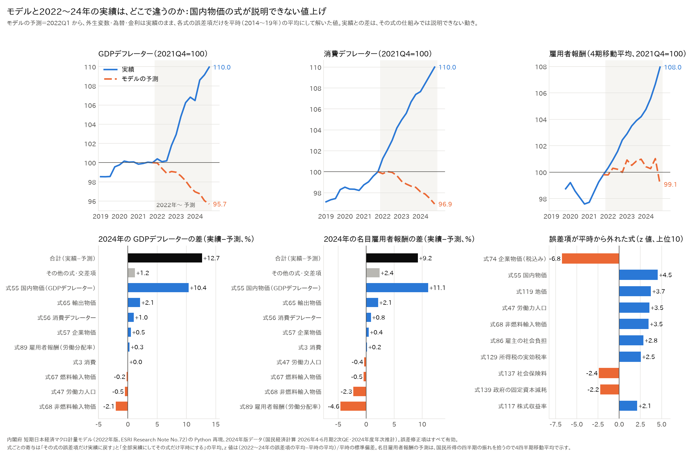
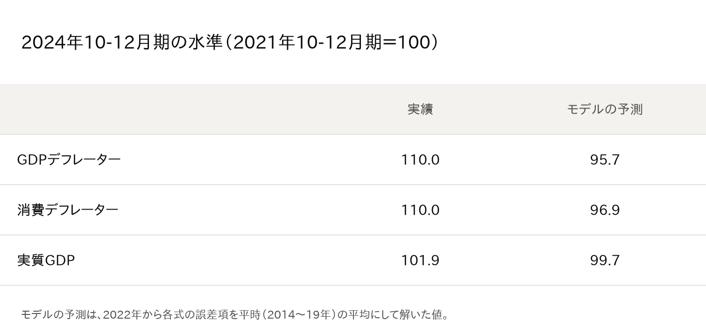
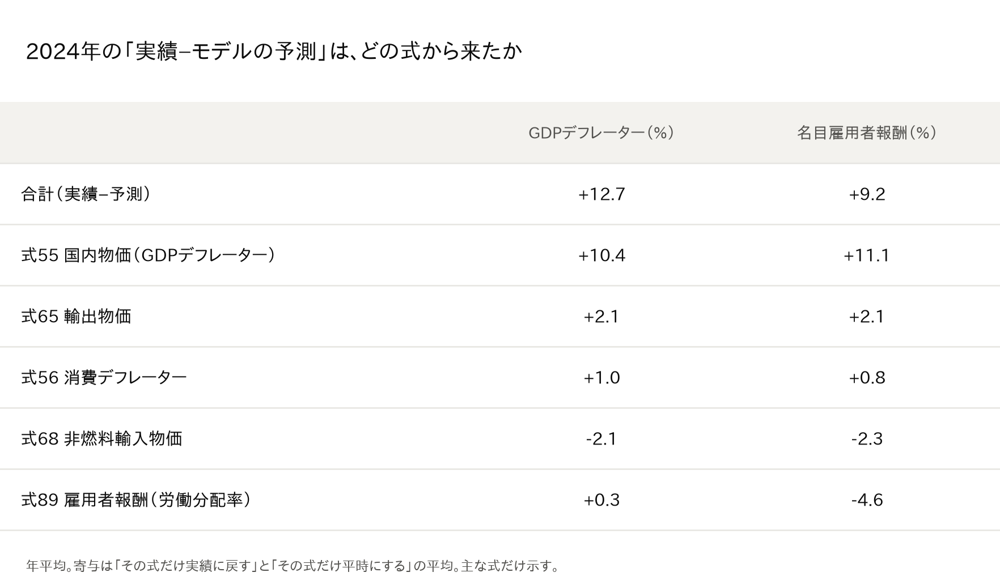

# 内閣府モデルは2022〜24年に「デフレ」を予測していた：ずれの正体は企業の値上げ

※ この記事は、内閣府の「短期日本経済マクロ計量モデル（2022年版）」を Python で再現したもの（[p72/esri-short-run-macro-model](https://github.com/p72/esri-short-run-macro-model)）と、内閣府 経済社会総合研究所（ESRI）の国民経済計算などの公表データを使って計算しています。

## はじめに

前回の記事（[「交易損失は賃金を下げるのか」を内閣府モデルで確かめた](07_交易損失は賃金を下げるのかを内閣府モデルで確かめた.md)）では、内閣府の短期マクロ計量モデルに2022年規模の交易損失を与えました。

すると、どの金融政策でも「2008年型」になりました。国内の物価はほとんど上がらず、名目賃金が下がる、という結果です。ところが、実際の2022〜24年は、国内の物価が上がり、賃金も上がりました。

では、モデルと実績は、どこで、なぜ違ったのでしょうか。今回は、モデルの式を1本ずつ調べて、ずれの出どころを探しました。

結論を先に書きます。

- **モデルは、2022〜24年に「デフレ」を予測する**。2024年末の GDPデフレーターは、実績 110.0 に対してモデルの予測は 95.7 です（2021年末＝100）。
- **ずれのほぼ全部は、国内物価の式から来る**。モデルの国内物価は、需要と供給の差（GDPギャップ）とお金の量でしか上がりません。コストを価格に転嫁する仕組みがないので、2022年以降の値上げを説明できません。
- **賃金は、値上げに追いつかなかった**。その分は企業の利潤に回りました。

## 1. どうやって調べたか

マクロ計量モデルの各式には、「式では説明できない部分」（誤差項）があります。モデルで実績をそのまま再現するときは、この誤差項を足しています。

そこで、次のように計算しました。

1. **モデルの予測を作る**
   - 2022年から、為替・金利・海外の価格などは実績のまま入れる。
   - 各式の誤差項だけを、平時（2014〜19年）の平均に置き換えて解く。
   - これが「いつもどおりの関係が続いたら、モデルはどう予測したか」になります。
2. **ずれを式ごとに分ける**：実績との差が、どの式の誤差項から来たかを1本ずつ測ります。
3. **平時からの外れ方を見る**：2022〜24年の誤差項が、平時と比べてどれだけ外れたかを見ます。

## 2. モデルは「デフレ」を予測していた

上の段の左と中央を見てください。青が実績、オレンジの点線がモデルの予測です。

実績では、GDPデフレーターも消費デフレーターも、3年で約10%上がりました。一方、モデルの予測ではどちらも下がっています。モデルは、2022〜24年をデフレの時期と見ていたことになります。

## 3. ずれの正体は「国内物価の式」

2024年の GDPデフレーターのずれ（+12.7%）のうち、**+10.4% は式55（国内物価）** から来ています。

式55 は、国内物価を次の2つだけで説明しています。

- GDPギャップ（需要が供給を上回ると物価が上がる）
- お金の量（マネーストック／GDP）

「原材料が高くなったから値上げする」「みんなが値上げしているから自分も上げる」といった仕組みは入っていません。

2022〜24年は、この式で説明できない値上げが、毎四半期 約1%ずつ続きました。平時と比べた外れ方は、標準偏差の4.5倍です（図の右下）。3年で約10%の「説明できない値上げ」が積み上がったことになります。

モデルでは、名目賃金は名目の所得についていきます。そのため、この値上げが名目賃金の差（+11.1%）の大部分も生んでいます。

このほかに、次の式からもずれが出ています。

- **式65（輸出物価）**：+2.1%。企業は輸出でも値上げしました。
- **式56（消費デフレーター）**：+1.0%。輸入コストが消費者物価に回りやすくなりました（前々回の記事「[円安の物価押し上げ効果](06_円安の物価押し上げ効果は大きくなったか.md)」と同じ話です）。
- **式68（輸入物価）**：−2.1%。輸入物価がモデルの予測より大きく上がり、交易条件が悪くなりました。

## 4. 賃金は値上げに追いつかなかった

名目雇用者報酬の列で、**式89（労働分配率）の寄与は −4.6%** です。

モデルの関係どおりなら、賃金は名目の所得の伸びにもっとついていくはずでした。実際の賃金はそれより遅れ、その分は企業の利潤に回りました。1本目の記事（01）で、2023年に「単位利潤」が大きくプラスだったことと合っています。

外部の情報とも合います。

- 日本銀行は、2022年以降、企業の価格転嫁の動きが長引き、値上げを決めるまでの時間も短くなったと指摘しています（展望レポート 2023年10月 BOX）。
- 春闘の賃上げ率（連合の最終集計）は、3.58%（2023年）→ 5.10%（2024年）→ 5.25%（2025年）と上がりました。ただし、雇用者報酬全体で見ると、物価の上昇には遅れました。

## まとめ

- 内閣府モデルは、2022〜24年に「デフレ」を予測していました。実績との差のほぼ全部は、**国内物価の式に、コストを価格に転嫁する仕組みがないこと**から来ています。
- 前回の記事で、モデルが金融政策にかかわらず「2008年型」になったのも、同じ理由です。モデルの係数は1990年代〜2020年のデフレ期に推定されたので、「企業は値上げしない」という前提が式に組み込まれているのです。
- 2022年以降の日本では、企業が値上げできるようになりました。ただし、賃金はそれに遅れて、利潤が先に増えました。

元記事の「交易損失は必ずしも賃金を下げない」という主張は、モデルの点検からも支持されます。ただし、分かれ目は金融政策だけではありません。**企業の値上げの仕方（価格設定行動）が変わったこと**が大きい、というのが今回の答えです。

### 注意点

- モデルのデータは2024年10-12月期までです（所得の内訳の四半期データが、2024年度の年次推計までしかないため）。2025年は分析していません。
- 国民所得の四半期の値は振れが大きいので、図の名目雇用者報酬は4四半期の移動平均で示しました。
- 「平時」を2014〜19年としています。期間の取り方で、数字は少し変わります。

## データの取り方

- コード・データ：https://github.com/p72/esri-short-run-macro-model（内閣府 ESRI 短期日本経済マクロ計量モデル 2022年版の Python 再現）
  - 分析：`src/experiment_expost_2022.py`
  - 図・表：`src/plot_expost_2022.py`
- モデルのデータ：内閣府 国民経済計算（2026年4-6月期2次速報、2024年度年次推計）、日本銀行、e-Stat などから作成
- 式ごとの寄与：「その式の誤差項だけ実績に戻す」と「全部実績にして、その式だけ平時にする」の平均

## 参考文献

- 酒巻哲朗他「短期日本経済マクロ計量モデル（2022年版）の構造と乗数分析」内閣府 ESRI Research Note No.72（2022年12月）
  https://www.esri.cao.go.jp/jp/esri/archive/e_rnote/e_rnote080/e_rnote072.pdf
- 日本銀行「経済・物価情勢の展望」2023年10月 BOX
  https://www.boj.or.jp/mopo/outlook/box/2310box2a.pdf
- 連合 春季生活闘争 最終回答集計（2023年 3.58%、2024年 5.10%、2025年 5.25%）
  - https://roumu.com/?p=118048
  - https://sp.m.jiji.com/english/show/34010
  - https://www.mhlw.go.jp/content/11200000/001539435.pdf
