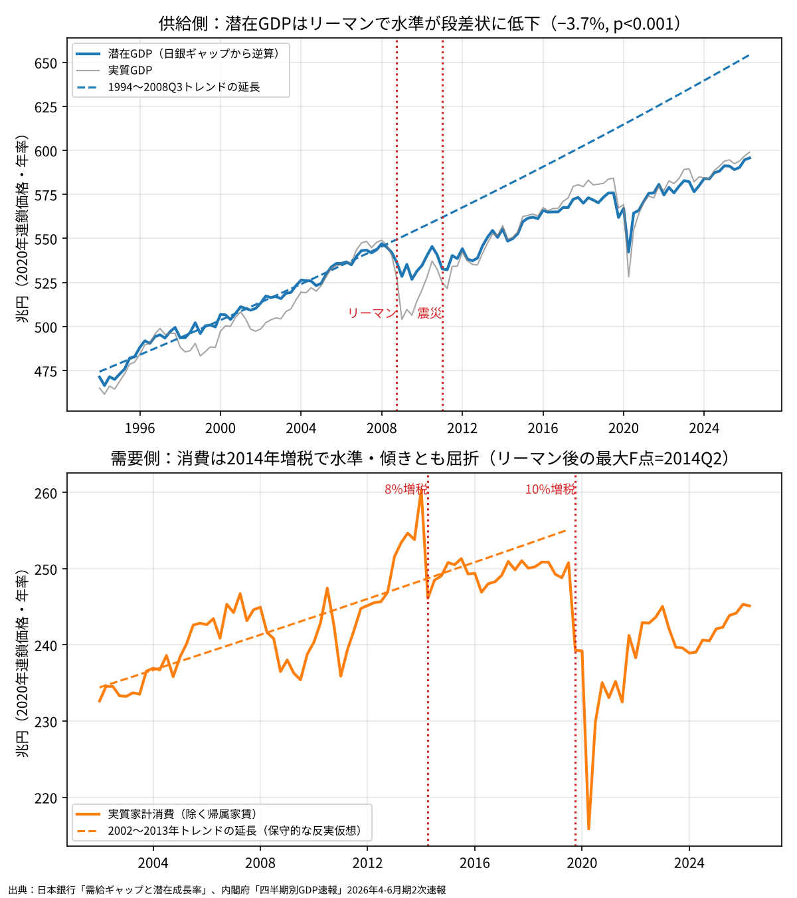
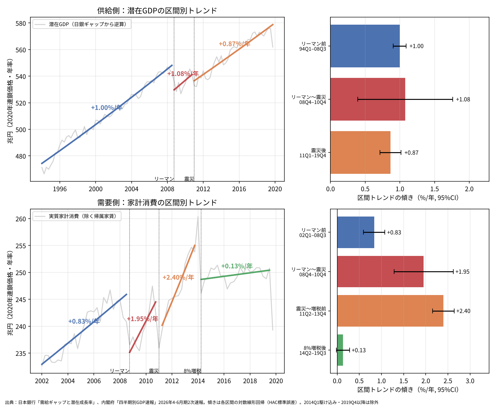

# リーマン・ショックは供給を、消費税増税は消費を壊したのか──構造変化検定による検証

※ 本稿は、日本銀行「需給ギャップと潜在成長率」と、内閣府 経済社会総合研究所（ESRI）「四半期別GDP速報」（2026年4-6月期2次速報）の公表データを用いて計算したものである。

日本経済の長期停滞については、「供給はリーマン・ショックと東日本大震災で壊れ、需要は消費税増税で壊れた」という説明がしばしばなされる。本稿では、この命題を潜在GDPと実質家計消費の時系列に対する構造変化検定で検証する。

結論は次のとおりである。

- 潜在GDPは2008年10-12月期に水準が約3.7％下方にシフトし、その後も回復していない。未知の変化点を探索する検定でも、最も強い変化点は2008年10-12月期に検出される。
- 東日本大震災による潜在GDPの水準低下は約1.1％で、有意水準5％では有意とならない。「大震災で供給が壊れた」は、データからは弱くしか支持されない。
- 実質家計消費は、リーマン・ショック後の期間に限れば、変化点が2014年4-6月期ちょうどに検出される。リーマン・ショックと震災の後には年2％前後の回復が見られたが、8％への増税後の伸びは年0.13％にとどまり、統計的にゼロと区別できない。
- ただし、需給ギャップは2014〜2019年に平均でプラスであった。壊れたのは需要全体ではなく、家計消費である。

## 方法

供給側の指標には潜在GDPを用いる。日本銀行は潜在GDPの水準を公表していないため、実質GDPを「1＋需給ギャップ」で割って逆算した。需要側の指標には、実質家計最終消費支出（持ち家の帰属家賃を除く）を用いる。いずれも季節調整済みの四半期系列である。

検定は2種類である。

- **変化点を固定した折れ線トレンド回帰**：対数値を時間トレンドに回帰し、リーマン・ショック（2008年10-12月期）、東日本大震災（2011年1-3月期）、8％への増税（2014年4-6月期）の各時点で、水準の段差と傾きの変化を表すダミーを加える。標準誤差は系列相関に頑健なHAC標準誤差（ラグ4）とした。
- **変化点を固定しない探索（Quandt-Andrews の supF 検定）**：標本の前後15％を除く全時点について、その時点で水準と傾きが変わったと仮定したときのF値を計算し、最大となる時点を求める。分析者が変化点を恣意的に選んでいないかを確認するためのものである。Andrews（1993）の5％臨界値は、この設定でおよそ11.8である。

コロナ禍の影響を避けるため、推計期間は原則として2019年までとした。2019年10月の10％への増税は、直後にコロナ禍が重なるため、効果を分離できない。

## 供給側：潜在GDPはリーマン・ショックで水準が下がった

1994年1-3月期から2019年10-12月期の潜在GDPに折れ線トレンドを当てはめた結果は次のとおりである。

- リーマン・ショック：水準 −3.66％（標準誤差0.55、p<0.001）、傾きの変化 +0.02％ポイント/四半期（p=0.82）
- 東日本大震災：水準 −1.13％（標準誤差0.60、p=0.058）、傾きの変化 −0.05％ポイント/四半期（p=0.55）

リーマン・ショックでは水準が約3.7％下方にシフトしたが、傾きはほとんど変わっていない。成長率は元に戻ったが、失った水準は取り戻していないということである。図の破線は1994年から2008年7-9月期までのトレンドを延長したもので、実際の潜在GDPはこれと平行に、一段低い位置を推移している。

supF 検定で変化点を探索すると、最大値は2008年10-12月期（F=101.0）であった。標本を2001年以降に限っても、最大値は同じく2008年10-12月期（F=57.8）である。上位5時点はいずれも2008年4-6月期から2009年4-6月期に集中しており、変化点の位置はきわめて明瞭である。

一方、東日本大震災の水準低下は1.1％で、5％水準では有意とならない。日本銀行による潜在成長率の要因分解を期間平均でみると、資本ストックの寄与は次のように推移している。

- 1994〜2007年：+0.60％
- 2008〜2010年：−0.15％
- 2011〜2013年：−0.29％
- 2014〜2019年：+0.30％

資本の寄与は2008年から2013年までマイナスであり、震災後も低迷が続いたが、2014年以降はプラスに戻っている。データに即していえば、供給力を損なったのは震災よりもリーマン・ショック後の設備投資の停止であり、震災はその低迷を長引かせた要因の一つと位置づけるのが妥当である。

## 需要側：家計消費は2014年の増税で伸びを失った

区間ごとにトレンドの傾き（年率）を推計すると、潜在GDPと家計消費とでは損傷の形が異なる。

潜在GDPの傾きは次のとおりである。

- リーマン前（1994年1-3月期〜2008年7-9月期）：+1.00％/年
- リーマン〜震災（2008年10-12月期〜2010年10-12月期）：+1.08％/年
- 震災後（2011年1-3月期〜2019年10-12月期）：+0.87％/年

潜在GDPの傾きはほぼ一定で、損傷は「段差」として現れている。

家計消費の傾きは次のとおりである。

- リーマン前（2002年1-3月期〜2008年7-9月期）：+0.83％/年
- リーマン〜震災（2008年10-12月期〜2010年10-12月期）：+1.95％/年
- 震災〜増税前（2011年4-6月期〜2013年10-12月期）：+2.40％/年
- 8％増税後（2014年4-6月期〜2019年7-9月期）：+0.13％/年（95％信頼区間 −0.02〜+0.28）

リーマン・ショックと震災でも家計消費は落ち込んだが、その後は年2％前後のペースで回復していた。8％への増税の後だけは、落ち込んだ水準からほとんど伸びていない。損傷が水準の段差にとどまらず、傾きの低下として現れたのはこの区間だけである。

検定でも同じ結果が得られる。2002年から2019年7-9月期の家計消費に、増税時点の段差と傾きの変化を加えて推計すると、傾きの変化は −0.09％ポイント/四半期（年率 −0.36％ポイント、p=0.002）で有意となる。supF 検定では、リーマン・ショック後（2009年7-9月期〜2019年7-9月期）に標本を限ると、最大値は2014年4-6月期ちょうど（F=31.1）であった。

ただし、2002年以降の全期間で探索すると、最大値は2013年1-3月期（F=13.0）となる。これは、2013年初からの消費の加速（アベノミクス初期の資産効果と駆け込み需要）を変化点として拾っているものと考えられる。2014年の変化点は、リーマン・ショック後の回復局面と比べたときに最も明瞭になる。

## 増税の影響の大きさは反実仮想に依存する

増税がなかった場合の消費をどう置くかで、影響の大きさは大きく変わる。

増税直前の8四半期（駆け込み期を除く）のトレンドを延長すると、8％への増税から3年後の家計消費はトレンドを10.6％下回る。1997年の3％から5％への増税では、同じ方法で3年後に7.2％下回っていた。もっとも、1997年は金融危機と重なっており、増税だけの効果とはいえない。

一方、増税直前のトレンドには、アベノミクス初期の加速と駆け込み需要が含まれる。より保守的に2002年から2013年までのトレンドを延長すると、2019年7-9月期の乖離は −1.7％にとどまる。

増税の影響は、少なく見積もって −2％程度、多く見積もって −10％程度という幅を持つ。どちらの基準でも、2014年以降の消費が以前のトレンドを下回ったという点は変わらない。

## 壊れたのは需要全体ではなく家計消費である

日本銀行の需給ギャップの期間平均は次のとおりである。

- 2009〜2013年：−1.65％
- 2014年4-6月期〜2019年7-9月期：+0.82％
- 2017年1-3月期〜2019年7-9月期：+1.37％

8％への増税の後、需給ギャップはむしろプラスに転じている。家計消費の対GDP比は、2013年10-12月期の46.0％から2019年4-6月期の42.6％へ低下した。消費の停滞を、輸出と設備投資が埋めた形である。

したがって、「需要が壊れた」という表現は正確ではない。データが支持するのは「家計消費が壊れた」という命題である。また、需給ギャップがプラスになったこと自体、潜在GDPの水準が低いことの裏返しでもあり、供給側の損傷と切り離して評価することはできない。

## まとめ

- 潜在GDPは、リーマン・ショックで水準が約3.7％下方にシフトし、その後も回復していない。傾きはほぼ一定で、損傷は段差として残っている。
- 東日本大震災による潜在GDPの水準低下は約1.1％で、5％水準では有意とならない。資本ストック寄与の低迷を長引かせた要因とみるのが妥当である。
- 家計消費は、リーマン・ショックと震災の後には年2％前後で回復していたが、8％への増税の後は年0.13％にとどまり、伸びを失った。変化点はリーマン後の標本で2014年4-6月期ちょうどに検出される。
- 需給ギャップは増税後にプラスであり、壊れたのは需要全体ではなく家計消費である。

## 注意点

- **時期の一致は因果の証明ではない**：構造変化検定が示すのは、トレンドが変化した時期がショックの時期と一致することまでである。2014年は円安による輸入物価の上昇と重なっており、実質所得の低下を増税だけに帰することはできない。
- **潜在GDPは推計値である**：日本銀行の潜在GDPは、実績の需要の影響を受けやすい推計方法による。2020年のコロナ禍でも潜在GDPが大きく落ち込んでいるのはそのためである。リーマン・ショック後の水準低下が、供給そのものの損傷なのか、需要不足が長引いたことで供給力が損なわれた履歴効果（ヒステリシス）なのかは、このデータだけでは区別できない。
- **平滑化された系列の検定**：潜在GDPは平滑化された系列であるため、F値やt値は大きく出やすい。変化点の位置は信頼できるが、有意性の強さは割り引いて読む必要がある。
- **震災〜増税前の高い伸び**：2011〜2013年の家計消費の伸び（年2.40％）には、震災後の反動、アベノミクス初期の資産効果、駆け込み需要が含まれる。増税後との落差は、その分を割り引いて評価する必要がある。
- **10％への増税は評価できない**：2019年10月の増税は、直後にコロナ禍が重なるため、本稿の方法では効果を分離できない。

## データの取り方

- 需給ギャップ・潜在成長率とその要因分解：日本銀行「需給ギャップと潜在成長率」（gap.xlsx） [https://www.boj.or.jp/research/research_data/gap/index.htm](https://www.boj.or.jp/research/research_data/gap/index.htm)
- 実質GDP・実質家計最終消費支出（除く持ち家の帰属家賃）：内閣府 ESRI「2026年4-6月期 2次速報」実質季節調整系列（gaku-jk2622.csv、2020暦年連鎖価格） [https://www.esri.cao.go.jp/jp/sna/sokuhou/sokuhou_top.html](https://www.esri.cao.go.jp/jp/sna/sokuhou/sokuhou_top.html)
- 潜在GDPは「実質GDP ÷ (1＋需給ギャップ/100)」で逆算した。推計は Python の statsmodels による（OLS、HAC標準誤差、ラグ4）。supF 検定は標本の前後15％を除外して計算した。推計・作図のコードは `code/` に置いている。
