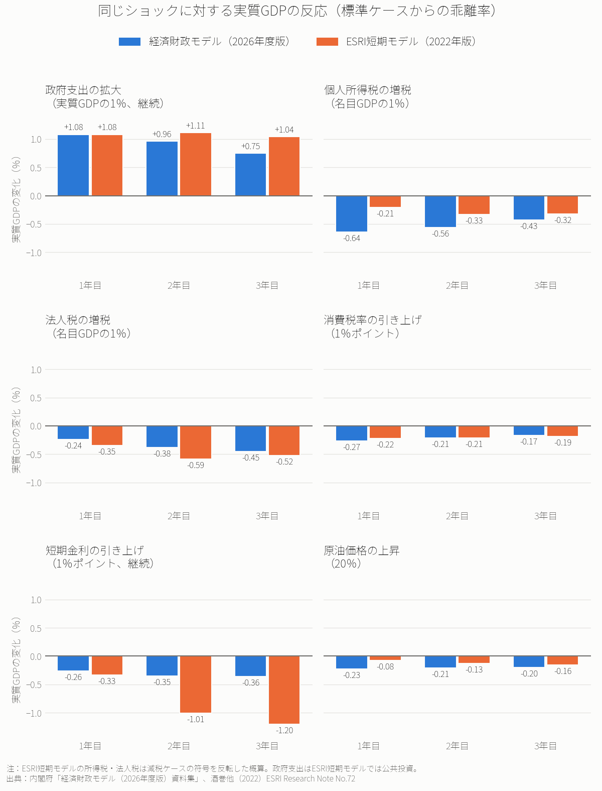

# 経済財政モデルとESRI短期モデルは何が違うのか──内閣府の2つのマクロ計量モデルを比べる

※ この記事の数値は、内閣府「経済財政モデル（2026年度版）」の資料集と、内閣府 経済社会総合研究所（ESRI）「短期日本経済マクロ計量モデル（2022年版）」の論文（ESRI Research Note No.72）に載っている乗数表から取った。新しい計算はしていない。

内閣府は、性格の異なる2つのマクロ計量モデルを公表している。

- **経済財政モデル**：政策統括官（経済財政分析担当）の計量分析室が作成
- **短期日本経済マクロ計量モデル**（以下、ESRI短期モデル）：経済社会総合研究所が作成

「内閣府の試算によれば」という数字が、どちらのモデルから出たものかによって、その意味は変わる。2026年に経済財政モデルの新版（2026年度版）が公表されたので、ESRI短期モデルの最新版（2022年版）と構造と乗数を比べる。

結論は次のとおりである。

- 2つのモデルは、**作られた目的が違う**。経済財政モデルは、中長期の財政の見通しを、マクロ経済・国と地方の財政・社会保障と整合的に描くためのモデルである。ESRI短期モデルは、1年程度の短期の調整過程を描き、政策や海外からのショックの効果を測るためのモデルである。
- マクロ経済の骨格（生産関数、フィリップス曲線、テイラー・ルール、購買力平価）はよく似ている。違いは、**財政と社会保障をどこまで細かく作っているか**にある。
- 公共支出の1年目の乗数は、どちらも**1.08**で一致する。一方、**所得税と金融政策の効果は、モデルによって3倍程度違う**。

## 1. 基本的な仕様

### 経済財政モデル（2026年度版）

- 作成：内閣府 計量分析室。第一次版は2001年11月に、ESRIの協力を得て作成された
- 用途：年2回公表される「中長期の経済財政に関する試算」の土台
- データの単位：**年度**
- 構成：人口・労働供給、マクロ経済、財政、社会保障の**4つのブロック**
- 2026年度版の主な改定点：2020年基準の国民経済計算への対応と再推計、非社会保障歳出の推計方法の見直し（2026年1月の中長期試算で実施）、GX経済移行債などの政策変数の追加

### ESRI短期モデル（2022年版）

- 作成：内閣府 経済社会総合研究所。初版は1998年で、2022年版は第11版にあたる
- 用途：政策や外的なショックが日本経済に与える短期的な影響の評価
- データの単位：**四半期**（推計期間は最長で1980年1-3月期〜2020年10-12月期）。ただし、乗数表は1年目・2年目・3年目の年単位で公表されている
- 規模：**方程式152本（うち推定式47本）**の中型モデル
- 枠組み：マンデル＝フレミング・モデル（IS-LM-BP）を基本とし、物価をフィリップス曲線で決める「価格調整を伴う開放ケインジアン型」
- 構成：財・サービス、労働、貨幣、外国為替の**4つの市場**と政府部門

## 2. 最大の違いは財政と社会保障の作り方

### 経済財政モデル：会計ごとに推計する

経済財政モデルの財政ブロックは、次の会計を**会計ベースで**推計する。

- 国の一般会計
- 交付税及び譲与税配付金特別会計
- 東日本大震災復興特別会計など
- 地方財政計画
- 地方普通会計（決算）

国と地方は、地方交付税と国庫支出金でつながっている。地方交付税は、所得税・法人税・消費税・酒税の法定率分と地方法人税の合計に、特例加算などを加減して計算する。

公債費は、元金償還額と、発行年度・年限別の金利から計算した利払費の合計である。償還ルールは、国債が60年の定率繰入、地方債が20年の元利均等償還である。GX経済移行債と半導体・AI債も、それぞれ独立した項目として入っている。

こうして推計した会計ベースの歳入・歳出を、国民経済計算（SNA）の政府最終消費支出、公的固定資本形成、税収、補助金などに振り分ける。そのうえで、**基礎的財政収支（PB）と公債等残高の対GDP比**を計算する。

社会保障ブロックも細かく作られている。

- **年金**：給付は基礎年金と、被用者年金一元化後の厚生年金に分けて推計する。改定率にはマクロ経済スライドを反映し、受給者数は厚生労働省の財政検証を用いる。
- **医療**：協会けんぽ、共済組合、市町村国保、後期高齢者医療などの制度別・年齢階層別に医療費を推計する。診療報酬改定率は、賃金と物価の上昇率から推計する。
- **介護**：要支援1・2と要介護1〜5の区分別、居宅サービスと施設サービス別に介護費を推計する。

人口は、国立社会保障・人口問題研究所の将来推計人口（年齢・男女別）を用いる。労働力人口は、年齢・男女別の労働参加率を外から与えて計算する。

### ESRI短期モデル：一般政府をまとめて扱う

ESRI短期モデルの政府部門は、**一般政府ベース**で定義されている。

- 支出：政府投資（外生）、政府消費、社会保障給付
- 歳入：個人税、法人税、間接税（消費税を含む）、社会保障負担

社会保障給付は、賃金と65歳以上人口の関数として与えられているだけである。その代わりに、消費、設備投資、輸出入、為替、金利といった**需要側の短期の動き**を詳しく扱う。主な推計式はエラー・コレクション型で、変数間の長期的な均衡関係と、そこへの調整過程を表す。

## 3. 共通点：マクロ経済の骨格は似ている

マクロ経済の部分の骨格は、両モデルでよく似ている。

- **供給側**：生産関数で潜在GDPを決める（経済財政モデルはコブ・ダグラス型で、全要素生産性は外生）
- **物価**：GDPギャップを用いたフィリップス曲線で決まる
- **金融政策**：両モデルとも、短期金利を**テイラー・ルール**で決める（ESRI短期モデルはゼロ金利を考慮し、下限を0.001％としている）
- **為替**：長期は内外価格差（購買力平価）、短期は内外金利差の影響を受ける
- **消費**：短期は可処分所得、長期は資産や所得の水準に左右される
- **設備投資**：最適な資本ストックに向けて徐々に調整される

短期は需要で決まり、長期は供給側に戻る、という考え方は共通している。経済財政モデルの資料も、短期の景気変動と中長期の成長経路への調整の両方を描けることを特徴に挙げている。

## 4. 乗数を並べる

両モデルとも主要な乗数表を公表している。以下に、実質GDPへの影響（標準ケースからの乖離率、％）を並べる。

> **比べるときの注意点**
> - 経済財政モデルは、推計期間より後の期間で、GDPギャップがゼロのまま推移する標準ケースにショックを与えている。ESRI短期モデルは、推計期間内の2018〜2020年にショックを与えている。
> - ショックの中身は完全には同じでない。政府支出と公共投資の違い、増税と減税の違いがある。
> - ESRI短期モデルの減税ケースは、**符号を反転して増税ケースに読み替えた概算**である（モデルが線形に近いという仮定による）。
> - ESRI短期モデルの論文は、短期分析を目的とするため、2年目以降の数字は参考程度だとしている。

6つのケースを同じ縦軸で並べた。公共支出と消費税では両モデルの結果が近い。所得税では経済財政モデルの反応が大きく、短期金利ではESRI短期モデルの反応が2年目以降に大きくなる。以下、ケースごとに数値を示す。

### 政府支出の拡大（実質GDPの1％相当を継続）

- 経済財政モデル（実質政府支出、国と地方に1:1で配分）：**1年目 +1.08、2年目 +0.96、3年目 +0.75**（5年目 +0.41）
- ESRI短期モデル（実質公共投資）：**1年目 +1.08、2年目 +1.11、3年目 +1.04**

1年目の値は一致する。経済財政モデルでは、2年目以降に効果が小さくなっていく。物価と金利の上昇によって需要が抑えられ、供給力で決まる成長経路に戻っていくためである。ESRI短期モデルでは、3年目まで効果がほぼ保たれる。なお、ESRI短期モデルで短期金利を一定とすると、2年目・3年目の乗数は1.3程度に大きくなる。

### 個人所得税の増税（名目GDPの1％相当）

- 経済財政モデル：**1年目 −0.64、2年目 −0.56、3年目 −0.43**
- ESRI短期モデル（減税ケースの符号を反転）：**1年目 約−0.21、2年目 約−0.33、3年目 約−0.32**

1年目の差は約3倍ある。経済財政モデルでは、所得税の増税で可処分所得が2.4％減り、消費が1.1％、住宅投資が2.3％減る。所得税の変化が家計の支出に強く効く作りになっている。

### 法人税の増税（名目GDPの1％相当）

- 経済財政モデル：**1年目 −0.24、2年目 −0.38、3年目 −0.45**
- ESRI短期モデル（減税ケースの符号を反転）：**1年目 約−0.35、2年目 約−0.59、3年目 約−0.52**

どちらのモデルでも、設備投資を通じて効果が時間とともに大きくなる。

### 消費税率の1％ポイント引き上げ

- 経済財政モデル：**1年目 −0.27、2年目 −0.21、3年目 −0.17**
- ESRI短期モデル：**1年目 −0.22、2年目 −0.21、3年目 −0.19**

両モデルの結果はほぼ同じである。

### 短期金利の1％ポイント引き上げ（継続）

- 経済財政モデル：**1年目 −0.26、2年目 −0.35、3年目 −0.36**
- ESRI短期モデル：**1年目 −0.33、2年目 −1.01、3年目 −1.20**

3年目には3倍以上の差がつく。ESRI短期モデルでは、設備投資が1年目に2.1％、3年目に6.4％減り、金融政策の効果が大きく出る。

### 原油価格の20％上昇

- 経済財政モデル：**1年目 −0.23、2年目 −0.21、3年目 −0.20**
- ESRI短期モデル：**1年目 −0.08、2年目 −0.13、3年目 −0.16**

## まとめ

- 基礎的財政収支や債務残高の見通し、年金・医療・介護の制度変更の影響を見るには、経済財政モデルが向いている。財政と社会保障の制度が会計単位で組み込まれており、制度の変更をそのまま前提に入れられる。
- 経済対策の短期的な効果や、為替・海外需要のショックの影響を見るには、ESRI短期モデルが向いている。四半期の需要の動きを詳しく扱う。
- 公共支出の1年目の乗数はどちらも1.08だが、所得税と金融政策の効果はモデルによって3倍程度違う。「内閣府の試算」という数字を見るときは、どちらのモデルの、どのケースの数字なのかを確認する必要がある。
- 両モデルの資料が述べているとおり、乗数はモデルの性質を見るための機械的なテストの結果である。現実の政策効果は、そのときの経済環境によって変わる。

## データの取り方

- 内閣府 計量分析室「計量経済モデル及び試算関係資料」 https://www5.cao.go.jp/keizai3/econome.html
- 内閣府「経済財政モデル（2026年度版）資料集 概要・乗数」 https://www5.cao.go.jp/keizai3/econome/ef2rrrrrr-summary.pdf
- 酒巻哲朗他「短期日本経済マクロ計量モデル（2022年版）の構造と乗数分析」内閣府 ESRI Research Note No.72（2022年12月） https://www.esri.cao.go.jp/jp/esri/archive/e_rnote/e_rnote080/e_rnote072.pdf
- 内閣府 経済社会総合研究所「短期日本経済マクロ計量モデル」 https://www.esri.cao.go.jp/jp/esri/prj/current_research/macro/macro.html
