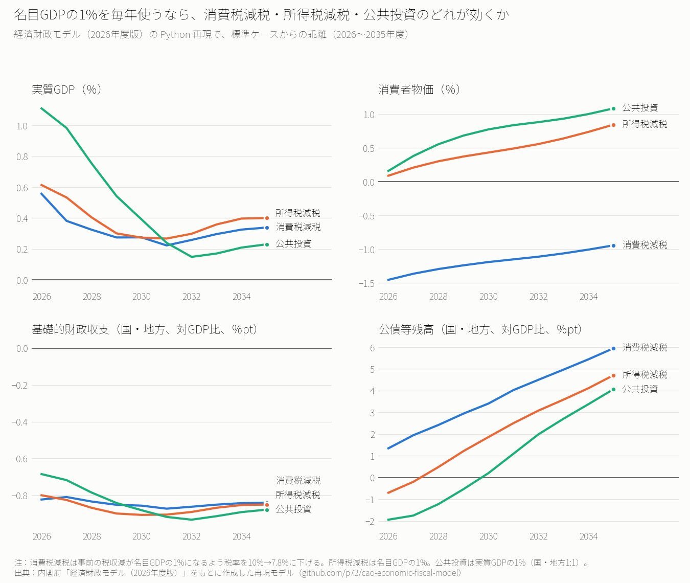

# 6.8兆円を毎年使うなら、消費税減税・所得税減税・公共投資のどれが効くか──内閣府の経済財政モデルで計算した

※ この記事は、内閣府「経済財政モデル（2026年度版）」を Python で再現したもの（[p72/cao-economic-fiscal-model](https://github.com/p72/cao-economic-fiscal-model)）で計算している。再現の方法と精度は最後の節に書いた。

減税か、歳出の拡大か。景気対策の議論では、同じ金額をどう使うかがいつも問題になる。

この記事では、**名目GDPの1%（約6.8兆円）を、2026年度から10年間使い続ける**という3つの政策を比べる。

- **消費税減税**：事前の税収減が名目GDPの1%になるだけ、消費税率を下げる（10%→7.8%）
- **所得税減税**：個人所得税を名目GDPの1%減らす
- **公共投資**：実質の公的固定資本形成を実質GDPの1%増やす（国と地方で半分ずつ）

何もしない場合（標準ケース）からの乖離を、実質GDP、消費者物価、基礎的財政収支、公債等残高の4つで見る。

結果を先に書くと、次のようになった。

- **実質GDPを最も押し上げるのは公共投資だが、効果は早く薄れる。** 1年目は+1.1%と減税の約2倍だが、5年目には+0.4%まで縮み、10年目には減税を下回る。
- **消費税減税だけが物価を下げる。** 1年目に消費者物価が1.5%下がる。所得税減税と公共投資は物価を上げる。
- **10年後の公債等残高（対GDP比）は、どの政策でも4〜6%pt上がる。** 最も上がるのは消費税減税である。物価が下がる分、名目GDPが伸びず、残高の比率が高くなる。

## 計算の結果

### 実質GDP

- **公共投資**：1年目+1.11%、2年目+0.98%、3年目+0.76%、5年目+0.39%、10年目+0.23%
- **所得税減税**：1年目+0.61%、3年目+0.40%、5年目+0.27%、10年目+0.40%
- **消費税減税**：1年目+0.56%、3年目+0.32%、5年目+0.28%、10年目+0.34%

公共投資は政府が直接需要をつくるので、1年目の効果が大きい。ただし、景気が良くなると物価と金利が上がり、民間の設備投資が減っていく（5年目−0.75%、10年目−0.90%）。そのため効果は年を追って小さくなる。

減税の2つは、家計の手取りが増えて消費が増える経路で効く。消費の増え方は、1年目に所得税減税で+1.05%、消費税減税で+0.87%である。消費税減税は物価が下がって金利も下がるので、設備投資も5年目まで+0.4〜0.5%増える。

### 消費者物価

- **消費税減税**：1年目−1.45%、5年目−1.19%、10年目−0.94%
- **所得税減税**：1年目+0.09%、5年目+0.43%、10年目+0.84%
- **公共投資**：1年目+0.16%、5年目+0.77%、10年目+1.08%

消費税率を下げた分は、税込みの価格を直接下げる。所得税減税と公共投資は、需要が増えて需給が引き締まる分、物価をゆっくり押し上げる。

### 基礎的財政収支（国・地方、対GDP比）

3つとも、毎年0.7〜0.9%pt悪化する。名目GDPの1%を使うので、景気が良くなって税収が増えても、悪化の大部分は残る。公共投資の1年目（−0.69%pt）が減税（−0.80〜0.82%pt）より小さいのは、1年目の景気の押し上げが大きく、税収が増えるためである。

### 公債等残高（国・地方、対GDP比）

- **消費税減税**：1年目+1.35%pt、3年目+2.42%pt、5年目+3.41%pt、10年目+5.95%pt
- **所得税減税**：1年目−0.70%pt、3年目+0.48%pt、5年目+1.86%pt、10年目+4.71%pt
- **公共投資**：1年目−1.94%pt、3年目−1.22%pt、5年目+0.20%pt、10年目+4.07%pt

公共投資と所得税減税では、最初の数年は残高の比率が下がる。残高そのものは増えるが、それ以上に名目GDP（分母）が増えるからである。消費税減税は物価が下がって名目GDPが伸びないので、1年目から比率が上がり、10年後の上昇幅も最も大きい。

## まとめ

- 景気の押し上げを1〜2年で比べるなら、公共投資が最も大きい。ただし効果は持続せず、民間の設備投資を押し下げていく。
- 減税の2つは押し上げが小さいが、効果が比較的長く続く。所得税減税のほうが消費税減税よりやや大きい。
- 物価を下げたいなら消費税減税だが、その分、名目GDPが伸びず、公債等残高の対GDP比は最も上がる。
- どの政策でも、名目GDPの1%を10年使い続ければ、公債等残高の対GDP比は4〜6%pt上がる。景気が良くなって税収が増えても、財源の大部分は戻らない。

## 注意点

- **財政部分は簡略化している**：経済財政モデルの財政・社会保障ブロック（約2,900本の式）は移植せず、税収・歳出・公債の積み上げを簡略な式で置き換えている。公債等残高の数字は、この簡略化に強く左右される。たとえば、地方の収支の悪化をすべて地方債の増加とみなす形にすると、10年後の上昇幅は1.5〜1.9倍になる（下の図の破線）。3つの政策の中で消費税減税が最も上がることは変わらないが、公共投資と所得税減税の順位は入れ替わる。

- **消費税は単一税率で計算している**：軽減税率（8%）は扱っていない。食料品だけの減税とは結果が異なる。
- **標準ケースは機械的な経路である**：2024年度の実績を出発点に、実質0.5%・物価2%で伸びる経路を置いた。内閣府の「中長期の経済財政に関する試算」の経路とは異なる。
- **乗数はモデルの性質を示すもので、実際の政策効果そのものではない**：結果は、モデルの式が推計された時期（おおむね1980〜2024年度）の経済の関係を前提にしている。

## 再現の方法と精度

- **再現の範囲**：経済財政モデル（2026年度版）は3,253本の式からなる。このうちマクロ経済と人口・労働の部分（約300本）は、内閣府の方程式リストの式をそのまま Python の関数に変換して使った。財政と社会保障は上に書いたとおり簡略版である。
- **データ**：2024年度の国民経済計算（年次推計）、労働力調査、財務省の公債等残高の実績を出発点にした。
- **精度**：内閣府が公表している主要乗数表（政府支出、法人税、所得税、消費税、TFP、原油価格、短期金利の8ケース×5年）と比べた。実質GDPは、ほとんどのケースで差が0.1%pt以内に収まる。たとえば実質政府支出を実質GDPの1%増やし続けるケースは、モデルが1年目+1.05%、3年目+0.72%、5年目+0.38%、公表値が+1.08%、+0.75%、+0.41%である。
- **公表値に合わせた修正**：公表乗数に合わせるため、次の点を変えた（変えない計算もできる）。
  - 短期金利の式から、テイラー・ルールの今期の変化に直接反応する項を外した。
  - 地方の収支の変化のうち4分の1だけを地方債の増減とした。
  - 法人課税の増減の半分を翌年度の残高に反映した。
- **再現できなかった点**：原油価格とTFPのケースでは、公表表の実質GDPが、同じ表の需要項目を足し上げた値と0.1%pt強食い違っている。モデルの需要項目は公表値とほぼ一致するので、この差は再現していない。

## データの取り方

- モデル：内閣府「経済財政モデル（2026年度版）」 https://www5.cao.go.jp/keizai3/econome.html
- 国民経済計算：内閣府 経済社会総合研究所「2024年度国民経済計算年次推計」 https://www.esri.cao.go.jp/jp/sna/data/data_list/kakuhou/files/2024/2024_kaku_top.html
- 労働力調査（年度平均）：総務省統計局（e-Stat）
- 公債等残高：財務省「国及び地方の長期債務残高」（2026年4月） https://www.mof.go.jp/budget/fiscal_condition/basic_data/202604/sy202604g.pdf
- 再現モデルと計算のコード：https://github.com/p72/cao-economic-fiscal-model （計算は `src/scenario.py`、図は `src/plot_scenario.py`）
