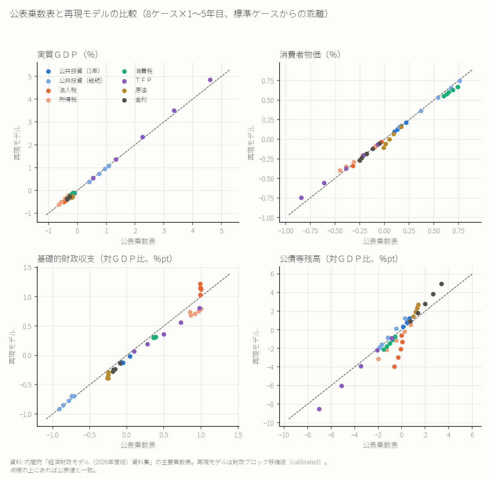
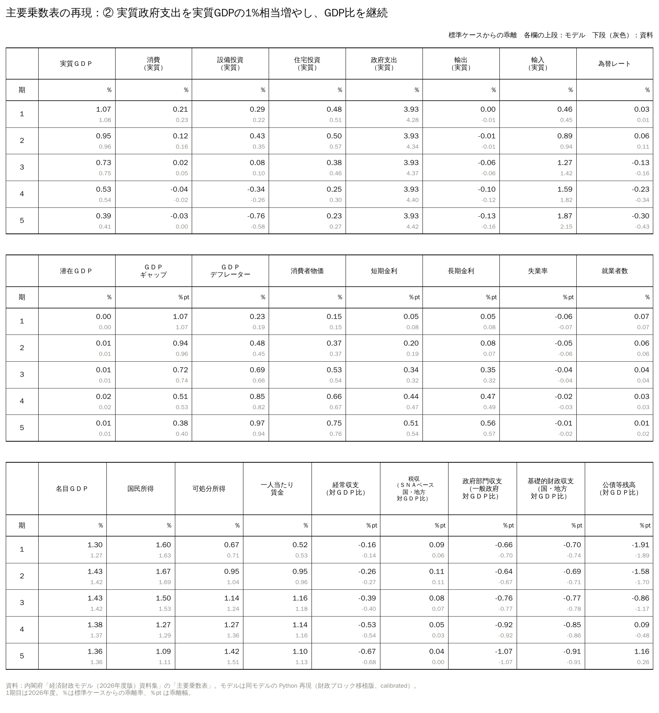
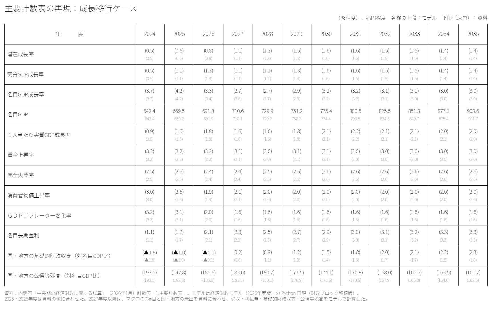

# 内閣府の経済財政モデル（2026年度版）を Python で再現した──公表乗数表と中長期試算の主要計数表で精度を確かめる

内閣府の「中長期の経済財政に関する試算」（中長期試算）は、「経済財政モデル」という計量モデルで計算されている。モデルの方程式と変数の一覧は資料集として公表されているが、モデルそのもの（プログラムとデータ）は公表されていない。

この記事では、公表されている資料集から2026年度版のモデルを Python で組み立て直した結果を紹介する。コードと計算結果は GitHub で公開している。

- リポジトリ：[p72/cao-economic-fiscal-model](https://github.com/p72/cao-economic-fiscal-model)

結果を先に書くと、次のようになった。

- **公表されている乗数表（8ケース×5年）を、実質GDP・物価・基礎的財政収支については、おおむね0.1%pt以内のずれで再現できた。** 公債等残高の対GDP比は、法人税と金利のケースでずれが残る。
- **中長期試算（2026年1月）の主要計数表（3ケース）を、2035年度の基礎的財政収支で0.5%pt以内、公債等残高比で1〜3%pt以内のずれで再現できた。** 成長率・物価・金利などマクロの前提を資料に合わせ、財政は資料の予算ベースの歳出・税収などを与えて、基礎的財政収支と公債等残高をモデルで計算した。
- **中長期試算の感応度分析3つ（TFPの低下、長期金利の上昇、政府支出の増加）も、向きと大きさはおおむね再現できた。** たとえば長期金利が0.5%pt上がると、2035年度の公債等残高比は資料で+3.2%pt、再現モデルで+3.6%ptになる。
- **資料集を読み込む過程で、方程式リストの欠落・誤植や、公表乗数表の中の食い違いがいくつか見つかった。**

## 経済財政モデルとは

経済財政モデルは、内閣府の計量分析室が作っている中長期のマクロ計量モデルである。中長期試算のほか、経済財政諮問会議に出す各種の試算に使われる。

2026年度版の資料集によると、方程式は全部で3,253本あり、次の4つのブロックからなる。

- **人口構造・労働供給**：84本。年齢・性別ごとの労働力人口、就業者数、雇用者数など
- **マクロ経済**：291本。需要項目、物価、賃金、金利、為替、分配など
- **財政**：1,711本。国の一般会計、地方財政計画、地方の普通会計、国債・地方債の発行年度別・年限別の残高と利払費など（うち国債・地方債が1,293本）
- **社会保障**：1,167本。年金、医療（制度別・年齢別）、介護（年齢別・要介護度別・サービス別）など

方程式の大部分は定義式や会計上の関係で、統計的に推計された式は50本にとどまる。マクロ経済と財政・社会保障を会計の単位まで一体で解く点が、このモデルの特徴である。ESRI の短期モデルとの違いは、このシリーズの[01の記事](01_経済財政モデルとESRI短期モデルは何が違うのか.md)に書いた。

## 何をどこまで再現したか

### 作り方

- **方程式**：資料集の方程式リスト（PDF）からテキストを取り出し、EViews 形式の式を Python の関数に自動で変換した。年齢・性別、制度、発行年度などの「ひな形」で書かれた式は、区分ごとに展開した。
- **データ**：2024年度を出発点にした。マクロ経済は国民経済計算（2024年度年次推計）と労働力調査、財政は財務省の決算、総務省の地方財政計画・普通会計決算・地方財政白書から取った。
- **標準ケース**：2024年度の値から一定の成長率で伸びる経路を作り、各式の誤差項（アドファクター）をこの経路で式がちょうど成り立つように決めた。乗数は、この標準ケースからの乖離として計算する。
- **解き方**：毎年度、すべての式を同時に満たす値を、式を1本ずつ解く反復計算と、同時に解く必要のある部分のニュートン法で求める。

### 原典どおりにした部分

- マクロ経済・人口ブロックの式
- 財政ブロックの会計部分（国の一般会計、公共事業関係特別会計、地方財政計画、交付税特会、地方の普通会計など、約250本）
- 普通国債の発行年度×年限（1・2・3・5・10・20・30・40年）の積み上げ。2025年度末に残っている国債557銘柄の残高・利率・償還日は、財務省の「普通国債の銘柄別現在高」と「国債の入札結果」から取った
- 地方債・臨時財政対策債の発行年度別の積み上げ（20年の元利均等償還）
- 社会保障ブロックの年金（83本）とその他（雇用保険・社会扶助、10本）。値は公的年金財政状況報告などの統計から取った
- 医療・介護の制度ごとの財政の仕組み（前期高齢者の財政調整、後期高齢者支援金、公費負担、保険料）

### 原典と違う扱いにした部分

- **医療・介護の年齢別・要介護度別の積み上げ（約940本）**：「基準年度の給付費 × 診療報酬・介護報酬の改定率で伸びる費用の指数」にまとめた。乗数を計算するショックでは人口や加入者数が変わらず、どの年齢区分の一人当たり費用も同じ改定率で伸びるので、まとめても給付費の動きは同じになる。人口が変わるシナリオを計算するには、展開が必要になる。
- **年金特例国債・復興債・GX経済移行債・半導体・AI債**：発行年度別の積み上げは移植していない。残高は合わせて約10兆円である。
- **資料に値が載っていないパラメータ**：診療報酬改定率の賃金と物価の重みや、既発の地方債の償還予定などは推定した。

また、公表乗数表に合わせるための修正を入れた「calibrated」と、資料のとおりにした「faithful」の2つのモードを切り替えられるようにした。calibrated では、コールレートの式の1項を外すなど3か所を変えている。

## 精度1：公表乗数表との比較

資料集の主要乗数表には、8つのケース（公共投資の1年だけの拡大と継続的な拡大、法人税・所得税の増税、消費税率の引き上げ、TFPの上昇、原油価格の上昇、金利の引き上げ）について、1〜5年目の標準ケースからの乖離が載っている。同じショックを再現モデルに与えて比べた。

点線の上にあれば公表値と一致している。8ケース×5年の40点について、公表値とのずれの二乗平均は次のとおりである（財政ブロックを原典どおりに移植した版、calibrated）。

- 実質GDP：0.068%pt
- 消費者物価：0.032%pt
- コールレート：0.025%pt（金利を引き上げるケースを除く）
- 基礎的財政収支（国・地方、対GDP比）：0.111%pt
- 公債等残高（国・地方、対GDP比）：1.02%pt

実質GDP・物価・基礎的財政収支は、ほとんどの点が点線の近くに並ぶ。たとえば公共投資を継続的に実質GDPの1%拡大するケースでは、実質GDPの乖離は公表値が1年目1.08%・5年目0.41%、再現モデルが1.07%・0.39%である。

ずれが大きいのは公債等残高の対GDP比で、法人税のケースと金利のケースが目立つ。

- **法人税のケース**：再現モデルでは、法人税の増税による実質GDP（5年目−0.51%、公表−0.47%）や基礎的財政収支（+1.0〜1.2%pt、公表+1.0%pt）は公表値とおおむね合う。それでも公債等残高比は、5年目に公表値（−0.6%pt）より大きく下がる（−4.0%pt）。原典では、税収が増えればその分だけ国債の発行が減る式になっている。基礎的財政収支が毎年1%改善しても残高がほとんど下がらない公表値は、資料集の範囲では説明できなかった。
- **金利のケース**：再現モデルのほうが残高比の上がり方が大きい（5年目+4.9%pt、公表+3.4%pt）。既発債の満期と短期債の借換えを銘柄単位で積み上げると、金利の上昇が利払費に早く波及するためである。

消費税率のケースでは、原典の式にある軽減税率の項を使い、民間消費の課税ベースの2割を軽減税率の対象として、標準税率と軽減税率をともに1%pt引き上げている。軽減税率を使わずに全体に標準税率をかけると、物価の上がり方が公表値より小さく出る（1年目 +0.67%、公表 +0.74%。直したあとは +0.70%）。

なお、財政ブロックを移植せず簡略な式で置き換えた版では、公債等残高比のずれは0.25%ptまで小さくなる。ただしこれは、地方の収支のうち地方債に回る割合などを、公表値に合うように選んだ結果である。

リポジトリの `src/plot_multipliers.py` を実行すると、資料集の主要乗数表と同じ体裁の表（3つの表×8ケース）が、ケースごとの図と Excel で出力される。各欄の上段が再現モデル、下段（灰色）が公表値である。次の図は、公共投資を継続的に実質GDPの1%拡大するケースの表である。

## 精度2：中長期試算の感応度分析

[中長期試算（2026年1月）](https://www5.cao.go.jp/keizai3/econome/r8chuuchouki2601.pdf)の「リスク・不確実性」の節には、3つの感応度分析が載っている。いずれも2027年度以降、ほかの前提を変えずにショックを与えた場合の姿である。

- TFP上昇率が過去投影ケースより0.5%pt低い（図19）
- 長期金利が0.5%pt高い（図20）
- 政府支出が毎年、名目GDPの0.5%多い（図21）

資料の感応度分析は、2026年度版ではなく「経済財政モデル（2018年度版）」の主要乗数表を当てはめて作られている。再現モデルで同じショックを直接計算し、比べた。標準ケースは、過去投影ケースと成長移行ケースの2027〜2035年度の平均的な姿（実質成長率、GDPデフレーター、長期金利）に近い一定成長の経路にした。

2035年度の乖離は次のとおりである（資料 → 再現モデル）。

- **TFP上昇率−0.5%pt**：潜在成長率 −0.9%pt → −0.8%pt、基礎的財政収支 −1.0%pt → −1.2%pt、公債等残高比 +9.4%pt → +11.4%pt
- **長期金利+0.5%pt**：公債等残高比 +3.2%pt → +3.6%pt（過去投影ケース対比）、+3.2%pt → +3.1%pt（成長移行ケース対比）
- **政府支出+名目GDPの0.5%**：基礎的財政収支 −0.5%pt → −0.5%pt（過去投影ケース対比、成長移行ケース対比とも）

3つとも向きと大きさはおおむね合う。過去投影ケース対比の金利と政府支出のケースは、年ごとの経路もほぼ重なる。

資料は乗数表を2つのケースに同じように足しているので、過去投影ケース対比と成長移行ケース対比の乖離は同じ値になっている。再現モデルでは、標準ケースの金利と成長率の水準によって乖離が変わる。成長移行ケースは名目成長率が高いので、金利の上昇による残高比の上がり方がやや小さくなる（+3.1%pt）。

最初の計算では、成長移行ケース対比の政府支出のケースで2034〜35年度に地方の歳出が膨らみ、基礎的財政収支の悪化が広がっていた。原因は標準ケースの作り方の不具合で、財政ブロックの「1＋伸び率」の変数を名目値と同じく毎年伸ばしていたため、式との差が誤差項に入って年々大きくなっていた。伸び率の変数を一定として扱うように直すと、悪化の広がりは消えた。

## 精度3：中長期試算の主要計数表

中長期試算の計数表「1.主要計数表」（過去投影ケース、成長移行ケース、高成長実現ケース）を、2024年度の実績から2035年度まで計算し直した。

- **マクロの前提は資料に合わせた。** 潜在成長率・実質GDP成長率・消費者物価・GDPデフレーター・失業率・賃金・名目長期金利を、対応する式の誤差項で資料の値に合わせた。人口は社人研の将来推計人口（令和5年推計、出生中位・死亡中位）を使った。短期金利は資料にないので、長期金利との差を2024年度の実績（0.87%pt）に保った。
- **財政は、資料の「財政の詳細計数表」の予算ベースの項目を与えた。** 国の基礎的財政収支対象経費、地方の一般歳出、国の利払費、地方の税収、地方交付税等を与え、SNAベースの基礎的財政収支と公債等残高をモデルで計算した。高成長実現ケースは資料に財政の表がないので、成長移行ケースの値を賃金上昇率の差で延ばした。

2035年度の値は次のとおりである（再現モデル／資料）。

| ケース | 名目GDP（兆円） | 基礎的財政収支（対GDP比、％） | 公債等残高（対GDP比、％） |
|---|---:|---:|---:|
| 過去投影 | 773.0／771.7 | 1.0／0.8 | 186.7／187.5 |
| 成長移行 | 903.6／901.7 | 2.3／1.8 | 161.7／162.6 |
| 高成長実現 | 924.2／924.5 | 2.0／2.3 | 160.4／157.6 |

2027〜2035年度を通して、基礎的財政収支のずれは3ケースとも0.5%pt以内、公債等残高比のずれは過去投影・成長移行ケースで1%pt以内、高成長実現ケースで最大2.8%ptだった。

残る差は2つある。

- 2027年度の基礎的財政収支が、3ケースとも資料より0.4%pt低い（再現モデル0.1〜0.2%、資料0.6%）。
- 成長移行ケースの2032年度以降は、基礎的財政収支が資料より0.3〜0.5%pt高い。地方のSNAベースの収支が資料より良く出ている（2035年度に18.3兆円、資料15.4兆円）。

予算ベースの税収・歳出・利払費は資料と合っているので、どちらも予算からSNAへ換算するところの違いとみられる。

計算の途中では、短期金利をテイラー・ルールのまま動かすと3.4%まで上がり、長期金利（2%前後）を上回っていた。超長期債の利率は長期金利と短期金利の差で決まるので、利率が下がって利払費が小さく出ていた。短期金利を長期金利との差で決めるように直すと、公債等残高比のずれは3〜4%ptから1%pt前後まで縮んだ。

## 資料集を読んで分かったこと

モデルを組み立てる過程で、資料集について次のことが分かった。

- **方程式リストに欠落と誤植がある。** 地方財政計画の歳出総額（`ZP_LGEXTOTAL`）は見出しだけで式がなく、別の変数の式が載っている。括弧の閉じ忘れが3本ある。雇用保険料の式は、単位の違う量（賃金と雇用者数）を足す形になっており、積の誤植と判断した。年金の改定率の式4本は、PDF の行の折り返しで式が途切れており、注記の続きをつないで復元した。
- **国債の残高・償還額・利払費の合計式は、モデルで発行する令和7年度以降の分だけを並べている。** 一方、変数リストには平成11年度〜令和6年度に発行した既発債の変数もある。普通国債の残高は1,000兆円を超えるので、合計には既発債も含まれているはずである。
- **公表乗数表の実質GDPは、需要項目の乖離を足し上げた値と一致しないケースがある。** 原油価格のケースでは約+0.12%pt、金利のケースでは約−0.1%pt、TFPのケースでは約+0.12%pt食い違う。再現モデルは需要項目ではおおむね公表値と合う。

## 残る課題

- 医療・介護の年齢別・要介護度別の積み上げを展開する。人口が変わるシナリオ（高齢化や健康寿命の延伸など）を計算するために必要になる。
- 年金特例国債・復興債・GX経済移行債・半導体・AI債の積み上げを移植する。
- 既発の地方債の償還予定を統計で置き換える。
- 法人税のケースの公債等残高比の差の原因を調べる。
- 主要計数表の2027年度と成長移行ケースの2032年度以降の基礎的財政収支の差を、予算からSNAへの換算の式を1本ずつ調べて詰める。

作業の計画はリポジトリの `docs/plan_faithful_port.md` にまとめている。

## 出典

- 内閣府「経済財政モデル（2026年度版）資料集」（モデルの概要・主要乗数表、方程式リスト、変数リスト） https://www5.cao.go.jp/keizai3/econome.html
- 内閣府「中長期の経済財政に関する試算」（2026年1月） https://www5.cao.go.jp/keizai3/econome/r8chuuchouki2601.pdf
- 内閣府 経済社会総合研究所「国民経済計算」（2024年度年次推計）
- 国立社会保障・人口問題研究所「日本の将来推計人口（令和5年推計）」
- 総務省「労働力調査」、「地方財政計画」、「地方公共団体普通会計決算の概要」、「地方財政白書（令和8年版）」
- 財務省「令和6年度決算の説明」、「国及び地方の長期債務残高」、「普通国債の銘柄別現在高」、「国債の入札結果」
- 社会保障審議会年金数理部会「公的年金財政状況報告―令和6(2024)年度―」、厚生労働省「医療保険に関する基礎資料」、「介護保険事業状況報告」

統計の出典の詳細は、リポジトリの README の「参照資料」に載せている。
