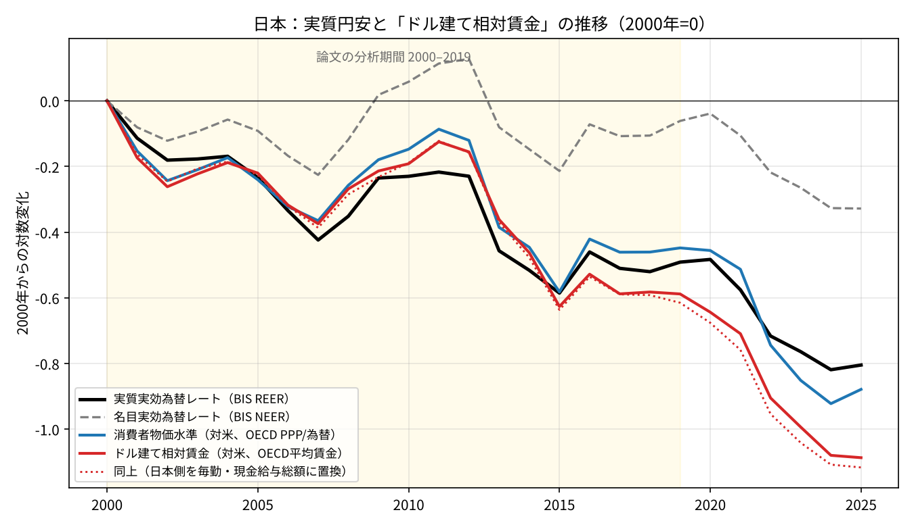
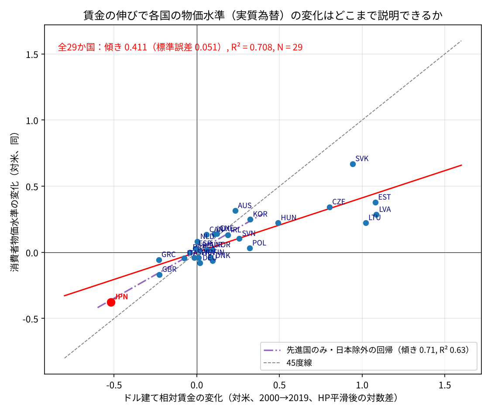
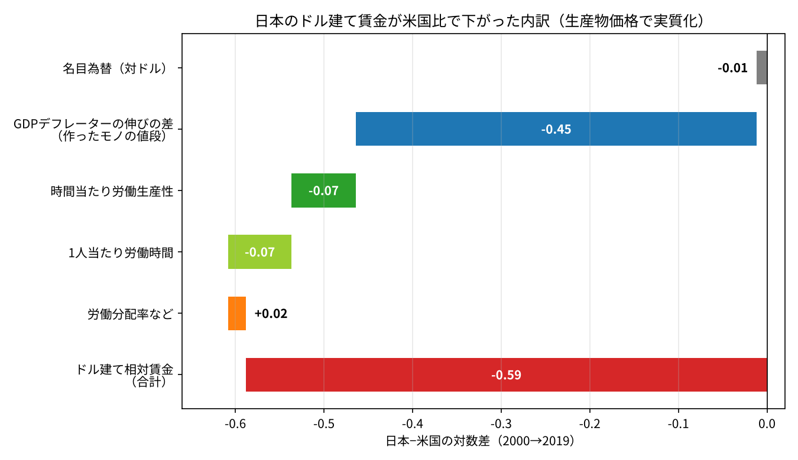
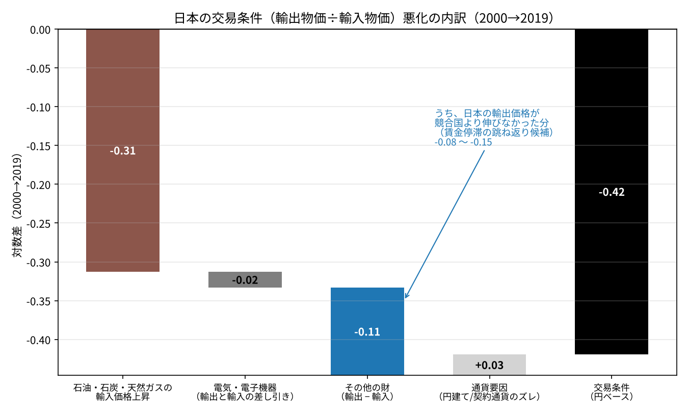
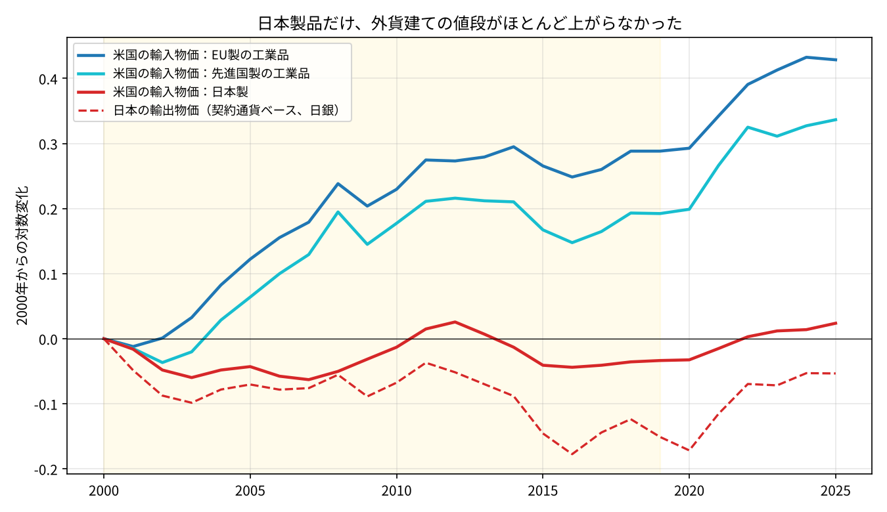

# 実質円安の正体は「賃金」だった──バラッサ＝サミュエルソン論文を日本のデータで確かめる

※ この記事は、BIS・OECD・日本銀行・厚生労働省・米国労働統計局（FRED経由）の公表データを使って計算している。

2000年から2019年にかけて、日本の実質実効為替レートは大きく下がった。いわゆる「実質円安」であり、日本のモノやサービスが海外と比べて安くなったということである。

この実質円安はよく「日本の生産性が伸びなかったから」と説明される。ところが、2026年2月に経済産業研究所（RIETI）から出た菊池信之輔氏（UCSD）のディスカッション・ペーパーは、その説明では日本の実質円安がほとんど説明できないことを示した。論文が最後に指摘しているのは「賃金」である。

本稿では、論文の内容を紹介したうえで、その結論を日本の実データで確かめ、さらに「交易条件の悪化」がどこまで関わっていたのかを分解する。

結果を先に示すと、次のようになった。

- 2000〜2019年の実質円安（対数で−0.49）のうち、名目為替の円安によるものは1割ほどで、9割は「日本の物価が海外ほど上がらなかった」ことによるものであった。
- その物価の差は、日本の名目賃金（円）が米国の名目賃金（ドル）より伸びなかったこと、つまりドル建て相対賃金が下がったことで、ほぼそのまま説明できる。29か国で比べても、賃金の伸びと物価水準の変化は強く結びついており、日本を除いた先進国の関係式で日本の物価の変化をほぼ正確に当てることができた。
- 日本の賃金が米国より伸びなかった分のうち、約4分の3は「作ったモノの値段（GDPデフレーター）が上がらなかった」名目の部分であった。生産性や労働時間などの実質の部分は約5分の1である。
- 同じ時期の交易条件の悪化は、約4分の3が資源価格の上昇によるものであった。日本の賃金が伸びなかったことの跳ね返りと考えられる部分もあったが、実質賃金への影響に直すと小さなものであった。

## 本稿で使う言葉

- **名目賃金**：それぞれの国の通貨で測った賃金である。日本なら円、米国ならドルである。
- **ドル建て相対賃金**：日本の円建ての賃金を円ドルレートでドルに換算し、米国の賃金と比べたものである。その変化は「日本の名目賃金（円）の変化 − 米国の名目賃金（ドル）の変化 − 円ドルレートの変化」になる。
- **二国間の実質為替レート**：ある国と基準国（本稿では米国）の物価を、同じ通貨に換算して比べたものである。
- **実質実効為替レート（REER）**：多くの貿易相手国との実質為替レートを、貿易の大きさで重み付けして平均したものである。

実質為替レートは「同じ通貨で測った物価の比」なので、それと対応させるために、賃金も同じ通貨（ドル）に換算して比べている。ただし、2000〜2019年は円ドルレートがほとんど動かなかったので、日本と米国の賃金差は、円とドルのまま比べてもドルに換算して比べても、ほぼ同じになる。

## 論文の内容：バラッサ＝サミュエルソン効果は「ある」が「小さすぎる」

論文のタイトルは「Balassa–Samuelson in the Long Run: Qualitative success, quantitative limits」（RIETI DP 26-E-012）である。

論文は前半と後半で、使っている為替レートが異なる。前半の実証では、Penn World Table の消費価格水準から作った「基準国との二国間の実質為替レート」を使っている。後半のモデルの検証では、BIS の実質実効為替レート（REER）と比べている。

### バラッサ＝サミュエルソン効果とは

バラッサ＝サミュエルソン（BS）効果は、国際経済学でよく知られた考え方である。

製造業のような「貿易できる財」の生産性が上がると、その国の賃金が上がる。労働者は業種の間を移動できるので、生産性があまり変わらない理髪店のような「貿易できないサービス」でも、賃金を上げなければ人が集まらない。その結果、サービスの値段が上がり、国全体の物価が高くなる。つまり、貿易財の生産性が速く伸びる国ほど、実質為替レートが上がる（実質で通貨高になる）というものである。

### 実証：時間の固定効果を入れると、BS効果は安定して確認できる

これまでの実証研究では、BS効果があるという結果とないという結果が混在していた。論文はその原因を、推計の方法に求めている。

従来の推計では、米国などの「基準国」を1つ決めて、各国の為替レートや生産性を基準国との比で表す。ところが、この方法では基準国に固有のショックがすべての国のデータに入り込み、国の数を増やしても打ち消されない。実際、基準国を変えると推計結果が大きく変わり、米国を基準にするとBS効果はむしろマイナスに出ていた。

論文は、年ごとの共通の動きを取り除く「時間の固定効果」を加えることで、この問題を解消した。すると、どの国を基準にしても、推計値はおおむね0.3前後で安定し、BS効果がはっきり確認できた。

### 定量：モデルに生産性を入れても、実際の為替レートの動きは再現できない

一方で、論文の後半では、多国間の貿易モデルに各国の部門別の生産性の推移を入れて、実質実効為替レートの変化をどこまで再現できるかを確かめている。

結果は、どのモデルでも再現できる幅が小さすぎ、国によっては向きまで逆になった。貿易費用、国の数、部門の数、産業連関を加えても改善しない。

なかでも日本は、論文が最も目立つ失敗例として挙げている国である。論文によると、2000〜2019年に日本の実質実効為替レートは対数で0.7を超えて下がったのに、生産性だけを入れたモデルは逆に上昇を予測した（この0.7という数字と、本稿で使ったBISのデータとのズレは、最後の注意点に記した）。

### 失敗の原因は「賃金」

論文は最後に、モデルが計算する賃金の代わりに、実際の各国の名目賃金（自国通貨建て）をモデルに入れている。すると、サービスの価格を中心に、実際の為替レートの動きがかなりよく再現できた。日本も、賃金を入れたモデルではほぼデータどおりの経路をたどっている。

つまり、問題は「価格がどう決まるか」ではなく、「生産性から賃金がどう決まるか」の部分にある、というのが論文の結論である。ただし、賃金は経済の中で決まる結果なので、「賃金が原因だ」とまでは言えない、と論文自身も注意している。

## 日本のデータで確かめる

ここからは、論文の結論を公表データで確かめる。

### 実質円安の9割は「物価の差」

まず、BISの実効為替レートで、2000〜2019年の日本の実質円安を分解した（数字はすべて対数の変化である）。

- 実質実効為替レート：−0.49
- 名目実効為替レート：−0.06
- 両者の差（日本と貿易相手国の物価の差）：−0.43

実質円安の9割は、名目為替の円安ではなく、日本の物価が貿易相手国ほど上がらなかったことによるものであった。円ドルの名目レートも、2000年と2019年の年平均でほとんど同じである。

グラフは、BISの実質実効為替レート（黒）、OECDの購買力平価から計算した米国比の消費者物価水準（青、二国間の実質為替レートにあたる）、ドル建て相対賃金（赤）を、2000年を0として並べたものである。点線の赤は、日本の賃金を毎月勤労統計の現金給与総額に置き換えたものである。

2000〜2019年は、3本の線がほぼ重なって動いている。日本の名目賃金（円）は20年間でむしろ少し下がり（OECDの平均賃金で−0.06、毎月勤労統計で−0.08）、米国の名目賃金（ドル）は対数で0.52（約7割）上がった。円ドルレートはほぼ横ばいだったので、この差がほぼそのままドル建て相対賃金の差（−0.59）になり、物価水準の差になっている。

### 29か国で比べても、賃金が物価を決めている

論文の図6と同じ考え方で、29か国の2000〜2019年の変化を比べた。横軸がドル建て相対賃金の変化、縦軸が消費者物価水準の米国比の変化である。論文と同じく、トレンドを取り出すフィルター（HPフィルター）をかけている。

ただし、論文の図6(c)は実質実効為替レート（REER）とモデルの計算結果を比べたものであるが、ここでは米国との二国間で、賃金と物価水準を直接比べている。為替が大きく動いた国（東欧や韓国など）もあるので、ここでは賃金をドルに換算しなければ比べられない。

- 29か国全体：傾き0.41、決定係数0.71
- 先進国だけ：傾き0.72、決定係数0.77

賃金の伸びで、各国の物価水準の変化の7割以上が説明できる。さらに、日本を除いた先進国で関係式を作って日本の物価の変化を予測すると−0.36となり、実際の−0.38とほぼ一致した。

日本は特殊な国ではなく、「賃金が伸びなかった国が、そのぶん安くなった」という国際的な関係どおりの国だった、ということである。

## 賃金の伸び負けを分解する

では、日本のドル建て相対賃金が下がった（−0.59）のはなぜか。国民経済計算のデータを使って分解した。

- 名目為替（対ドル）：−0.01
- GDPデフレーター（作ったモノの値段）の伸びの差：−0.45
- 時間当たり労働生産性の伸びの差：−0.07
- 1人当たり労働時間の変化の差：−0.07
- 労働分配率など：＋0.02

全体の約4分の3は、日本で作ったモノやサービスの値段そのものが上がらなかったという、名目の部分である。本来なら、日本の物価が上がらない分だけ円高になって帳尻が合うはずであるが、名目為替がほとんど動かなかったため、その差がまるごと実質円安になった。

生産性や労働時間といった実質の部分は約5分の1にとどまる。意外なことに、労働分配率は日米の差の要因になっていない。日本も米国も、同じくらい分配率が下がっていたためである。

なお、日本だけで見ると、2000〜2019年の時間当たり労働生産性は対数で0.21伸びていた。それでも実質賃金がほとんど伸びなかったのは、1人当たり労働時間の減少（−0.10）、労働分配率の低下（−0.07）、交易条件の悪化（−0.04）が、生産性の伸びをほぼ打ち消したためである。

### 実質化に何を使うかで、交易条件の扱いが変わる

ここで1つ注意がある。当初、筆者は実質賃金を「消費者が払う値段」（消費デフレーター）で計算し、その中に交易条件の悪化を含めていた。しかし、それでは「日本の名目賃金が伸びない → 日本の輸出品が相対的に安くなる → 交易条件が悪化する」という跳ね返りを、賃金が伸びなかった原因として数えてしまう。

そこで上の分解では、「作ったモノの値段」（GDPデフレーター）で実質化した。こうすると、交易条件は分解の外に出る。交易条件は、作ったモノの値段と消費者が払う値段のズレとして現れる。

このズレを見ると、日本の消費者物価はGDPデフレーターほどは下がっていなかった（差は＋0.03）。輸入品が高くなった分、消費者物価の下落が和らいだためである。交易条件の悪化は、実質賃金にとってはマイナスであったが、消費者物価で見た実質円安にとっては、むしろクッションとして働いていた。

## 交易条件の悪化は、どこまで賃金の跳ね返りだったのか

では、交易条件の悪化のうち、日本の賃金が伸びなかったことの跳ね返りはどれくらいだったのか。日本銀行の輸出・輸入物価指数を使って分解した。

輸出・輸入物価指数には「円ベース」と「契約通貨ベース」がある。契約通貨ベースは、ドルなど実際に取引された通貨での価格の動きを表す。輸入物価の契約通貨ベースの上昇は、日本の賃金とは関係のない世界の価格の動きである。

2000〜2019年の交易条件（円ベース）の悪化は−0.42であった。その内訳は次の通りである。

- 石油・石炭・天然ガスの輸入価格の上昇：−0.31
- 電気・電子機器（輸出と輸入の差し引き）：−0.02
- その他の財（輸出−輸入）：−0.11
- 通貨要因（円ベースと契約通貨ベースのズレ）：＋0.03

約4分の3は資源価格の上昇であり、これは外から来たショックである。電気・電子機器は、日本の輸出価格（−0.22）も輸入価格（−0.20）も同じくらい下がっており、交易条件にはほとんど影響していない。

### 日本製品だけ、外貨建ての値段が上がらなかった

賃金の跳ね返りの姿がはっきり見えるのは、「その他の財」の輸出である。米国の原産国別の輸入物価指数で、米国が買った工業品の値段（ドル建て）を比べた。

2000〜2019年のドル建ての値段の変化は次の通りである。

- EU製の工業品：＋0.29
- 先進国製の工業品：＋0.19
- 日本製：−0.03

日本製品だけ、ドル建ての値段がほとんど上がっていない。日本銀行の輸出物価でも、機械や自動車などの電機以外の輸出品は、契約通貨ベースで＋0.09しか上がっていなかった。

日本の輸出品が競合国並みに値上がりしていたと仮定すると、交易条件の悪化のうち−0.08〜−0.15（比べる相手をEUにするか先進国全体にするかで幅がある）は、日本の輸出価格が伸びなかったことによるものと計算できる。交易条件の悪化全体の2〜4割である。

ドル建て相対賃金が−0.59下がったのに対して、競合国と比べた日本製品の値段の下がり方は−0.2〜−0.3であった。賃金の伸び負けのおよそ4〜5割が、輸出価格に反映されたことになる。

### 実質賃金への影響は小さい

国民経済計算で見ると、2000〜2019年に交易条件の悪化が日本の実質賃金を押し下げた分は−0.04であった。これを上の割合で分けると、資源価格による分が約−0.03、賃金の跳ね返りによる分が約−0.01になる。

賃金の跳ね返りは理屈の上では確かに存在するが、ドル建て相対賃金の差−0.59と比べれば、ごく小さなものであった。

## まとめ

- 論文が示した通り、日本の実質円安は生産性（BS効果）ではほとんど説明できず、賃金でほぼ説明できる。29か国で比べても、日本は「賃金が伸びなかった国が安くなった」という関係どおりの国であった。
- 日本の賃金が米国より伸びなかった分の約4分の3は、作ったモノの値段が上がらなかった名目の部分である。名目為替がそれを打ち消さなかったため、そのまま実質円安になった。
- 生産性と労働時間による実質の部分は約5分の1で、労働分配率は日米の差の要因ではなかった。
- 交易条件の悪化は主に資源価格によるもので、賃金の跳ね返りの部分は実質賃金に直すと−0.01程度であった。

この結果は、同じリポジトリの「[交易損失は賃金を下げるのか](https://github.com/p72/note-draft/blob/main/交易条件とデフレ/01_交易損失は賃金を下げるのか.md)」の結論とも重なる。2000年代のデフレの主因は交易損失ではなく、国内の名目の物価と賃金の動きであった。実質円安も同じで、その本体は「名目の賃金と物価が上がらず、名目為替もそれを打ち消さなかった」ことにあると言える。

## 注意点

- **因果関係までは言えない**：本稿の分解は、すべて足し算として成り立つ恒等式である。賃金も物価も経済の中で同時に決まるので、「賃金が原因だ」とまでは言えない。論文と同じく、「問題の所在は賃金にある」というところまでの話である。
- **論文の「0.7」とのズレ**：論文は日本の実質実効為替レートが2000〜2019年に対数で0.7を超えて下がったとしているが、本稿でFREDから取ったBISの広義の実質実効為替レート（年平均）では−0.49、HPフィルター後では−0.41であった。論文の国別のグラフ（図A1）を目で見ると−0.6前後である。狭義・広義の指数の違い、月次か年次か、フィルターの端の扱いなどが考えられるが、論文からは特定できなかった。
- **2019年以降は話が変わる**：2000〜2025年で見ると、2022年以降の名目の円安（−0.33）が加わり、実質円安はさらに大きくなっている。本稿の分析は、主に論文と同じ2000〜2019年を対象にしている。
- **労働時間の減少の中身**：1人当たり労働時間の減少には、パートタイム労働者の増加と、正社員の労働時間の短縮の両方が含まれる。本稿では分けていない。
- **交易条件の分解は概算**：日本銀行の輸出・輸入物価指数は財だけで、サービスの貿易は入っていない。国民経済計算の交易条件とは範囲が違うので、実質賃金への影響は割合で配分した概算である。また、類別のウェイトは公表値ではなく、月次データから5年ごとに推計した（当てはまりの良さを表す決定係数は0.97〜0.996）。
- **「競合国より伸びなかった分」には賃金以外も入る**：製品の品質調整の違いや、輸出する品目の構成の違いも混ざっている。−0.08〜−0.15と幅を持たせたのはそのためである。
- **毎月勤労統計の段差**：毎月勤労統計の賃金指数は、2024年に段差のような動きがある。2024年以降の水準は参考程度に見てほしい。

## データの取り方

- 論文：Shinnosuke Kikuchi「Balassa–Samuelson in the Long Run: Qualitative success, quantitative limits」RIETI Discussion Paper 26-E-012（2026年2月）[https://www.rieti.go.jp/en/](https://www.rieti.go.jp/en/)
- 実質・名目実効為替レート：BIS「Effective exchange rate indices」広義、年平均（FRED API で取得、系列ID RBJPBIS・NBJPBIS など）[https://fred.stlouisfed.org/series/RBJPBIS](https://fred.stlouisfed.org/series/RBJPBIS)
- 日本の賃金：厚生労働省「毎月勤労統計調査」長期時系列表、現金給与総額指数（5人以上、調査産業計、年平均、2020年＝100）（e-Stat のデータカタログから取得）[https://www.e-stat.go.jp/statistics/00450071](https://www.e-stat.go.jp/statistics/00450071)
- 各国の平均賃金、為替レート、購買力平価：OECD「Average annual wages」「Annual Purchasing Power Parities and exchange rates」（家計の実質個別消費の購買力平価）[https://data-explorer.oecd.org](https://data-explorer.oecd.org)
- 国民経済計算（GDP、雇用者報酬、最終消費支出、輸出・輸入、就業者・雇用者数）と年間労働時間：OECD の年次国民経済計算（Table 1・Table 3）と「Average annual hours actually worked per worker」
- 輸出・輸入物価指数：日本銀行「企業物価指数」（2020年基準、円ベース・契約通貨ベース、総平均と類別）（時系列統計データ検索サイトの API で取得）[https://www.stat-search.boj.or.jp/](https://www.stat-search.boj.or.jp/)
- 米国の原産国別輸入物価指数：米国労働統計局（FRED API で取得、系列ID JPNTOT・INDUSMANU・EECMANU）[https://fred.stlouisfed.org/series/JPNTOT](https://fred.stlouisfed.org/series/JPNTOT)
- 長期の変化は、1995〜2019年の対数系列にHPフィルター（λ＝6.25）をかけ、2000年と2019年の値の差で求めた（29か国の比較）。日本の分解は、2000年と2019年の年次の値の対数差である。
- 賃金の分解は、「賃金 ＝ （賃金／1人当たり雇用者報酬）× 労働分配率（自営業を調整）× 時間当たり実質GDP × 1人当たり労働時間 × GDPデフレーター」の恒等式を、日本と米国で比べて求めた。
