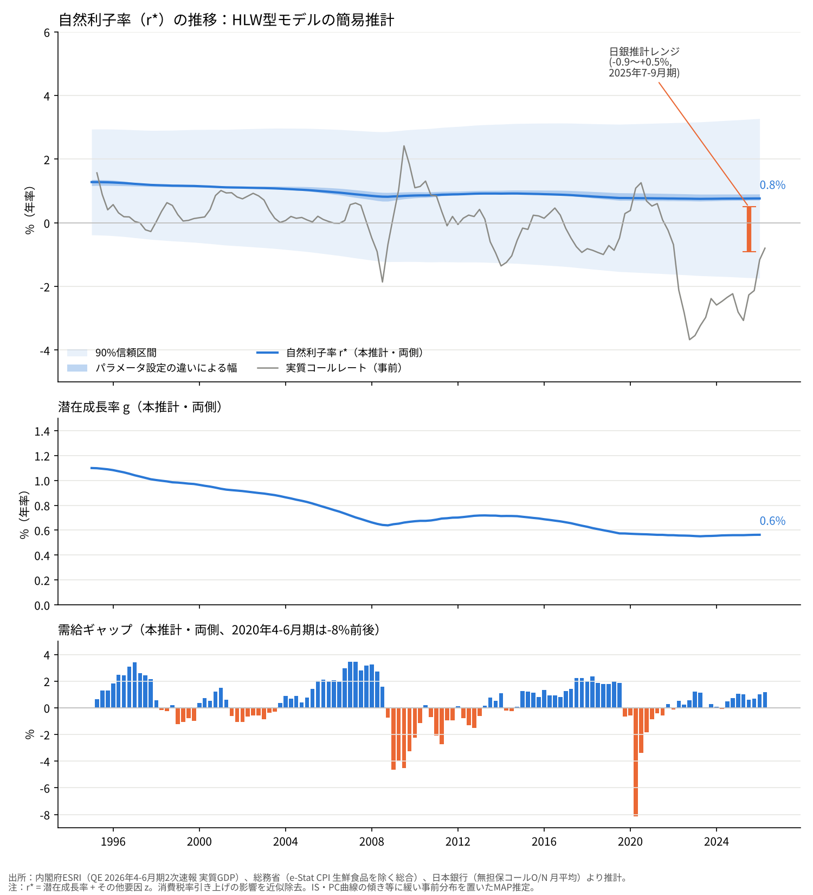

# HLW型モデルで日本の自然利子率を推計する──潜在成長率は0.6％、r*は0.8％、ただし誤差は±2.5％

※ この記事は、内閣府 経済社会総合研究所（ESRI）の四半期GDP速報、総務省の消費者物価指数（e-Stat API）、日本銀行の時系列統計（API）の公表データを使い、Python で推計しています。推計コードは同じフォルダの `01_hlw_japan.py` です。

## 要旨

景気を熱しも冷やしもしない実質金利、つまり自然利子率（r*）は、日本銀行の利上げがどこまで続くかを考えるうえでの基準になります。日本銀行は2026年3月の日銀レビューで、6つのモデルによる推計レンジを「マイナス0.9％程度からプラス0.5％程度」（2025年7-9月期時点）と示しました。

この記事では、米国の連邦準備制度でよく使われる Holston-Laubach-Williams（HLW）型のモデルを、日本の公表データで推計し直しました。1995年4-6月期から2026年4-6月期までの四半期データを使っています。

結果を先に書くと、次のようになりました。

- 自然利子率は、1995年の1.3％から2026年1-3月期の0.8％まで、ゆっくり下がりました。
- その下落は、ほぼすべてが潜在成長率の低下（1.1％→0.6％）で説明され、「その他の要因」はほとんど動きませんでした。
- ただし、90％の信頼区間はマイナス1.7％からプラス3.3％ほどと非常に広く、日本銀行のレンジもすっぽり入ります。
- 2022年以降、実質コールレートは平均でマイナス2.6％と、推計した自然利子率を大きく下回っており、金融環境は強く緩和的だったことになります。
- 日本では、教科書どおりの最尤法だけで推計すると、金利と景気の関係がほぼゼロに潰れてしまいます。ゼロ金利が長く続いたため、データに「金利を動かすと景気がどう動くか」の情報が少ないからです。

## 1. はじめに

自然利子率は直接観測できません。そのため、各国の中央銀行や研究者は、観測できるデータから逆算する様々なモデルを使っています。

なかでも、Laubach and Williams（2003）と、その国際版である Holston, Laubach and Williams（2017）のモデルは、最も広く使われているものの1つです。仕組みはシンプルで、「実質金利が自然利子率より低いと景気が過熱し、景気が過熱するとインフレが加速する」という2本の式から、自然利子率と潜在GDPを同時に推計します。

日本銀行のスタッフも、HLW型を含む複数のモデルで日本の自然利子率を推計しています。ただし、日本銀行は推計値に「相当なばらつきがある」としており、具体的な水準は示していません。

この記事の目的は、HLW型のモデルを日本の公表データで実際に回してみて、どのような結果が出るのか、そしてどこが難しいのかを、手を動かして確かめることです。

## 2. モデル

モデルは、観測できる変数の式（2本）と、観測できない変数の動きの式（3本）でできています。記号は次の通りです。

- y：実質GDPの対数×100
- y*：潜在GDP（観測できない）
- ỹ = y − y*：需給ギャップ
- π：インフレ率（年率）
- r：実質金利（政策金利−期待インフレ率）
- r*：自然利子率（観測できない）
- g：潜在成長率（観測できない）
- z：その他の要因（観測できない）

### 観測できる変数の式

1本目は、景気と金利の関係を表すIS曲線です。

```
ỹ(t) = a1·ỹ(t-1) + a2·ỹ(t-2) + (ar/2)·Σ[ r(t-j) − r*(t-j) ]（j=1,2） + ε1
```

実質金利が自然利子率より低いと（r − r* < 0）、ar がマイナスなので需給ギャップはプラスに向かいます。

2本目は、需給ギャップとインフレの関係を表すフィリップス曲線です。

```
π(t) = bπ·π(t-1) + (1−bπ)·[π(t-2)〜π(t-4)の平均] + by·ỹ(t-1) + ε2
```

需給ギャップがプラスだと、インフレ率が過去の平均より高くなります。

### 観測できない変数の動き

```
y*(t) = y*(t-1) + g(t-1) + ε3
g(t)  = g(t-1) + ε4
z(t)  = z(t-1) + ε5
r*(t) = g(t) + z(t)
```

潜在成長率 g とその他の要因 z は、どちらもランダムウォーク（毎期少しずつ、予測できない方向に動く）と仮定します。自然利子率は、その2つの和です。

前の記事などで触れた「r* ＝ 潜在成長率＋その他の要因」という形は、この最後の式のことです。z には、高齢化による貯蓄の増加、安全資産への需要、財政赤字など、成長率以外で自然利子率を動かすものがまとめて入ります。

## 3. データ

- **実質GDP**：内閣府 ESRI「2026年4-6月期 2次速報」の実質・季節調整系列（1994年1-3月期〜2026年4-6月期）
- **インフレ率**：総務省「消費者物価指数」の生鮮食品を除く総合（全国、2020年基準）を四半期平均し、STL法で季節調整したうえで、前期比を年率換算
- **政策金利**：日本銀行の無担保コールレート・オーバーナイト物の月平均を四半期平均
- **期待インフレ率**：HLW と同じく、過去4四半期のインフレ率の平均
- **実質金利**：政策金利−期待インフレ率

消費税率の引き上げは物価を一時的に押し上げるので、日本銀行の試算をもとに、1997年4-6月期に1.5％、2014年4-6月期に2.0％、2019年10-12月期に1.0％の押し上げ分を物価の水準から取り除きました。

コロナ禍の2020年4-6月期から10-12月期までは、GDPの急落と反動をIS曲線のダミー変数で吸収しています。ラグを取る関係で、推計期間は1995年4-6月期から2026年4-6月期までの125四半期です。

## 4. 推計方法

観測できない変数（潜在GDP、潜在成長率、その他の要因）は、カルマンフィルタで推計します。カルマンフィルタは、新しいデータが入るたびに「観測できない変数の今の値」を更新していく方法です。

そのうえで、IS曲線とフィリップス曲線の係数や、各ショックの大きさを、尤度が最大になるように選びます。

### 最尤法だけでは潰れてしまう

最初は、教科書どおり最尤法だけで推計しました。すると、IS曲線の金利の係数 ar が、許した範囲の下限（ほぼゼロ）に張り付きました。同時に、IS曲線の誤差もゼロ近くまで縮み、GDPの動きのほとんどが潜在GDPの動きとして説明されてしまいました。需給ギャップが消えてしまったわけです。

これは、HLW型モデルでよく知られた問題（パイルアップ問題）が、日本では特に強く出たものと考えられます。1995年以降の日本は、政策金利がほとんど0％近くに張り付いていました。金利がほとんど動かないので、データの中に「金利を動かすと景気がどう動くか」の情報がほとんどありません。

### ゆるい事前分布を置く

そこで、いくつかの係数に「ゆるい事前分布」を置き、事後確率が最大になる値を選ぶ方法（MAP推定）に切り替えました。日本銀行スタッフの岡崎・須藤モデルなども、ベイズ推定を使っています。置いた事前分布は次の通りです。

- IS曲線の金利の係数 ar：平均−0.10、標準偏差0.05
- フィリップス曲線の傾き by：平均0.10、標準偏差0.05
- 潜在GDPのショックの標準偏差：平均0.40、標準偏差0.15
- IS曲線の誤差の標準偏差：平均0.60、標準偏差0.30

### ショックの大きさは決め打ちして、感応度を見る

潜在成長率 g とその他の要因 z のショックの大きさは、データからはほとんど決まらないため、HLW と同じく外から決めました。

ただし、本家 HLW の z の決め方（ar で割る形）を使うと、日本では ar が小さいために z のショックが過大になり、z が大きく暴れました。そこで、z のショックの標準偏差は直接設定しています。

基本ケースは、潜在成長率のショックを潜在GDPのショックの0.06倍、z のショックを四半期0.10％としました。そのうえで、前者を0.03〜0.10倍、後者を0.05〜0.20％の範囲で振った4つのケースも推計しました。

## 5. 結果



上段が自然利子率、中段が潜在成長率、下段が需給ギャップです。いずれも、全期間のデータを使って推計した値（両側推計）です。上段の濃い青の帯は、ショックの大きさの設定を変えた5つのケースの幅、薄い青の帯は基本ケースの90％信頼区間、灰色の線は実質コールレート、オレンジの棒は日本銀行の推計レンジ（2025年7-9月期）です。

### 推計された係数

基本ケースの主な係数は次の通りです。

- IS曲線のラグ係数：a1 = 1.12、a2 = −0.25（需給ギャップの持続性は合計0.87）
- IS曲線の金利の係数：ar = −0.047
- フィリップス曲線の傾き：by = 0.040
- インフレの慣性：bπ = 0.51

金利の係数とフィリップス曲線の傾きは、どちらも事前分布の平均（−0.10、0.10）より小さい値になりました。データは「金利が景気に効く度合いも、景気が物価に効く度合いも小さい」という方向を示しています。

### 自然利子率は0.8％、潜在成長率は0.6％

基本ケースの自然利子率は、1995年1-3月期の1.3％から、2000年に1.2％、2008年に0.9％、2019年10-12月期に0.8％と下がり、2026年1-3月期は0.8％でした。設定を変えた5つのケースでも、最新値は0.7〜0.9％に収まっています。

潜在成長率は、1995年の1.1％から2008年に0.7％、2019年以降は0.6％前後で横ばいです。内閣府や日本銀行が公表している潜在成長率（0％台半ば）と、おおむね同じ水準です。

その他の要因 z は、全期間を通じて0.2％前後でほとんど動きませんでした。つまり、この推計では「自然利子率の低下は、ほぼすべて潜在成長率の低下による」という結果になっています。

### 誤差はとても大きい

基本ケースの自然利子率の標準誤差は、1995年の1.0％から、2026年には1.5％まで広がっています。90％信頼区間にすると、最新時点でマイナス1.7％からプラス3.3％ほどです。

日本銀行の推計レンジ（マイナス0.9〜プラス0.5％）は、この信頼区間の中に完全に入ります。この記事の0.8％という値は、日本銀行のレンジの上限より少し高いものの、統計的に区別できる差ではありません。

### 実質金利は自然利子率を大きく下回ってきた

灰色の線の実質コールレートを見ると、1995〜2012年の平均は0.4％で、推計した自然利子率（1％前後）を少し下回る程度でした。

2022年以降は様子が一変します。政策金利がほぼ0％のまま、インフレ率が上がったため、実質コールレートは2022年10-12月期にマイナス3.7％まで下がり、2022〜2025年の平均はマイナス2.6％でした。自然利子率との差は3％以上あり、この推計に従えば、金融環境は強く緩和的だったことになります。

2026年4-6月期は、利上げと期待インフレ率の低下で、実質コールレートはマイナス0.8％まで戻っています。それでも、推計した自然利子率より1.5％ほど低い水準です。

### 需給ギャップ

需給ギャップは、2007年7-9月期に＋2.8％、リーマン・ショック後の2009年1-3月期に−4.6％、コロナ禍の2020年4-6月期に−8.2％でした。2026年4-6月期は＋1.2％で、需要超過の状態です。日本銀行が2026年3月の再推計で需給ギャップをプラスに改めたことと、向きは合っています。

## 6. 考察

### なぜ自然利子率の水準が決まらないのか

推計した金利の係数 ar は−0.047でした。これは、実質金利が自然利子率から1％ずれても、需給ギャップへの影響が四半期で0.05％ほどしかない、ということです。

裏返すと、自然利子率が1％ずれていても、GDPの動きにはほとんど差が出ません。そのため、データから自然利子率の「水準」を決める力がとても弱くなります。信頼区間が広いのも、z がほとんど動かず、初期値と事前の設定に引っ張られているのも、このためです。

フィリップス曲線の傾き by も0.04と小さく、「インフレが加速していないから、需給ギャップは大きくない」という手がかりも弱くなっています。日本の物価が長く景気に反応しにくかったことの表れでしょう。

### 潜在成長率への依存

この推計では、自然利子率の動きが潜在成長率の動きとほぼ同じになりました。理論的には自然利子率は潜在成長率と関係しますが、各国の長期データでは、両者の関係はそれほど強くないことが知られています。高齢化や安全資産への需要など、成長率以外の要因の影響も大きいはずです。

z がほとんど動かなかったのは、「成長率以外の要因が効いていない」ことを示すのではなく、「データから成長率以外の要因を読み取る力が弱い」ことを示している、と考えるのが自然です。

### 中立金利に直すと

自然利子率0.8％に、物価安定の目標の2％を足すと、名目の中立金利は2.8％ほどになります。日本銀行のレンジから同じように計算した1.1〜2.5％より高い値です。

ただし、信頼区間の広さを考えると、この推計から「中立金利は2.8％」と言うことはできません。言えるのは、「HLW型の簡易推計では、日本銀行のレンジより少し高めの値が出るが、誤差を考えると区別はできない」というところまでです。

## 7. まとめ

- HLW型のモデルを日本の公表データで推計すると、自然利子率は2026年1-3月期に0.8％、潜在成長率は0.6％でした。
- 自然利子率の低下は、ほぼすべて潜在成長率の低下で説明される形になりました。
- 2022年以降の実質金利は、自然利子率を3％以上下回り、金融環境は強く緩和的でした。
- ただし、90％信頼区間はマイナス1.7〜プラス3.3％と広く、日本銀行のレンジとも区別できません。
- 日本では、金利がほとんど動かなかった期間が長いため、金利と景気の関係がデータから読み取りにくく、自然利子率の水準はとても決まりにくいことが、手を動かしてみてよくわかりました。日本銀行が1つのモデルに頼らず、複数のモデルの「幅」で示している理由も、ここにあると考えられます。

## 注意点

- **簡易版である**：本家の HLW は、3段階に分けた推計（Stock and Watson の中央値不偏推定）でショックの大きさを決めています。この記事は、ショックの大きさを外から与えた1段階の簡易版です。
- **事前分布の影響**：金利の係数などにゆるい事前分布を置いています。事前分布を変えると結果も変わります。とくに、自然利子率の水準はデータから決まる力が弱いため、事前の設定の影響を受けやすくなっています。
- **z のショックの決め方**：本家 HLW の決め方では、z のショックが過大になったため、直接設定しています。本家の決め方のままだと、最新値は1.1〜2.7％と大きくぶれました。
- **期待インフレ率**：過去4四半期のインフレ率の平均という簡単な方法です。家計や企業へのアンケート、日本銀行の推計値などに差し替えると、実質金利も自然利子率も変わります。
- **物価の特殊要因**：消費税率の引き上げだけを近似的に取り除いています。携帯電話の通信料の引き下げ（2021年）、幼児教育・保育の無償化（2019〜2020年）、エネルギー価格の補助金（2023年以降）などは調整していません。
- **両側推計と片側推計**：グラフは全期間のデータを使った両側推計です。その時点までのデータだけを使った片側推計は、後から大きく修正されることがあります。最新時点では両者は一致します。
- **ゼロ金利制約**：政策金利が0％近くに張り付いていた期間は、モデルの想定（金利が自由に動く）と合いません。この問題は HLW 自身も指摘しています。

## データの取り方

- 実質GDP：内閣府 ESRI「2026年4-6月期 2次速報」実質季節調整系列（`gaku-jk2622.csv`） [https://www.esri.cao.go.jp/jp/sna/sokuhou/sokuhou_top.html](https://www.esri.cao.go.jp/jp/sna/sokuhou/sokuhou_top.html)
- 消費者物価指数：総務省「消費者物価指数」2020年基準 生鮮食品を除く総合・全国・指数（e-Stat API、統計表ID 0003427113、1970年1月〜2026年8月） [https://www.e-stat.go.jp/](https://www.e-stat.go.jp/)
- 政策金利：日本銀行 時系列統計データ検索サイト API（FM02、無担保コールレート・O/N 月平均、系列コード STRACLUCON） [https://www.stat-search.boj.or.jp/](https://www.stat-search.boj.or.jp/)
- 日本銀行の自然利子率の推計レンジ：日本銀行「自然利子率の動向と金融緩和度合いの評価」（日銀レビュー、2026年3月27日）。数値は三井住友DSアセットマネジメントの解説による [https://www.smd-am.co.jp/market/macroview/2026/mvreport20260501_1/](https://www.smd-am.co.jp/market/macroview/2026/mvreport20260501_1/)
- 推計とグラフは Python（numpy、scipy、statsmodels、matplotlib）で自作しました。コードは `01_hlw_japan.py`（推計）と `01_plot.py`（グラフ）です。

## 参考文献

- Laubach, T. and J. C. Williams (2003) "Measuring the Natural Rate of Interest," Review of Economics and Statistics.
- Holston, K., T. Laubach and J. C. Williams (2017) "Measuring the Natural Rate of Interest: International Trends and Determinants," Journal of International Economics.
- Stock, J. H. and M. W. Watson (1998) "Median Unbiased Estimation of Coefficient Variance in a Time-Varying Parameter Model," Journal of the American Statistical Association.
- 岡崎陽介・須藤直（2018）日本の自然利子率の推計に関する日本銀行ワーキングペーパー
