# 賃金3％時代は本物か──毎月勤労統計で読む賃金上昇と「物価2％目標」

※ この記事は、厚生労働省「毎月勤労統計調査」の長期時系列表（2026年7月確報、e-Stat）の公表データを使って作図している。春闘の数字は連合の最終集計、共通事業所ベースの数字は厚生労働省の公表資料と民間シンクタンクのレポートによる。

「毎月勤労統計で3％の賃金上昇が続いている」というニュースを、2026年に入ってから何度も目にするようになった。この「3％」は何を意味していて、なぜ日本銀行の物価2％目標と「整合的」だと言われるのか。

結論を先に示すと、次のようになる。

- 基本給にあたる所定内給与の伸びは、2026年1〜7月のすべての月で前年比3％以上であった。3％台がこれだけ続くのは1992年以来、約34年ぶりである。
- ただし、ニュースで使われる「本系列」は、調査対象の入れ替えなどの影響で強めに出る。同じ事業所どうしで比べる「共通事業所」ベースでは、所定内給与は＋3％前後、現金給与総額は＋3％弱である。
- 賃金3％から労働生産性の伸び1％を引くと、単位労働コストは2％になる。企業がこのコストに一定のマージンを乗せて値付けするなら、物価は2％で落ち着く。これが「3％は2％目標と整合的」と言われる理由である。

## 34年ぶりの「3％台」

まず、所定内給与（就業形態計、事業所規模5人以上）の前年同月比を、1991年から並べた。

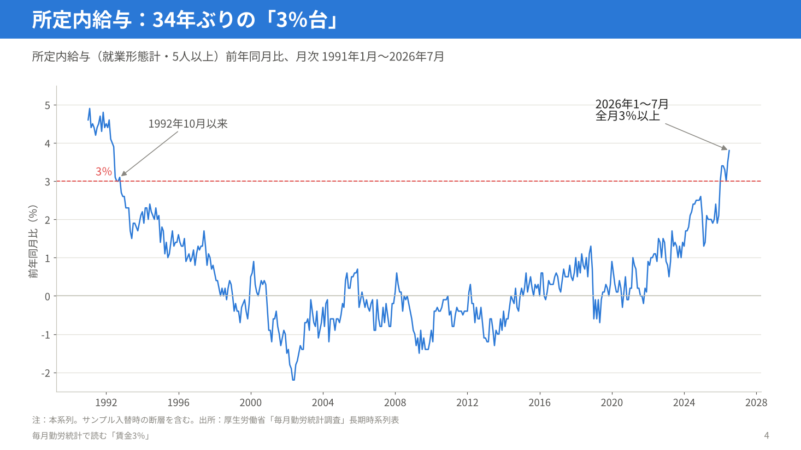

1992年秋に3％を割り込んでから、所定内給与の伸びは長く0％前後にとどまった。2022年ごろから上向き始め、2026年に入って一気に3％を超えている。7月の確報値は＋3.8％であった。

年平均で見ると、この30年余りの姿がよりはっきりする。

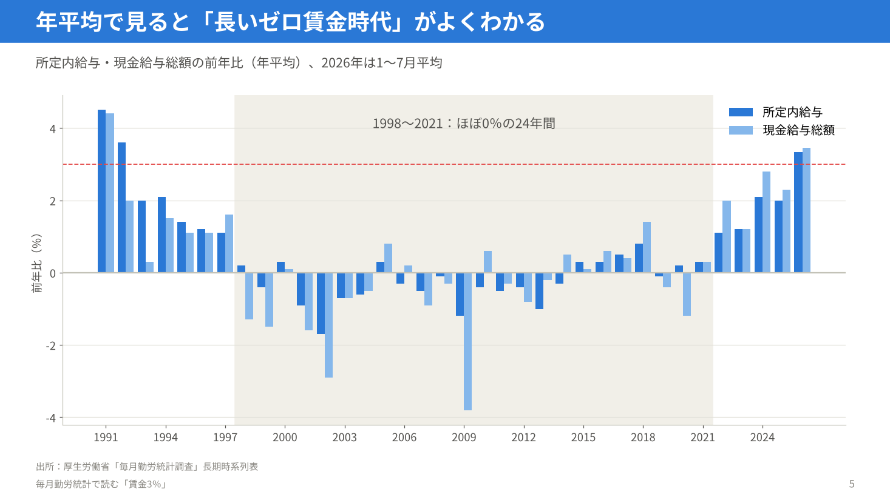

1998年から2021年までの24年間、所定内給与の伸びはほぼ0％、年によってはマイナスであった。2024年と2025年に2％台に乗り、2026年（1〜7月平均）は3％台になっている。

## 2026年は名目も実質もプラス

2025年7月から2026年7月までの月次の動きである。

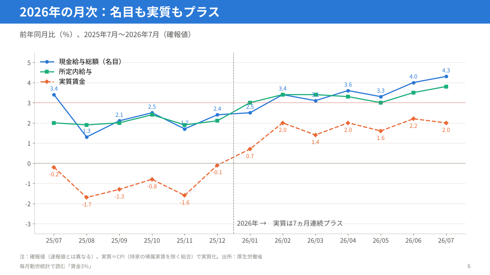

現金給与総額（名目賃金）は、7月に前年比＋4.3％であった。物価の変動を除いた実質賃金は、2026年1月から7ヵ月連続でプラスである。

なお、速報値と確報値はかなり違うことがある。7月分は、速報で＋4.7％だった現金給与総額が、確報で＋4.3％に下方修正された。所定内給与は＋4.1％から＋3.8％へ、実質賃金は＋2.4％から＋2.0％へ修正されている。

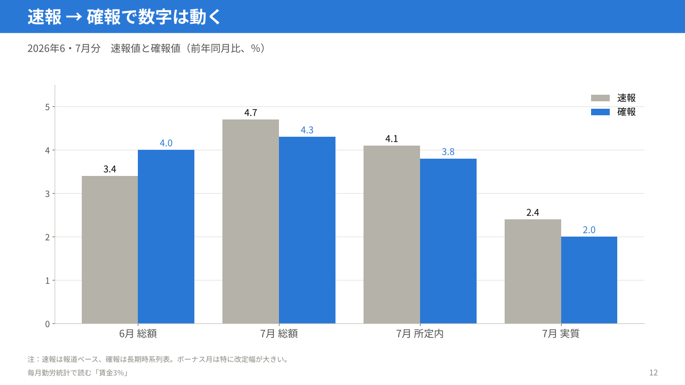

一般労働者とパートタイム労働者に分けて見ると、どちらも伸びが高まっている。

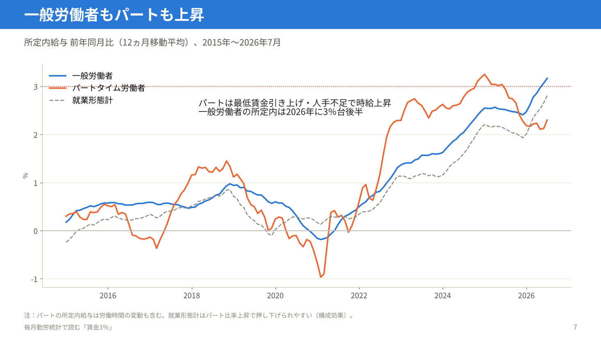

パートタイム労働者は、最低賃金の引き上げと人手不足で時給が上がっている。一般労働者の所定内給与も、2026年は3％台後半で推移している。

## 名目賃金と物価の関係

名目賃金、物価、実質賃金を、12ヵ月移動平均で並べた。物価は、名目賃金指数を実質賃金指数で割って逆算した値で、毎月勤労統計が実質化に使う消費者物価指数（持家の帰属家賃を除く総合）と同じものである。

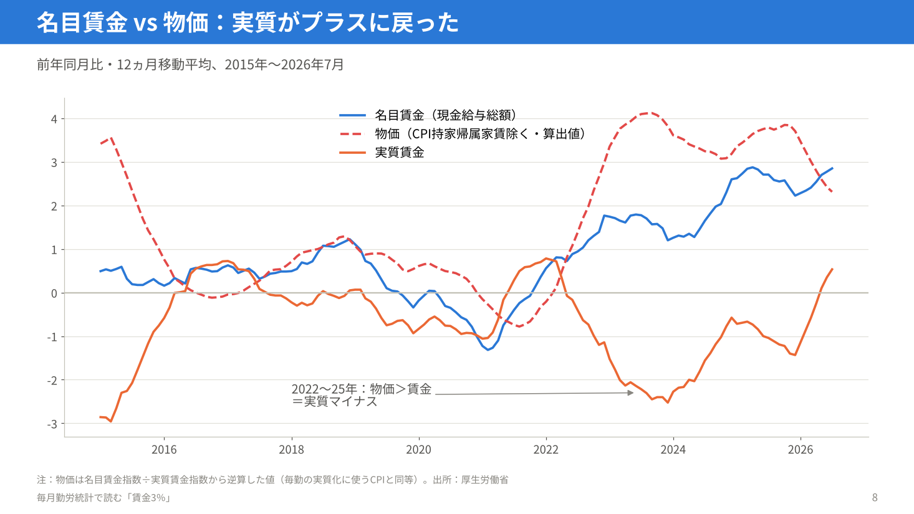

2022年から2025年までは、物価の上昇が賃金の上昇を上回り、実質賃金はマイナスであった。2026年に入って物価の伸びが落ち着き、名目賃金の伸びが高まったことで、実質賃金がプラスに戻っている。

ただし、実質賃金の「水準」は、1990年代後半を大きく下回ったままである。伸び率がプラスになったことと、生活水準が元に戻ったことは別の話である。

## 本系列と共通事業所のズレ

毎月勤労統計には、ニュースで使われる「本系列」と、「共通事業所」ベースの2種類の前年比がある。

本系列は、毎年1月に調査対象の事業所の一部を入れ替えるため、その影響が前年比に混ざる。2026年1月の入れ替えでは、新旧の結果を比べた断層が現金給与総額で−0.5％あった。

共通事業所ベースは、前年と当年の両方に回答した同じ事業所だけで比べたものである。「同じ職場の賃上げ」に近い数字になる。

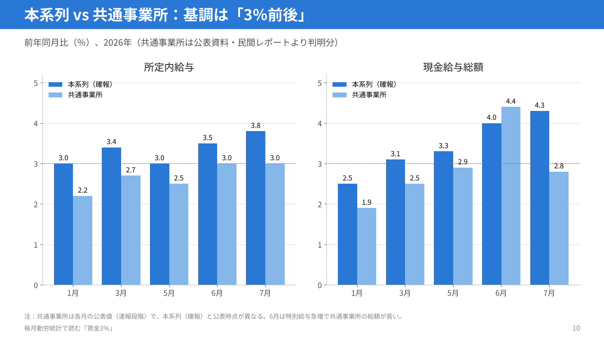

7月の所定内給与は、本系列の＋3.8％（確報）に対して、共通事業所では＋3.0％であった。現金給与総額は、本系列の＋4.3％に対して、共通事業所では＋2.8％である。本系列の数字は割り引いて見る必要があるが、共通事業所で見ても「3％前後」の伸びは続いていると言える。

## 背景にある春闘

この賃金上昇の背景には、3年連続で5％台となった春闘の賃上げがある。

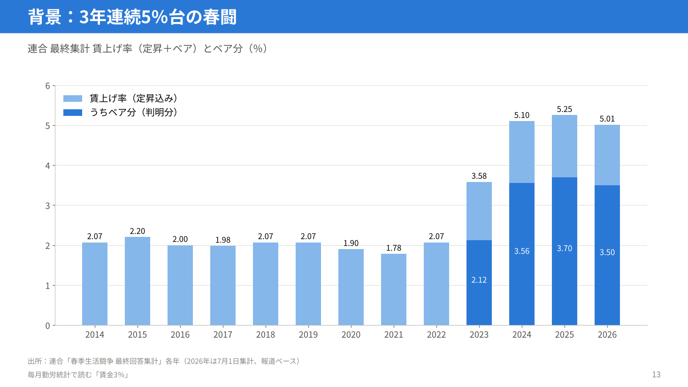

2026年の連合最終集計は、定期昇給とベースアップを合わせて5.01％であった。そのうちベースアップ分は3.50％である。

### 春闘5％なのに、なぜ毎月勤労統計は3％なのか

春闘の5％には、定期昇給（年齢や勤続年数で上がる分）が1.5％ほど含まれている。

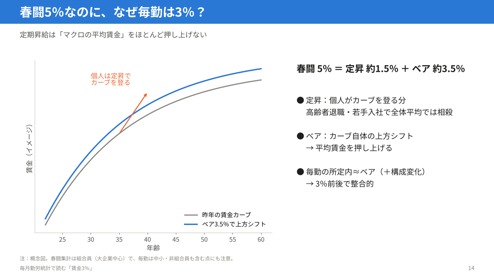

定期昇給は、一人ひとりが賃金カーブを登っていく分である。高齢の人が退職し、若い人が入ってくると、全体の平均ではほとんど打ち消される。全体の平均賃金を押し上げるのは、賃金カーブそのものを上に動かすベースアップの方である。

春闘のベースアップが3.5％前後、毎月勤労統計の所定内給与が共通事業所で3％前後というのは、おおむね辻褄が合っている。

## なぜ「3％」が物価2％と整合的なのか

ここからが本題である。考え方の中心は、単位労働コスト（ULC）である。ULCは、モノやサービスを1単位つくるのにかかる人件費を表す。

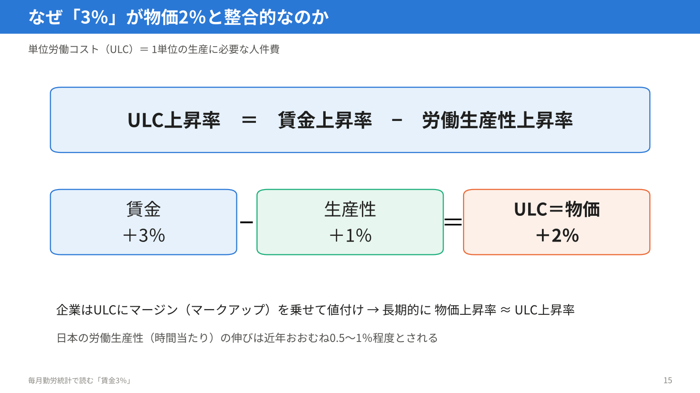

ULCの上昇率は、賃金の上昇率から労働生産性の上昇率を引いたものになる。日本の労働生産性の伸びを年1％程度とすると、賃金が3％上がればULCは2％上がる。企業がULCに一定のマージンを乗せて値付けするなら、長い目で見た物価の上昇率はULCの上昇率に近づく。

つまり、賃金3％、生産性1％、物価2％は、ちょうど釣り合う組み合わせである。

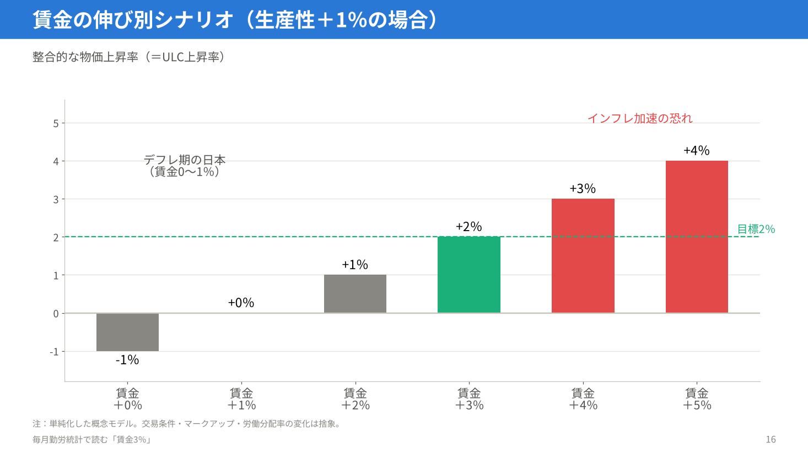

賃金が0〜1％しか伸びなければ、ULCはほとんど上がらず、物価も上がらない。これがデフレ期の日本の姿であった。逆に賃金が5％ずつ伸び続ければ、物価は3〜4％に加速するおそれがある。

別の見方もできる。賃金の総額がGDPに占める割合（労働分配率）が変わらないなら、1人あたりの名目賃金の伸びは、1人あたりの実質GDPの伸びとGDPデフレータの上昇率の合計にそろう。1人あたり実質成長が1％、物価が2％なら、賃金は3％である。同じ答えになる。

### 前提が変われば「整合的な賃金」も変わる

この計算は、労働生産性の伸びをいくらと見るかで結論が変わる。

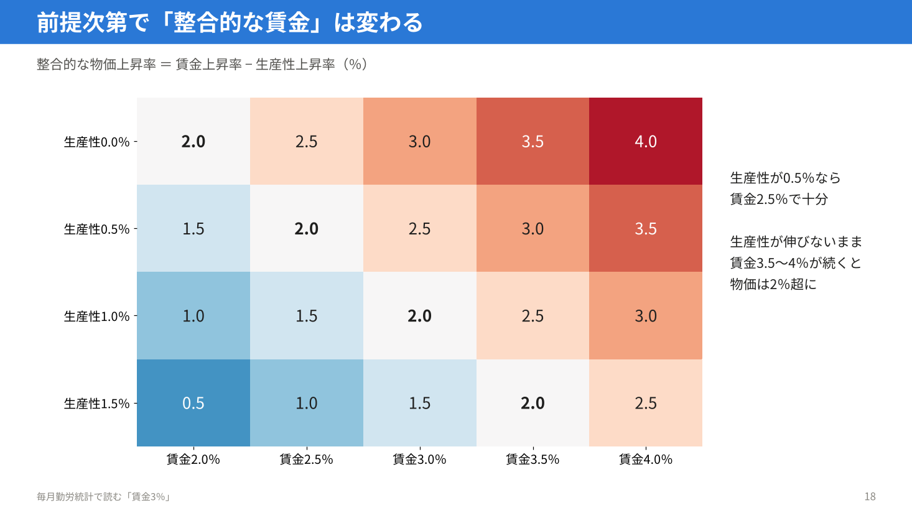

生産性の伸びが0.5％しかなければ、賃金2.5％で物価2％と釣り合う。生産性が伸びないまま賃金3.5〜4％が続けば、物価は2％を超えていく。

## 注意点

- 円安や資源高による輸入物価の上昇は、ULCとは別の経路で物価を押し上げる。2022〜2025年のように、賃金が3％近く伸びても実質賃金がマイナスになることはあり得る。
- 民間の予測では、消費者物価（生鮮食品を除く総合）の上昇率が2026年末から2027年初めに3％に近づくと見られている。そうなれば、実質賃金が再びマイナスに戻るおそれがある。
- 日本銀行が重視しているのは、賃金の上昇がサービス価格に転嫁され、「賃金が主導する2％」が定着するかどうかである。
- 2027年の春闘で、ベースアップ3％台が4年目も続くかが、次の試金石になる。

## まとめ

毎月勤労統計で「3％の賃金上昇が続いている」というのは、基本給の伸びが約34年ぶりに3％台に乗り、それが共通事業所ベースでもおおむね確認できる、ということである。

そして3％という数字は、労働生産性の伸び1％を差し引くと単位労働コストが2％上がる水準であり、物価2％目標と釣り合う「賃金の巡航速度」と言える。賃金0％のデフレ型の経済から、ようやく2％インフレと両立する賃金の伸びに届いた、というのがこの3％の意味である。

残る問題は持続性である。物価の再加速を賃金が上回り続けられるか、そして生産性が伸びるかが、これからの焦点になる。

全21枚のスライドはPDFでも置いている。

- [01_slides.pdf](01_slides.pdf)

## データの出典

- 厚生労働省「毎月勤労統計調査 全国調査 長期時系列表」2026年7月確報（e-Stat、2026年9月28日更新）。表7 現金給与総額、表19・21・23 所定内給与、表25-1 実質賃金（消費者物価指数〈持家の帰属家賃を除く総合〉による）
- 厚生労働省「毎月勤労統計調査 2026年2月分結果速報等」（調査対象事業所の部分入替えによる断層）
- 第一ライフ資産運用経済研究所「実質賃金は改善続くも、先行きは物価上振れが重石に（26年7月毎月勤労統計）」（2026年9月8日）ほか、共通事業所ベースの数値
- 連合「春季生活闘争 最終回答集計」各年（2026年は7月1日集計、報道による）
