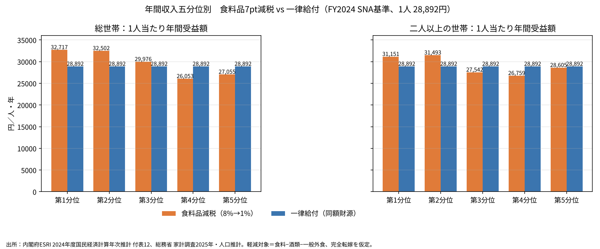

# 食料品の消費税を下げるか、一律に配るか──同じ財源で比べると低所得層はどちらが得か

※ この記事は、内閣府 経済社会総合研究所（ESRI）の国民経済計算（SNA）と、総務省の家計調査・人口推計の公表データを使って計算している。

食料品の消費税を下げる案には、「高所得の人ほど食費が多いので、減税の恩恵も大きい。困っている人を助けるなら給付の方がよい」という批判がよくある。

本稿では、**食料品の消費税を8％から1％へ7ポイント下げた場合**と、**その減収と同じ金額を国民1人ずつに同額配った場合**を比べる。財源の大きさを同じにそろえて、どの所得層がどちらで得をするかを見る。外部の政策案で出ている「○万円給付」といった金額は使わず、給付額は減税の減収額から逆算している。

結論を先に示すと、次のようになった。

- **年収の低い層（第1・第2分位）は、減税の方が得**であった。
- **年収の高い層（第4・第5分位）は、給付の方が得**であった。
- この向きは、「世帯あたり」で見ても「1人あたり」で見ても変わらない。違うのは金額の見え方である。

## 減税で税収はいくら減るか

まず、食料品の消費税を7ポイント下げたときの減収額を、国民経済計算から見積もった。

使ったのは、確報の付表「家計の目的別最終消費支出（名目）」の「食料・非アルコール飲料」である。この金額は税込みなので、税率8％のうち7ポイント分は「支出額×7／108」で計算できる。値下げ分がすべて価格に反映される（完全転嫁）という前提である。

その減収額を、毎年10月1日の総人口で割ると、同じ財源で配れる1人あたりの給付額になる。

- 2021年度：食料・非アルコール49.2兆円、減収3.19兆円、1人あたり25,422円
- 2022年度：50.2兆円、減収3.26兆円、1人あたり26,056円
- 2023年度：51.7兆円、減収3.35兆円、1人あたり26,953円
- 2024年度：55.2兆円、減収3.58兆円、1人あたり28,892円

参考までに、税率をゼロにする場合（×8／108）は、2024年度で減収4.09兆円、1人あたり33,020円になる。

以下では、最新の**2024年度の3.58兆円（1人28,892円）**を基準にする。

## 所得層ごとの受益をどう計算したか

家計調査（2025年）の「年間収入五分位階級別」の表から、各分位の世帯人員、年間収入、食料、酒類、一般外食を取り出した。五分位は、世帯を年収の低い順に並べて5等分したグループである。

軽減税率の対象は、おおよそ「食料 − 酒類 − 一般外食」と考えた（学校給食は軽減税率の対象なので残している）。この支出に7／108をかけたものが、各世帯が減税で得する金額である。

ただし、家計調査は家計簿の記入をもとにしているため、食費の合計は国民経済計算より小さく出る。そこで、国全体の1人あたり平均がSNAの減収額と一致するように、全分位の金額を同じ倍率で引き上げた。倍率は総世帯で1.40倍、二人以上の世帯で1.48倍である。これで、減税と給付の財源の総額がぴったりそろう。

## グラフで見る1人あたりの受益

オレンジが減税、青が一律給付（1人28,892円）である。左が総世帯、右が二人以上の世帯である。

## データから見えること

### 総世帯：低所得層は減税、高所得層は給付が得

1人あたりの年間受益額（減税／給付）は次の通りである。

- 第1分位（年収164万円、1.21人）：減税32,717円／給付28,892円
- 第2分位（年収301万円、1.75人）：減税32,502円／給付28,892円
- 第3分位（年収443万円、2.07人）：減税29,976円／給付28,892円
- 第4分位（年収652万円、2.62人）：減税26,053円／給付28,892円
- 第5分位（年収1,137万円、3.13人）：減税27,055円／給付28,892円

世帯あたりにすると、次のようになる。

- 第1分位：減税39,588円／給付34,960円（減税が4,628円多い）
- 第2分位：減税56,879円／給付50,562円（減税が6,317円多い）
- 第3分位：減税62,051円／給付59,807円（減税が2,244円多い）
- 第4分位：減税68,259円／給付75,698円（給付が7,438円多い）
- 第5分位：減税84,682円／給付90,433円（給付が5,751円多い）

年収に対する割合は、第1分位が減税2.41％・給付2.13％、第5分位が減税0.74％・給付0.80％であった。

### 二人以上の世帯でも同じ傾向

単身世帯を除いた二人以上の世帯でも計算した。世帯あたりで「給付 − 減税」の差を見ると次の通りである。

- 第1分位（年収267万円）：−5,195円（減税が得）
- 第2分位（年収412万円）：−6,632円（減税が得）
- 第3分位（年収582万円）：＋3,970円（給付が得）
- 第4分位（年収792万円）：＋6,891円（給付が得）
- 第5分位（年収1,289万円）：＋967円（ほぼ同じ）

第3分位の向きは総世帯と逆になったが、「低い2つの分位は減税が得、第4分位は給付が得」という点は変わらなかった。

### なぜ低所得層は減税の方が得なのか

- 年収の低い世帯には、高齢の単身世帯など人数の少ない世帯が多く含まれる。
- 人数が少ない世帯では、1人あたりの食費が多くなる。
- 給付は人数に比例して配られるので、人数が多く1人あたり食費が少ない高所得世帯ほど、給付の方が有利になる。

## 「世帯あたり」と「1人あたり」で何が違うか

- **世帯あたり**で見ると、減税の受益額は年収が高いほど大きくなる（第1分位約4.0万円 → 第5分位約8.5万円）。「減税は高所得層ほど得をする」という批判は、この見方にもとづいている。
- **1人あたり**で見ると、逆に年収の低い層ほど受益額が大きくなる（約3.3万円 → 約2.6〜2.7万円）。
- **年収に対する割合**で見ると、減税も給付も、低所得層ほど大きい（累進的な）形になる。
- ただし、**同じ財源の給付と比べてどちらが得か**という向きは、世帯あたりでも1人あたりでも同じであった。

つまり、「減税は高所得層を優遇する」という批判は、世帯あたりの金額だけを見たときの話である。同じ財源の一律給付と比べると、むしろ減税の方が低所得層にやや手厚くなった。ただし、その差は1人あたり数千円程度で、制度の違いとしては大きくない。

## まとめ

- 食料品の消費税を8％から1％に下げると、2024年度の数字で約3.6兆円の減収になる。同じ財源なら、1人あたり約2.9万円を配れる。
- 同じ財源で比べると、年収の低い第1・第2分位は減税の方が得で、第4・第5分位は給付の方が得であった。
- 世帯あたりの金額だけを見ると減税は高所得層に有利に見えるが、人数で割って給付と比べると、その印象は逆になる。
- 両者の差は小さく、どちらを選ぶかは、分配の差よりも、実施のしやすさや物価への効き方などで決まる面が大きいと考えられる。

## 注意点

- **完全転嫁の前提**：税率が下がった分がすべて値下げされると仮定している。実際には一部しか値下げされないことも多く、その場合は減税の家計への効果が小さくなる。
- **テイクアウトの扱い**：国民経済計算の「食料・非アルコール飲料」には、テイクアウトや出前は含まれず、外食（飲食サービス）に入っている。財務省の「食料品の軽減税率分は約5兆円」という試算は、テイクアウトなども含み、税率をゼロにした場合の見積もりである。そのため、本稿の約3.6兆円より大きくなる。
- **家計調査の引き上げ**：家計調査の食費は国民経済計算の約7割しかとらえていない。本稿では全分位を同じ倍率で引き上げたが、記入漏れの度合いが分位ごとに違えば、結果は変わる。また、家計調査は2025年、国民経済計算は2024年度で、時点がずれている。
- **等価所得で調整していない**：世帯人数の違いを調整した等価所得ではなく、世帯の年収で五分位を分けている。
- **事務コストは入れていない**：給付には事務費がかかり、減税には事業者のレジの改修や値札の付け替えなどの負担がかかる。どちらもこの計算には含めていない。
- 給付は子どもを含めて全員に同額を配る前提である。また、酒類以外の対象外の品目は、細かくは差し引いていない。

## データの取り方

- 食料・非アルコール飲料の支出額：内閣府 ESRI「2024年度 国民経済計算年次推計」付表12「家計の目的別最終消費支出の構成（名目）」（2024s12n_jp.xlsx）の年度シート https://www.esri.cao.go.jp/jp/sna/data/data_list/kakuhou/files/2024/2024_kaku_top.html
- 総人口（各年10月1日現在）：総務省「人口推計」参考表「男女別人口の計算表」（e-Stat API、statsDataId：0003448219、0004001640、0004012960、0004026260） https://www.e-stat.go.jp/
- 所得層別の支出・人員・年収：総務省「家計調査」用途分類（年間収入五分位階級別）2025年。総世帯は statsDataId 0002200004、二人以上の世帯は 0002070005（e-Stat API） https://www.e-stat.go.jp/
- 減収額、1人あたり給付額、分位別の受益額は、上のデータから自分で計算した。
