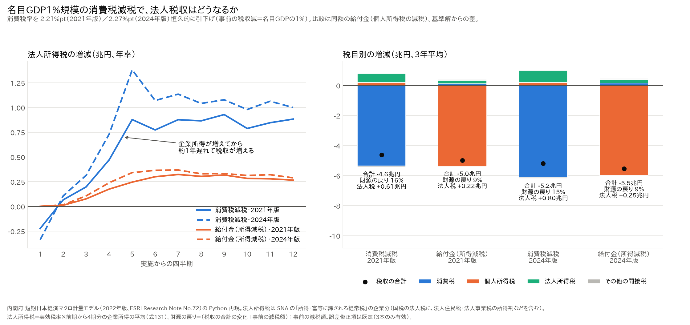
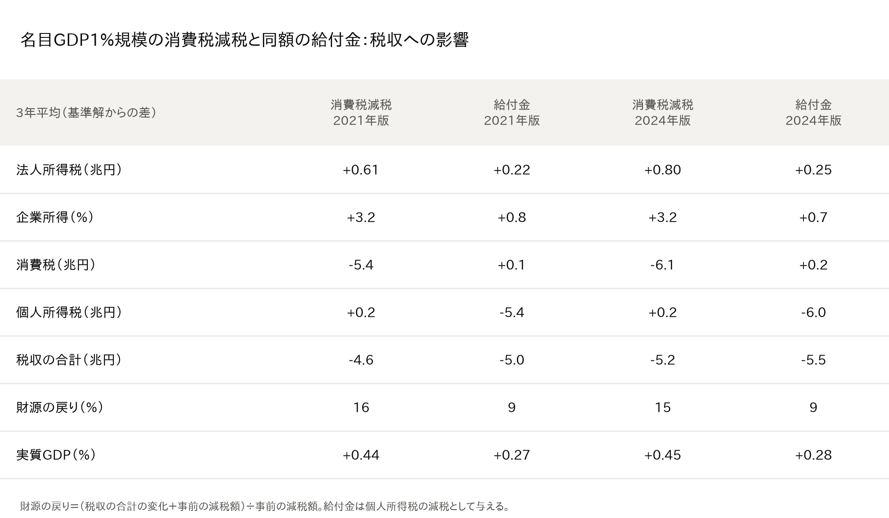

# 消費税を減税すると、法人税収は増えるのか──内閣府モデルで計算してみた

※ この記事は、内閣府の「短期日本経済マクロ計量モデル（2022年版）」を Python で再現したもの（[p72/esri-short-run-macro-model](https://github.com/p72/esri-short-run-macro-model)）と、内閣府 経済社会総合研究所（ESRI）の国民経済計算（SNA）を使って計算している。

消費税減税の議論では、「財源はどうするのか」が常に問題になる。

その際、「減税で景気が良くなれば、ほかの税収が増えて一部は戻ってくる」という意見がある。では、どの税がどれだけ増えるのか。

本稿では、**名目GDPの1％規模（約5.5〜6兆円）の消費税減税**を行ったとき、法人税収を中心に税収がどう変わるかを計算した。比較のために、**同じ金額の給付金**（モデルでは個人所得税の減税として与える）も計算している。前回の記事と同じく、財源の大きさをそろえて比べる。

結論を先に示すと、次のようになった。

- **消費税を減税すると、法人税収は増える**。2年目以降は年0.8〜1.2兆円、ふつうより約3％多くなる。
- 理由は、減税分の約半分が値下げに回らず、**企業の取り分**になるためである。そこに消費の増加が加わり、企業の所得が約3％増える。
- 税収の自然増で戻ってくるのは、減税額の**約15〜16％**である。同じ金額の給付金（約9％）より多いが、**8割以上は戻ってこない**。

## 計算の設定

- 消費税率を、事前の税収減が名目GDPの1％になるだけ引き下げる。
  - 2018〜20年の経済で計算する場合（モデルの論文と同じデータ）：2.21ポイント下げる
  - 2022〜24年の経済で計算する場合（最新のデータ）：2.27ポイント下げる
- 減税は恒久的に続ける。
- 比較として、同じ金額の給付金（個人所得税の減税）も計算した。

モデルの法人税収は、「実効税率 × 前の1年間の企業の所得」で決まる。そのため、企業の所得が増えると、**1年ほど遅れて**法人税収が増える。

## 法人税収は年0.6〜0.8兆円増える

左の図は、法人税収の増え方である。

- 消費税減税（青）では、実施から1年ほどで法人税収が年0.9〜1.4兆円まで増え、その後も年0.8〜1.1兆円の増加が続く。
- 同じ金額の給付金（オレンジ）では、年0.3兆円ほどの増加にとどまる。
- 実施直後に少し減っているのは、減税前の「買い控え」で企業の所得が一時的に減った分である。

主な数値をまとめると、次のとおりである（3年間の平均）。

- **法人税収**：消費税減税で0.61〜0.80兆円の増加、給付金で0.22〜0.25兆円の増加。消費税減税の方が約3倍多く増える。
- **企業の所得**：消費税減税で3.2％増、給付金で0.7〜0.8％増。
- **税収の合計**：消費税減税で4.6〜5.2兆円の減少、給付金で5.0〜5.5兆円の減少。
- **財源の戻り**（税収の自然増 ÷ 減税額）：消費税減税で15〜16％、給付金で9％。

## なぜ消費税減税で法人税収が増えるのか

ポイントは、**減税分がどれだけ値下げに回るか**である。

このモデルでは、消費税率が変わったとき、その約半分（0.52）しか消費者が払う価格に反映されない。残りの約半分は、企業の取り分（利益）になる。

1. 消費税が下がる。
2. 値下げは約半分。残りの約半分は企業の利益になる。
3. 値下げで消費が増え、企業の売上も増える。
4. 企業の所得が約3％増える。
5. 1年ほど遅れて、法人税収が増える。

給付金の場合は、家計の手取りが増えて消費が増えるだけなので、企業の所得の増え方は小さくなる。

## まとめ

- 消費税を名目GDPの1％分減税すると、法人税収は年0.6〜0.8兆円（3年平均）増える。
- 理由は、減税分の約半分が企業の利益になり、さらに消費の増加が加わって、企業の所得が増えるためである。
- 税収の自然増で戻ってくるのは減税額の約15〜16％で、同じ金額の給付金（約9％）より大きいものの、大部分は戻らない。

「消費税減税は企業を潤す」という見方は、このモデルでは数字として確認できる。ただし、それは「減税分が全部は値下げに回らない」ことの裏返しでもある。前回の記事は「減税分がすべて値下げに回る（完全転嫁）」前提で家計の受益を計算した。家計にとっての恩恵と、法人税収の戻りは、どちらかが大きければもう一方が小さくなる関係にある点に注意が必要である。

## 注意点

- **「半分が企業の取り分」は、モデルの前提である**：この0.52という数字は、1990年代〜2020年のデフレ期のデータで推定されたものである。
  - 減税分がすべて値下げに回る場合は、企業の所得の増え方も、法人税収の増え方も小さくなる。
  - 最近のデータでは、コストの変化が価格に回りやすくなっているという結果もある。今の日本では、法人税収の戻りはこの計算より小さい可能性がある。
- **ここでいう法人税収は、国の「法人税」より範囲が広い**：法人住民税や法人事業税（所得にかかる部分）を含む、国と地方の合計である（国民経済計算の定義）。決算で見る法人税収とは一致しない。
- **財源の8割以上は戻ってこない**：税収の自然増だけで減税を賄うことはできず、財政収支は悪化する。
- **一律の消費税減税として計算している**：食料品だけの減税ではなく、すべての品目の税率を同じだけ下げる計算である。

## データの取り方

- モデル：酒巻哲朗他「短期日本経済マクロ計量モデル（2022年版）の構造と乗数分析」内閣府 ESRI Research Note No.72（2022年12月） https://www.esri.cao.go.jp/jp/esri/archive/e_rnote/e_rnote080/e_rnote072.pdf
- モデルの再現と計算のコード：https://github.com/p72/esri-short-run-macro-model （計算は `src/experiment_ctax_revenue.py`、図は `src/plot_ctax_revenue.py`）
- モデルのデータ：内閣府 ESRI「国民経済計算」などから作成
  - 2018〜20年の計算：2021年10-12月期2次速報・2020年度年次推計（2015年基準）
  - 2022〜24年の計算：2026年4-6月期2次速報・2024年度年次推計（2020年基準） https://www.esri.cao.go.jp/jp/sna/data/data_list/kakuhou/files/2024/2024_kaku_top.html
- 法人税収：国民経済計算の一般政府の「所得・富等に課される経常税」（受取）から、家計の支払分を引いた値
