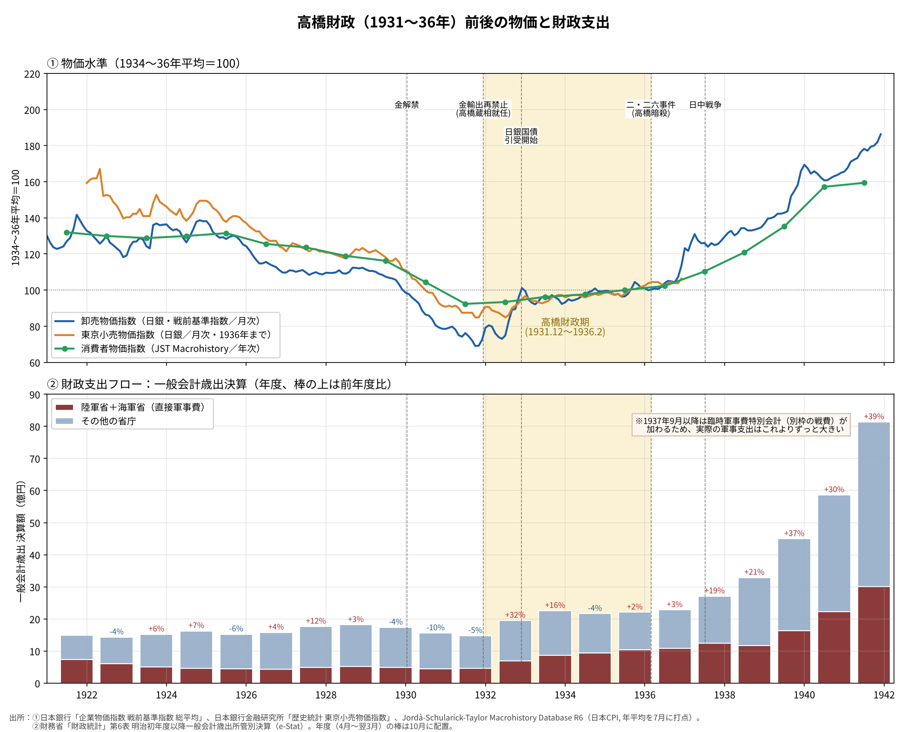
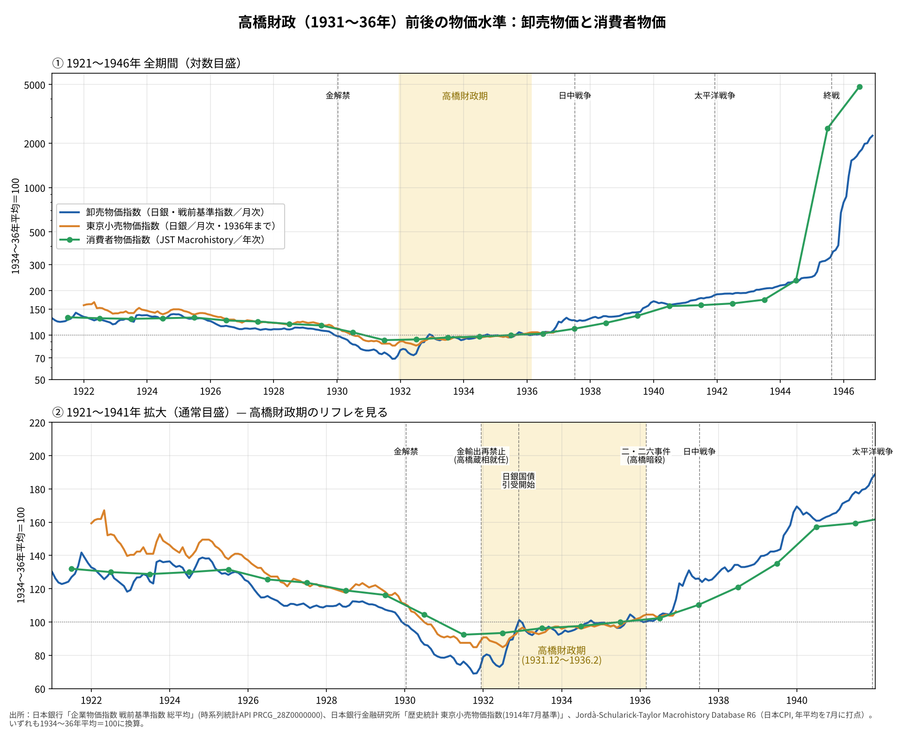

# 高橋財政で物価はどれだけ上がったのか──1921〜1946年の物価と財政支出をデータで見る

※ この記事は、日本銀行・日本銀行金融研究所・財務省（e-Stat）の公表データと、Jordà-Schularick-Taylor Macrohistory Database を使って調べている。

1931年12月に蔵相に就いた高橋是清は、金輸出の再禁止、日銀による国債引受、時局匡救事業を組み合わせて、昭和恐慌から日本経済を立て直した。今でいう「リフレ政策」の先例として、よく引き合いに出される。

では、そのとき物価はどのくらい上がったのか。財政支出はどれだけ増えたのか。本稿では、高橋財政の前後10年を含めて、1921〜1946年のデータを並べた。

## グラフで見る1921〜1941年

上下2段で、次のものを並べている。黄色の帯は高橋財政期（1931年12月〜1936年2月）である。

- 上段：物価水準。卸売物価（月次）、東京小売物価指数（月次、1936年まで）、消費者物価（年次）の3本である。いずれも1934〜36年平均を100にそろえている。
- 下段：一般会計の歳出決算（年度）。陸軍省と海軍省の分（直接軍事費）と、それ以外の省庁に分けている。棒の上の数字は前年度比である。

## データから見えること

### 1920年代はじわじわデフレ、金解禁で急落

- 卸売物価は1925年をピークに、1929年まで約2割下がっている。
- 1930年1月の金解禁（旧平価での金本位制復帰）と世界恐慌が重なり、卸売物価は1929年→1931年に年平均で約3割下がった。年率にすると−16.6％である。
- 消費者物価も同じ2年間で年率−10.8％であった。
- この時期の一般会計歳出は、1929年度の17.4億円から1931年度の14.8億円へと減っている。井上準之助蔵相の緊縮財政である。

### 高橋財政期の物価上昇は年2〜3％

1931→1936年の年率の上昇率は、次のとおりである。

- 卸売物価：＋6.7％
- 東京小売物価指数：＋3.3％
- 消費者物価：＋2.1％

年ごとに見ると、動きに特徴がある。

- 1932〜33年は、卸売物価だけが前年比＋11％、＋15％と2ケタで上がった。円相場がほぼ半分まで下がり、輸入品や原料の値段が上がったためである。
- 同じ2年間、消費者物価は＋1％、＋3％にとどまっている。
- 1934〜36年は、卸売物価も消費者物価も年2〜3％で落ち着いている。

デフレから抜け出したあと、物価の上昇は今の「物価目標2％」程度の水準に収まっていたことになる。

### 財政支出の拡大は最初の2年に集中

- 一般会計歳出は、1931年度の14.8億円から、1932年度に19.5億円（＋32％）、1933年度に22.5億円（＋16％）と、2年で約5割増えた。
- 財源は、1932年11月に始まった日銀引受の国債である。
- 増えたのは軍事費だけではない。時局匡救事業（農村救済の公共事業）などで、陸海軍省以外の支出も10.2億円から13.8億円に増えている。

### 1934年度からはブレーキ

- 1934〜36年度の歳出は21.6億円、22.1億円、22.8億円と、ほぼ横ばいであった。
- 名目GDPに対する比率は、1933年度の14.0％から1936年度の11.5％へ下がっている。景気回復で名目GDPが伸びたにもかかわらず、歳出を増やさなかったためである。
- 上段の物価が年2〜3％で落ち着いた時期と、ぴったり重なる。

### それでも軍事費は増え続けた

- 陸軍省と海軍省の歳出は、1931年度の4.5億円から1936年度の10.8億円へ、約2.4倍になった。
- 歳出の総額を抑えるなかで、軍事費の比率は3割から5割近くまで上がっている。
- 高橋は軍の予算要求を抑えようとして対立を深め、1936年2月の二・二六事件で暗殺された。

### 高橋のあと、歯止めが外れる

- 1937年度以降、一般会計歳出は毎年＋19％、＋21％、＋37％、＋30％、＋39％と膨らみ、1941年度には81.3億円になった。高橋財政期の約3.5倍である。
- 物価も同じタイミングで上がり始め、1937年の卸売物価は前年比＋21％であった。消費者物価は1938〜40年に年10〜16％上がっている。
- しかも1937年9月からは、一般会計とは別枠の「臨時軍事費特別会計」で戦費がまかなわれた。下段のグラフにはこれが入っていないので、実際の軍事支出はグラフよりずっと大きかったことになる。

## 1946年までの物価（対数目盛）

戦争末期から戦後にかけては、物価の桁が変わる。

- 卸売物価は、1934〜36年平均を100とすると、1944年に232、1945年に350、1946年に1,627であった。1946年の前年比は＋365％である。
- 1941〜43年の数字は、価格統制令で公定価格が固定されていたため、闇価格が入っていない。実際の暮らしの物価はもっと高かったと考えられる。
- 消費者物価（JST）の1945年の上昇率は＋976％と、卸売物価の＋51％と大きくずれている。戦時中の公定価格と闇価格をどう扱うかで大きく変わる時期なので、1945〜46年は「2年で数十倍」という桁の感覚で見るのが妥当だろう。

## まとめ

- 高橋財政は、金解禁で年率十数％のデフレに陥っていた日本経済を、2年ほどで物価上昇へ転じさせた。
- 財政支出は最初の2年で約5割増えたが、1934年度からは総額を抑え、物価上昇は年2〜3％に収まった。
- ただ、総額を抑えるなかでも軍事費は毎年増えていた。高橋の死後は歯止めが外れ、別枠の臨時軍事費も加わって、戦時インフレから戦後のハイパーインフレへとつながっていく。
- 「日銀の国債引受でも物価は暴走しなかった」のは、高橋が出口でブレーキを踏んでいたからでもある。そのブレーキが政治的に外されたとき何が起きたかも、同じグラフに映っている。

## データの取り方

- 卸売物価：日本銀行 時系列統計データ検索サイトの API。企業物価指数の「戦前基準指数 総平均」（系列 PRCG_28Z0000000、1934〜36年平均＝1、月次）である。
- 東京小売物価指数：日本銀行金融研究所「歴史統計」の東京小売物価指数（1914年7月基準、月次）の総平均。デジタル化されているのは1922年1月〜1936年12月である。 https://www.imes.boj.or.jp/jp/historical/hstat/hstat.html
- 消費者物価・名目GDP：Jordà-Schularick-Taylor Macrohistory Database（R6）の日本の cpi・gdp（暦年）。政府の戦前基準消費者物価指数（東京都区部）は1947年からしかないため、1937〜46年はこの系列で補っている。 https://www.macrohistory.net/database/
- 財政支出：財務省「財政統計」の「明治初年度以降一般会計歳出所管別決算」（e-Stat）。決算額の合計は「明治初年度以降一般会計歳入歳出予算決算」と一致することを確認している。
- 物価はすべて1934〜36年平均＝100に換算した。年度（4月〜翌3月）と暦年の差があるので、歳出のGDP比はおおよその値である。
